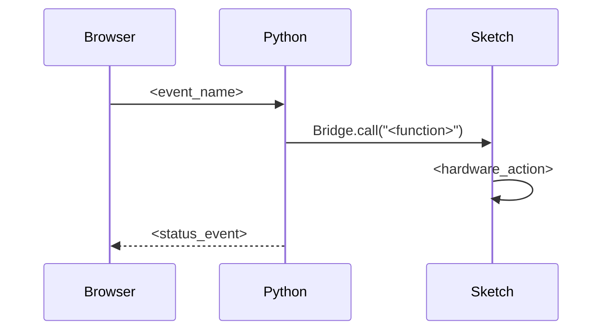

# UNO Q AI Kit — Code Project Conventions

Code projects in this repository are App Lab apps organized by module. Each app
follows a standard structure with a README.md documenting the project.

---

## README.md Format

Each app's README.md follows this structure:

```
# <NN> <Lesson Name>

<One-sentence introduction covering: what it does, the data path
(Browser → Socket.IO → Python → Bridge → Sketch → Hardware), and which pin.>


## Bricks Used

- `<brick_name>` – <what it provides>

## Hardware Requirements

### Hardware

- <Component> ×<qty>
- ...

### Software

- <Required software, one per line>

## Wiring

<One sentence describing the connection.>


## How to Use the Example

1. Open **Arduino App Lab**.
2. Select **Apps** → **Create New App** → **Import App** → **Import from Computer**.
3. Download [`<NN> <Lesson Name>.zip`](https://github.com/sunfounder/unoq-ai-kit/releases/latest/download/<NN>.<Lesson.Name>.zip) and import it in **Arduino App Lab**.
4. Click **Run**.
5. <What to do in the Web UI to see the result.>

## How it Works

<ASCII text flow diagram showing data path between components.>

<One paragraph prose explanation of the flow.>

## Code Overview

### Browser

<What the frontend does.>

- `index.html` — <role>
- `style.css` — <role>
- `app.js` — <role>

### Python Backend

`main.py` manages the application logic.

It is responsible for:

- <responsibility>
- ...

Example:

```python
<key one-liner showing the core API call>
```

### Sketch

`sketch.ino` controls the hardware running on the microcontroller.

It:

- <responsibility>
- ...

Example:

```cpp
<key one-liner showing the core API call>
```

## Communication Flow



<One closing sentence about the pattern being foundational to App Lab projects.>
```

> **Release download links.** The import step links straight to the lesson
> package on the releases page, using
> ``https://github.com/sunfounder/unoq-ai-kit/releases/latest/download/<name>.zip``
> so the link keeps working when a new release is published. GitHub publishes
> asset names with dots instead of spaces (``NN Name.zip`` becomes
> ``NN.Name.zip``); the link text keeps the readable name. The *Run the App*
> step of the matching RST lesson uses the same URL in a ``:download:`` role.

### Format Rules

- **Introduction**: One sentence. Always describe the full data path.
- **Code examples**: Show only the key API call (1-3 lines), never the full source.
- **Images**: Store in `assets/docs_assets/`. Use descriptive filenames matching the image content.
- **Zip reference**: Always `<NN> <Lesson Name>.zip`; the import step downloads it from the latest release.
- **Pin notation**: Use `**D5**` (bold, with D prefix).
- **Mermaid**: `sequenceDiagram`, minimal — participants + arrows only, no notes or styling.
- **Tone**: Technical documentation, not tutorial. No "you'll learn", no learning objectives, no troubleshooting, no experiment sections.

---

## App Project Structure

Each app follows this directory layout:

```
<NN> <Lesson Name>/
├── app.yaml              # App metadata (name, description, bricks, icon)
├── README.md             # Project documentation (see format above)
├── assets/               # Web frontend
│   ├── index.html        # Page structure
│   ├── app.js            # Browser logic (Socket.IO client)
│   ├── style.css         # Visual styling
│   ├── libs/             # Third-party JS libraries
│   ├── fonts/            # Font files
│   ├── img/              # UI images (favicon, logos)
│   └── docs_assets/      # Documentation images (screenshots, wiring diagrams)
├── python/
│   └── main.py           # Web server + Bridge communication
└── sketch/
    ├── sketch.yaml       # Platform config
    └── sketch.ino        # Hardware control (MCU)
```

### File Format Reference

> **TODO**: Formats for `main.py`, `sketch.ino`, and `index.html` to be added.
