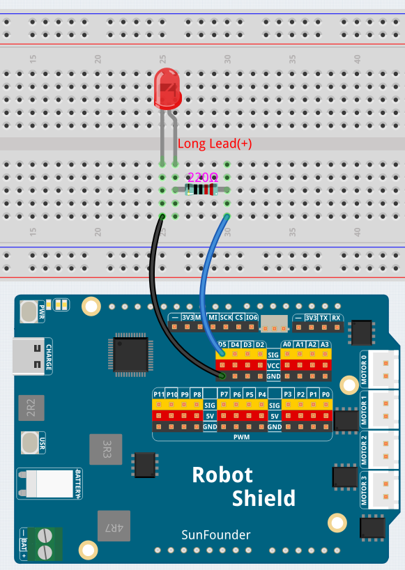

# 01 Hello LED

The **Hello LED** example blinks an external LED connected to digital pin **D5** — the "Hello World" of electronics. It introduces `pinMode()`, `digitalWrite()`, and `delay()`, the three fundamental functions used in almost every Arduino sketch.

## Hardware

- Pan Tilt Kit ×1
- Breadboard ×1
- Red LED ×1
- 220 Ω resistor ×1
- Jumper wires
- USB-C cable ×1

## Wiring

Connect the LED through a 220 Ω resistor between digital pin D5 and GND.

## How to Use the Example

1. Open **Arduino App Lab**.
2. Select **My Apps** → **Create New App** → **Import App** → **Import from Computer**.
3. Import `01 Hello LED.zip` from `unoq-ai-kit\basic`.
4. Click **Run**.
5. The LED on the breadboard blinks — half a second on, half a second off.

## How it Works

**Flow**

- `setup()` — configures pin 5 (`ledPin`) as an `OUTPUT`
- `loop()` — turns the LED on, waits 500 ms, turns it off, waits 500 ms, and repeats forever

**Digital output**

`digitalWrite(ledPin, HIGH)` sends 5 V to pin 5, lighting the LED; `digitalWrite(ledPin, LOW)` sends 0 V, turning it off. That's the "Hello World" of Arduino — writing a `HIGH` or `LOW` value to a digital pin.

**The blink cycle**

The 500 ms `delay()` between the two `digitalWrite()` calls sets the blink speed. Because `loop()` runs over and over, the LED keeps blinking until power is removed.

