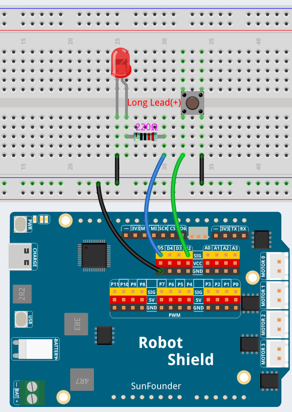

# 02 Button-Controlled Light

Press a button to turn on an LED — your first interactive circuit. This lesson introduces `digitalRead()` and `INPUT_PULLUP`, teaching the board to read input from the physical world and respond to you.

## Hardware

- Pan Tilt Kit ×1
- Breadboard ×1
- Push button ×1
- Red LED ×1
- 220 Ω resistor ×1
- Jumper wires
- USB-C cable ×1

## Wiring

Connect the push button to digital pin D2 and the LED through a 220 Ω resistor to pin D5.

## How to Use the Example

1. Open **Arduino App Lab**.
2. Select **My Apps** → **Create New App** → **Import App** → **Import from Computer**.
3. Import `02 Button-Controlled Light.zip` from `unoq-ai-kit\basic`.
4. Click **Run**.
5. Press the button — the LED lights up. Release it — the LED turns off.

## How it Works

**Flow**

- `setup()` — configures pin 2 (`buttonPin`) as `INPUT_PULLUP` and pin 5 (`ledPin`) as an `OUTPUT`
- `loop()` — reads the button with `digitalRead()`, then turns the LED on or off based on the result

**Reading a button**

`pinMode(buttonPin, INPUT_PULLUP)` enables the board's built-in pull-up resistor, so an unpressed button reads `HIGH` (5 V). Pressing the button connects the pin to GND, making it read `LOW` — that's why the code checks for `LOW` instead of `HIGH`.

**Making a decision**

The `if/else` statement turns the LED on when the button is pressed and off when it isn't. Making a decision from an input is the foundation of all interactive programs.

