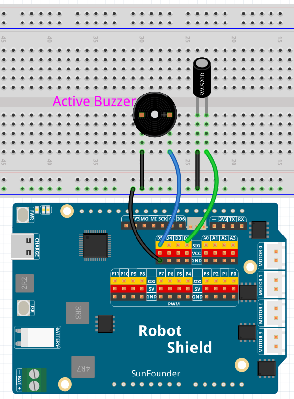

# 03 Tilt Alarm

Sound a rhythmic alarm when the device is tilted. Uses a tilt switch as a digital input and an active buzzer as an output. Introduces software **debounce** — a technique that prevents false triggers by confirming the input state before acting.

## Hardware

- Pan Tilt Kit ×1
- Breadboard ×1
- Tilt switch ×1
- Active buzzer ×1
- Jumper wires
- USB-C cable ×1

## Wiring

Connect the tilt switch to digital pin D2 and the active buzzer to pin D5.

## How to Use the Example

1. Open **Arduino App Lab**.
2. Select **Apps** → **Create New App** → **Import App** → **Import from Computer**.
3. Import `03 Tilt Alarm.zip` from `unoq-ai-kit\basic`.
4. Click **Run**.
5. Keep the breadboard flat — the buzzer is silent. Tilt it — a rhythmic alarm sounds (two short beeps, one long beep). Straighten it — the alarm stops.

## How it Works

**Flow**

- `setup()` — configures pin 2 (`tiltPin`) as `INPUT_PULLUP`, pin 5 (`buzzerPin`) as an `OUTPUT`, and starts with the buzzer off
- `loop()` — checks the tilt switch; if tilted, confirms the reading with a debounce check and sounds the alarm pattern

**The debounce check**

Tilt switches are mechanical — the internal ball can bounce when making contact, causing false readings. The code waits 30 ms with `delay(30)` and reads the pin again; if it's still `HIGH`, the tilt is real. If not, it's a momentary bounce and gets ignored.

**The alarm pattern**

The rhythmic alarm (two short beeps, one long beep) is created by turning the buzzer on and off with different `delay()` durations — 100 ms, 100 ms, then 300 ms.

