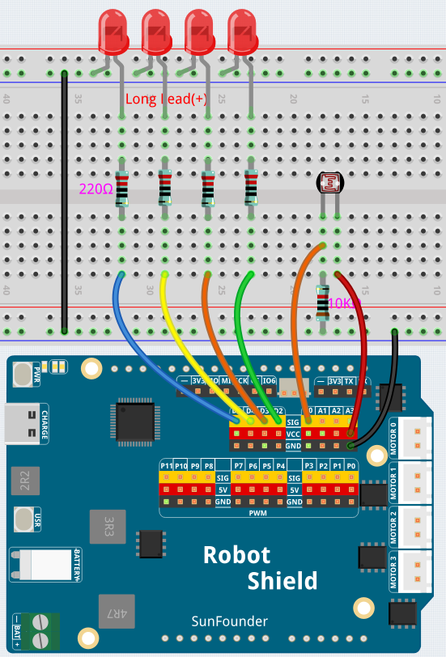

# 04 Photoresistor Night Light

A 4-level LED bar graph that responds to ambient light — the darker it gets, the more LEDs light up. Introduces `analogRead()`, `map()`, arrays, and `for` loops — four powerful tools that let you handle groups of pins and smooth sensor data with just a few lines of code.

## Hardware

- Pan Tilt Kit ×1
- Breadboard ×1
- Photoresistor ×1
- 10kΩ resistor ×1
- LEDs ×4
- 220Ω resistors ×4
- Jumper wires
- USB-C cable ×1

## Wiring

Connect the photoresistor with a 10kΩ resistor to analog pin A0, and four LEDs to pins D4–D7.

## How to Use the Example

1. Download [`04 Photoresistor Night Light.zip`](https://github.com/sunfounder/unoq-ai-kit/releases/latest/download/04.Photoresistor.Night.Light.zip).
2. In App Lab, go to **Apps** → **Create New App** → **Import App** → **Import from Computer** and open the package you downloaded.
3. Click **Run**.
4. Cover the photoresistor with your hand — more LEDs light up. Shine a flashlight on it — they turn off.
5. Open the **Serial Monitor** to see live light readings.

## How it Works

**Flow**

- `setup()` — starts the Serial Monitor and initializes all four LED pins as outputs with a `for` loop
- `loop()` — reads the photoresistor on A0, maps the value to a 1–4 level, updates the LEDs, and prints the reading

**Analog input**

`analogRead(lightPin)` returns 0–1023 — 1024 possible values instead of the 2 of digital input. The photoresistor's resistance changes with light, producing a voltage that drops as the room gets darker.

**Scaling with map()**

`map(lightValue, 0, 1023, 1, 4)` rescales the raw reading into four brightness levels, dividing the whole light range into bands.

**Arrays and for loops**

The `for` loop walks through the `ledPins[]` array, turning each LED on when its index is below the level and off otherwise — the same logic applied to all four pins with just a few lines of code.

