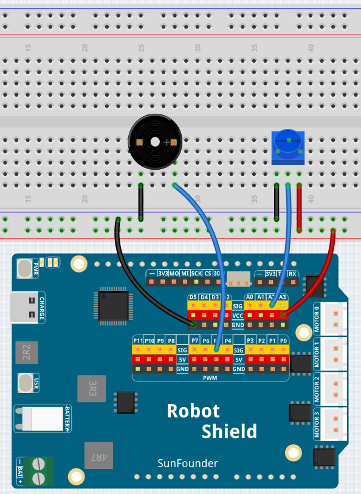

# 05 Variable Pitch Melody

Turn a potentiometer to raise or lower the pitch of a repeating four-note melody (C4 → E4 → G4 → C5). The passive buzzer plays the notes in sequence, and the potentiometer shifts the entire melody up or down while keeping the musical intervals intact — turn left for deeper, right for higher.

## Libraries Used

- **RobotShield** library

## Hardware

- Pan Tilt Kit ×1
- Breadboard ×1
- Potentiometer ×1
- Passive buzzer ×1
- Jumper wires
- USB-C cable ×1

## Wiring

Connect the potentiometer to A2 and the passive buzzer to P5 on the Robot Shield.

## How to Use the Example

1. Open **Arduino App Lab**.
2. Select **My Apps** → **Create New App** → **Import App** → **Import from Computer**.
3. Import `05 Variable Pitch Melody.zip` from `unoq-ai-kit\basic`.
4. Click **Run**.
5. Turn the potentiometer while the melody plays — the pitch shifts up or down. Open the Serial Monitor to see the current frequency.

## How it Works

**Flow**

- `setup()` — initializes the I2C bus and PWM channel on P5
- `loop()` — plays the four notes in sequence, reading the potentiometer before each note and multiplying the base frequency by the pitch percentage

**The melody array**

`MELODY[]` stores four base frequencies: C4 (262 Hz), E4 (330 Hz), G4 (392 Hz), C5 (523 Hz). The sketch loops through them continuously — `for (int note = 0; note < MELODY_LENGTH; note++)`.

**Pitch control**

`map(potValue, 0, 1023, 50, 200)` converts the potentiometer reading to a pitch percentage from 50% to 200%. Each base note is multiplied by this percentage — `MELODY[note] * pitchPercent / 100` — so at center position (~125%) the melody plays a little high, at minimum (50%) it plays an octave lower, at maximum (200%) an octave higher. The ratios between notes stay the same, so the melody is recognizable at any pitch.

**Generating the tone**

`playFrequency()` sets the PWM period with a 50% duty cycle — `period = 1000000 / frequency` and `pulse = period / 2` — to drive the passive buzzer. `stopBuzzer()` creates a short gap between notes so they don't blur together.
