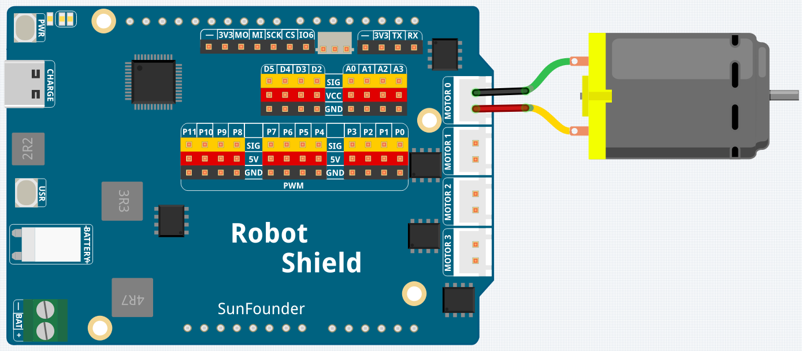

# 07 Motor Speed Controller

Drive a DC motor with speed and direction control using the Robot Shield's H-bridge. The motor spins forward at 50% power for 3 seconds, stops for 1 second, reverses for 3 seconds, then stops again — demonstrating both speed control (PWM) and direction reversal.

## Hardware

- Pan Tilt Kit ×1
- DC motor ×1
- Fan blade (optional)
- USB-C cable ×1

## Wiring

Connect the DC motor to the Robot Shield's M0 terminal and the battery pack to the Robot Shield.

## How to Use the Example

1. Open **Arduino App Lab**.
2. Select **Apps** → **Create New App** → **Import App** → **Import from Computer**.
3. Import `07 Motor Speed Controller.zip` from `unoq-ai-kit\basic`.
4. Connect the battery pack to the Robot Shield.
5. Click **Run**.
6. The motor spins forward 3 s → stops 1 s → reverses 3 s → stops 3 s → repeats. Attach the fan blade to see and feel the airflow change direction.

## How it Works

**Flow**

- `setup()` — starts the Serial Monitor and configures the M0 direction pin (D4) and PWM pin (D5) as outputs
- `loop()` — runs the sequence forward 3 s, stop 1 s, reverse 3 s, stop 3 s, then repeats

**Direction through the H-bridge**

`digitalWrite(motorDirPin, HIGH)` sets the M0 direction, and `analogWrite(motorPwmPin, 128)` spins the motor at ~50% speed (128 out of 255). Reversing is just flipping the direction pin to LOW — the Robot Shield's H-bridge swaps the voltage polarity, spinning the motor backward.

**Stopping**

`analogWrite(motorPwmPin, 0)` removes the drive signal and the motor stops.
