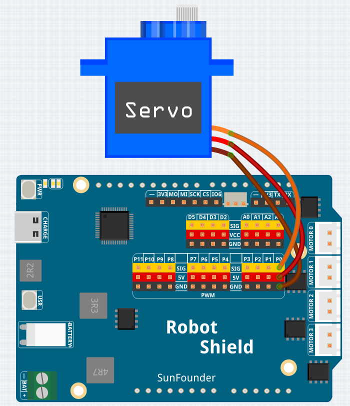

# 08 Servo Sweep

Sweep a servo back and forth between 45° and 135° (±45° around the 90° center) — like a radar scanner or a windshield wiper. The servo is your first **positional actuator**: instead of setting a speed (like a motor), you set a target angle and the servo moves there automatically using its internal closed-loop control.

## Libraries Used

- **Arduino_HardwareServo** library

## Hardware

- Pan Tilt Kit ×1
- USB-C cable ×1

## Wiring

Connect the servo to the Robot Shield's servo channel 0 (Arduino pin 9) and the battery pack to the Robot Shield.

## How to Use the Example

1. Download [`08 Servo Sweep.zip`](https://github.com/sunfounder/unoq-ai-kit/releases/latest/download/08.Servo.Sweep.zip).
2. In App Lab, go to **Apps** → **Create New App** → **Import App** → **Import from Computer** and open the package you downloaded.
3. Connect the battery pack to the Robot Shield.
4. Click **Run**.
5. The servo sweeps smoothly from 45° to 135° and back, incrementing by 2° every 30 ms. Open the Serial Monitor to see the current angle.

## How it Works

**Flow**

- `setup()` — starts the Serial Monitor and attaches the servo to pin 9 with `myservo.attach(9)`
- `loop()` — sweeps the angle from 45° to 135° in 2° steps, then back down to 45°

**Positional control**

`myservo.write(angle)` sends a position command (0–180°, with 90° as center). Inside the servo, a small DC motor, a gear train, and a potentiometer form a closed-loop system — it reads its own position and keeps adjusting until it matches the commanded angle.

**Smooth sweeping**

The `for` loop increments the angle by 2° every 30 ms (`delay(30)`), producing smooth motion — larger steps would make the servo jerk. Unlike the DC motor you used earlier, you don't control speed or direction directly — you just tell the servo *where to go*.
