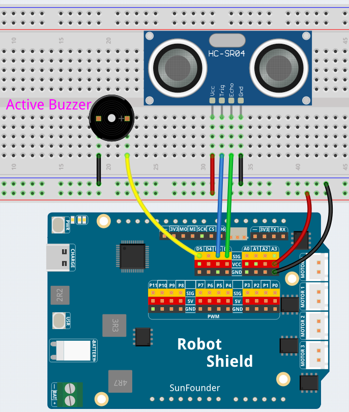

# 10 Ultrasonic Radar

Measure distance with ultrasonic sound waves — just like a bat or a parking sensor. The HC-SR04 sensor sends out 40 kHz sound pulses and measures the echo return time. The closer an obstacle gets, the faster the buzzer beeps, creating a **proximity alarm**.

## Hardware

- Pan Tilt Kit ×1
- Breadboard ×1
- HC-SR04 ultrasonic sensor ×1
- Active buzzer ×1
- Jumper wires
- USB-C cable ×1

## Wiring

Connect the HC-SR04's VCC to 3.3V, Trig to D11, Echo to D12, and GND to GND, and the active buzzer to D5.

## How to Use the Example

1. Open **Arduino App Lab**.
2. Select **Apps** → **Create New App** → **Import App** → **Import from Computer**.
3. Import `10 Ultrasonic Radar.zip` from `unoq-ai-kit\basic`.
4. Click **Run**.
5. Move your hand toward and away from the sensor. The buzzer beeps faster as obstacles get closer. Open the Serial Monitor to see distance in cm.

## How it Works

**Flow**

- `setup()` — Configures Trig, Echo, and buzzer pins
- `loop()` — Calls `getDistance()`, then picks a beep speed: >100 cm silent, 50–100 cm slow, 20–50 cm medium, <20 cm fast

**Measuring distance**

A 10 µs pulse on Trig starts the measurement. `pulseIn(echoPin, HIGH, 30000)` counts how long Echo stays HIGH — the sound's round-trip time in microseconds. `duration × 0.0343 ÷ 2` converts to cm (halved because the sound goes to the object and back). Returns −1 if no echo arrives within the 30 ms timeout.

**Proximity alarm**

`beepOnce(onTime, offTime)` produces different beep speeds. The closer the obstacle, the shorter the pause between beeps — from slow (500 ms pause) to urgent (100 ms pause).

