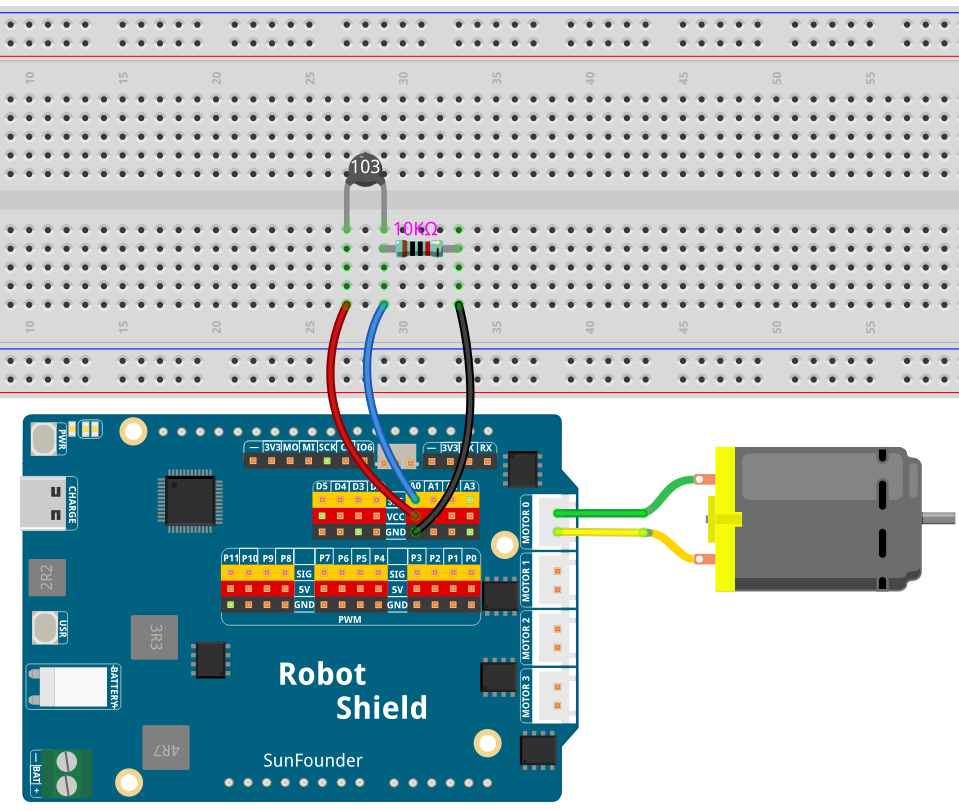

# 12 Thermistor-Controlled Fan

Read temperature with an NTC thermistor and automatically adjust a DC motor (fan) speed — faster when hot, off when cool. Uses the **Beta equation** to accurately convert thermistor resistance to temperature in degrees Celsius — a real-world physics formula in your code.

## Hardware

- Pan Tilt Kit ×1
- Breadboard ×1
- NTC thermistor ×1
- 10 kΩ resistor ×1
- DC motor ×1
- Fan blade (optional)
- USB-C cable ×1

## Wiring

Connect the NTC thermistor with a 10 kΩ resistor to analog pin A1 and the DC motor to the Robot Shield's M0 terminal.

## How to Use the Example

1. Open **Arduino App Lab**.
2. Select **Apps** → **Create New App** → **Import App** → **Import from Computer**.
3. Import `12 Thermistor-Controlled Fan.zip` from `unoq-ai-kit\basic`.
4. Connect the battery pack to the Robot Shield.
5. Click **Run**.
6. Open the Serial Monitor. Gently pinch the thermistor bead between your fingers — the temperature rises and the fan starts spinning. Let go and watch it cool down and stop.

## How it Works

**Flow**

- `setup()` — starts the Serial Monitor, configures the M0 control inputs (IN1 on D2, IN2 on D3), and starts with the fan off
- `loop()` — reads the thermistor on A1, converts resistance to temperature, maps temperature to motor power, and updates the fan

**Step 1 — the voltage divider**

`(1023.0 / adcValue - 1.0) * seriesResistor` reverses the voltage divider math (the thermistor plus the fixed 10 kΩ resistor, just like the photoresistor you used earlier) to recover the thermistor's resistance in ohms — the decimal `1023.0` keeps the division from truncating.

**Step 2 — the Beta equation**

`1 / (ln(R / R₀) / β + 1 / T₀) − 273.15` models how an NTC's resistance falls as it heats. β (3950) describes how steeply this thermistor's curve drops — a real physics formula doing work in your code.

**Step 3 — mapping temperature to power**

Below 25 °C the fan stays off (`power = 0`), above 50 °C it runs at maximum (`power = 100`), and in between `map()` — the same function used in earlier lessons — spreads the 25–50 °C range across 20–100% so the fan ramps smoothly instead of clicking on.

**Driving the motor**

`analogWrite(MOTOR_IN1_PIN, map(power, 0, 100, 0, 255))` converts the 0–100% power into the 0–255 PWM range and drives the fan, with `MOTOR_IN2_PIN` held at 0 so it always blows forward — exactly like the motor lesson, the only new thing here is where the number comes from.

