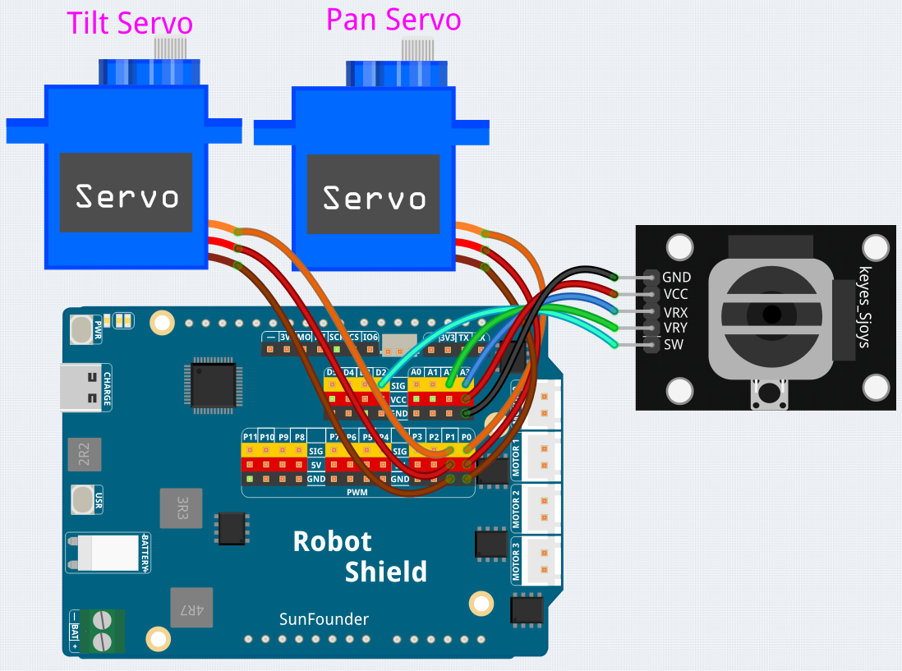

# 13 Joystick Servo

Control two servos (pan and tilt) with a joystick — push up/down to tilt, left/right to pan. Press the joystick button to reset both servos to center. Features **auto-calibration** of the joystick center position at startup and a **dead zone** to prevent drift when the stick is at rest.

## Libraries Used

- **RobotShield** library

## Hardware

- Pan Tilt Kit ×1
- Breadboard ×1
- Joystick module ×1
- USB-C cable ×1

## Wiring

Connect the joystick module to the UNO Q and the two servos to the Robot Shield's servo channels 0 and 1.

## How to Use the Example

1. Open **Arduino App Lab**.
2. Select **My Apps** → **Create New App** → **Import App** → **Import from Computer**.
3. Import `13 Joystick Servo.zip` from `unoq-ai-kit\basic`.
5. Connect the battery pack to the Robot Shield.
6. Click **Run**.
7. Wait one second for auto-calibration (don't touch the joystick). Then move the stick — the servos follow in real time. Press the stick down to reset both to 0°.

## How it Works

**Flow**

- `setup()` — configures the joystick button pin as `INPUT_PULLUP`, centers both servos at 0°, then auto-calibrates by averaging 20 X/Y reads
- `loop()` — handles the button reset, then reads the joystick axes and steps the servos by 1° when the stick leaves the dead zone

**Auto-calibration finds this joystick's center**

Every joystick rests at a slightly different voltage, so `setup()` reads X and Y 20 times and averages them. That measured average becomes "center" — no manual tuning, and the code adapts to *your* stick.

**The dead zone and incremental stepping**

At rest, the joystick voltage wobbles by a few counts — inside the ±100 band (`deadZone`) around center nothing happens, so the servo never creeps. Beyond the band, each `loop()` adds or subtracts just `stepSize` (1°) while the stick is held: hold it longer, move farther.

**Resetting with the button**

The button uses the `INPUT_PULLUP` pattern from Lesson 2 and reads `LOW` when pressed — one press jumps both servos back to center.

**Constrain keeps the servos in range**

The angles accumulate one degree at a time, so `constrain()` clamps them to ±45° — no matter how long you hold the stick, the servos stay within their safe range.

