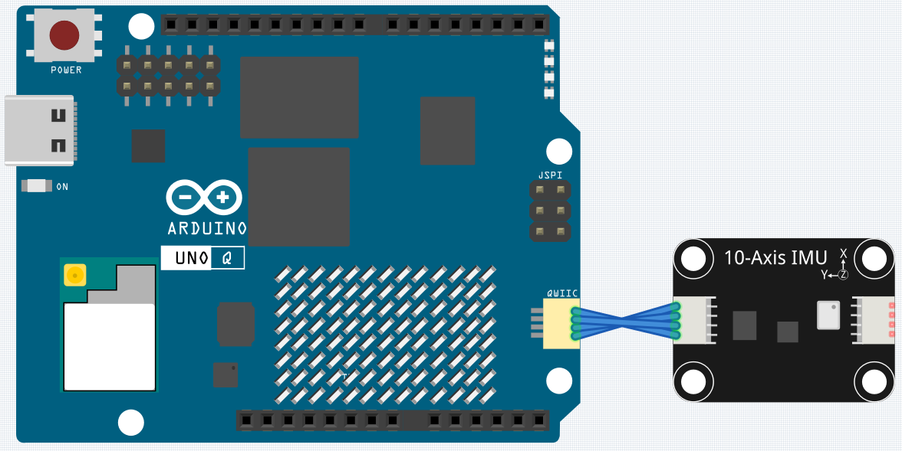

# 14 IMU Calibration

Calibrate the 10-axis IMU on the AVIO Carrier by placing the device in six orientations. Each sensor gets its own calibration method: the accelerometer uses six-face bias and scale calibration, the gyroscope uses stationary zero-rate bias calibration, and the magnetometer uses six-face hard-iron bias and axis scale correction.

## Libraries Used

- **SunFounder_IMU** library

## Hardware

- Pan Tilt Kit ×1
- 10-Axis IMU x1
- 4pin Cable x1
- USB-C cable ×1

## Wiring

The IMU is connected to the UNO Q QWIIC connector — no breadboard wiring needed, just attach the carrier to the UNO Q.

## How to Use the Example

1. Download [`14 IMU Calibration.zip`](https://github.com/sunfounder/unoq-ai-kit/releases/latest/download/14.IMU.Calibration.zip).
2. In App Lab, go to **Apps** → **Create New App** → **Import App** → **Import from Computer** and open the package you downloaded.
3. Click **Run** and switch to the **Serial Monitor** window.
4. Send any character once to display the first instruction: **Z face up**.
5. Place the device in the requested orientation and keep it completely still.
6. Send any character again to measure the current face.
7. Repeat the process for all six orientations.
8. Copy the printed constants into `calibration_data.h` in the **14 IMU Attitude** project.

> Keep the device away from magnets, speakers, motors, and large metal objects while calibrating the magnetometer.

## How it Works

**Flow**

- `setup()` — starts the Serial Monitor, waits for a connection, and initializes the IMU
- `loop()` — acts as a state machine: each character you send in the Serial Monitor advances from prompting to measuring to printing, stepping through all six orientations

**The six-face procedure**

For each orientation (Z up/down, X up/down, Y up/down), the sketch waits 500 ms for the device to settle, then averages 100 samples taken 10 ms apart. The six measurements expose each accelerometer axis to approximately +1 g and −1 g.

**Accelerometer**

`bias = (maximum + minimum) / 2` centers each axis, and `scale = 2 / (maximum - minimum)` maps the measured ±1 g span onto the true ±1 g.

**Gyroscope**

The device remains stationary during all six measurements, so the average reading is used as the zero-rate bias and scale stays 1.0. A stationary six-face procedure cannot measure gyroscope sensitivity — calculating scale from its tiny noise range would produce unstable values.

**Magnetometer**

Maximum and minimum values estimate hard-iron bias, and each axis's scale is adjusted toward the average half-range so the three axis ranges stay consistent while preserving the overall magnetic-field magnitude. This six-face method provides a practical basic correction — a full 3D rotation calibration is more accurate.

**The printed output**

When all six faces are done, the sketch prints the `ACCEL_BIAS`, `ACCEL_SCALE`, `GYRO_BIAS`, `GYRO_SCALE`, `MAG_BIAS`, and `MAG_SCALE` constants — copy them into `calibration_data.h` in the 14 IMU Attitude project.

