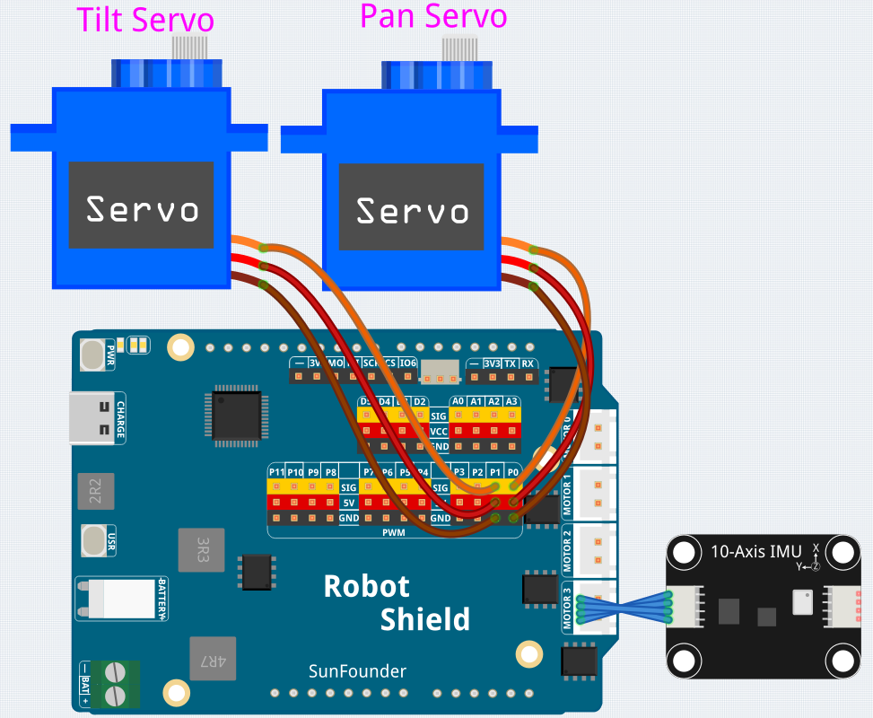

# 15 IMU Servo

Control two servos (pan and tilt) by tilting the board — no joystick, no buttons, just motion. The IMU's accelerometer measures gravity to calculate roll and pitch angles, which drive the servos in real time. Features multi-sample averaging, a dead zone to prevent jitter, and smooth incremental stepping for fluid motion.

## Libraries Used

- **Arduino_HardwareServo** library
- **SunFounder_IMU** library

## Hardware

- Pan Tilt Kit ×1
- 10-Axis IMU x1
- 4pin Cable x1
- USB-C cable ×1

## Wiring

The IMU is connected to the UNO Q QWIIC connector (no wiring needed); connect the pan servo to pin 9 and the tilt servo to pin 10 on the Robot Shield's servo headers.

## How to Use the Example

1. Open **Arduino App Lab**.
2. Select **Apps** → **Create New App** → **Import App** → **Import from Computer**.
3. Download [15 IMU Servo.zip](https://github.com/sunfounder/unoq-ai-kit/releases/latest/download/15.IMU.Servo.zip) and import it in **Arduino App Lab**.
4. Connect the battery pack to the Robot Shield.
5. Click **Run**.
6. Hold the board level — both servos center at 90°. Tilt left/right to pan, forward/back to tilt. The servos follow your motion smoothly.

## How it Works

**Flow**

- `setup()` — attaches both servos (pins 9 and 10) and centers them at 90°, initializes the IMU, and applies the calibration data from the IMU calibration project
- `loop()` — averages 10 accelerometer reads, converts them to roll/pitch angles, applies the dead zone, and steps the servos smoothly toward their targets

**Averaging the samples**

Every accelerometer read carries a little noise, so the loop sums `sampleCount` (10) reads before dividing once by the count — without averaging, the servos would twitch.

**Converting gravity to tilt angles**

When the board is level, gravity points down the Z axis; tilt it and gravity shifts onto X and Y. `atan2()` works out how far gravity shifted — the tilt angle in radians — and `* 180.0 / PI` converts to degrees, examining both arguments' signs for the correct angle in all four quadrants.

**Dead zone — a level board means still servos**

Tilts under `deadZone` (5°) are treated as exactly level, so the servos stay perfectly still when the board is nearly flat.

**Smooth stepping**

Each update moves a servo at most `maxStep` (2°) toward its target, and only when the difference reaches `updateThreshold` (2°) — flip the board quickly and the servo glides rather than snapping.

