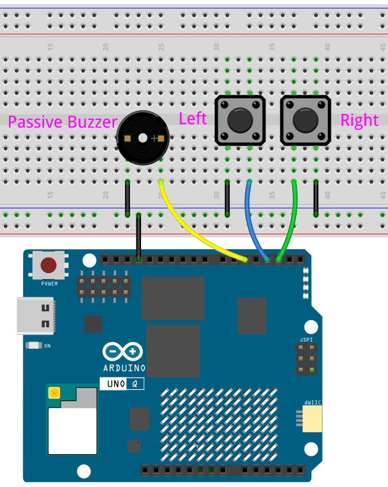

# 17 Opposite Reaction Game

Test your reaction skills! The LED matrix shows a left or right arrow at random — you must press the **opposite** button to score. A correct answer chirps the buzzer and moves to the next round. A wrong answer shows an X and sounds a continuous alarm until you restart.

## Hardware

- Arduino UNO Q ×1
- Breadboard ×1
- Push buttons ×2
- Passive buzzer ×1
- Jumper wires
- USB-C cable ×1

## Wiring

Connect the left button to D7 and the right button to D6, and the passive buzzer to D5.

## How to Use the Example

1. Open **Arduino App Lab**.
2. Select **Apps** → **Create New App** → **Import App** → **Import from Computer**.
3. Download [17 Opposite Reaction Game.zip](https://github.com/sunfounder/unoq-ai-kit/releases/latest/download/17.Opposite.Reaction.Game.zip) and import it in **Arduino App Lab**.
4. Click **Run**.
5. A smile appears, then an arrow. Press the opposite button — left arrow → right button, right arrow → left button. A correct answer shows a check mark with a short beep. A wrong answer shows an X with a continuous alarm. Press either button to restart.

## How it Works

**Flow**

- `setup()` — configures both buttons as `INPUT_PULLUP`, initializes the LED matrix and buzzer, seeds the random generator, then starts the first round
- `loop()` — polls both buttons; if game over, either button restarts; otherwise checks the pressed button against the current arrow

**The game logic**

`startRound()` randomly picks `LEFT` or `RIGHT` and displays the matching arrow. `checkAnswer()` compares the pressed button against the current arrow — correct only when the button is opposite to the arrow: left arrow needs right button, right arrow needs left button.

**Correct and wrong responses**

A correct answer shows a check mark and chirps the buzzer at 1200 Hz for 120 ms. A wrong answer shows an X and sounds the buzzer continuously at 350 Hz until either button restarts the game. `waitForButtonRelease()` prevents a single press from counting multiple times — a simple debounce that waits until both buttons are released.
