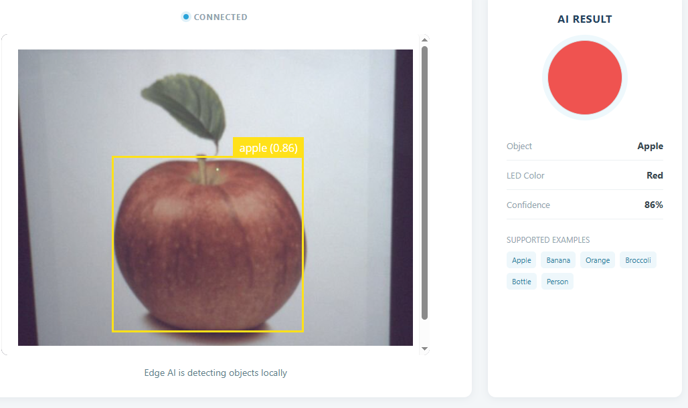

.. include:: /index.rst
   :start-after: start_hello_message
   :end-before: end_hello_message

03 AI Color Light
===================

In the face alarm project, the AI answered a yes-or-no question — is a face there? — and the buzzer had exactly one response. But real-world AI usually has to answer a richer question: not just *is something there*, but *what is it?* That is exactly what this project does. Point the camera at an apple, a banana, a water bottle, or a person — the model identifies the object, and the UNO Q lights an **RGB LED** in a matching color. Apple → red, banana → yellow, broccoli → green.

In this lesson, you will learn to:

* Filter the object-detection results down to the objects your project cares about
* Map each recognized object to a **color code** and send it to the sketch over Bridge
* Turn that single code number into three PWM brightness values that mix the right color
* Watch the Web UI report the object name, color, and confidence in real time

1. Setup
----------

**What You Need**

.. list-table::
   :widths: 25 25 25 25
   :header-rows: 0

   * - 1 * Pan Tilt Kit
     - 1 * :ref:`cpn_rgb_led`
     - 3 * :ref:`cpn_resistor` (220Ω)
     - 1 * USB-C Cable
   * - |list_pan_tilt|
     - |list_rgb_led|
     - |list_220ohm|
     - |list_usb_cable|

**Software Requirements**

This project uses the following Bricks:

* Bricks (declared in ``app.yaml``):

  * ``video_object_detection`` — runs the **general object-detection** model on every camera frame
  * ``web_ui`` — serves the Web UI with the live camera feed and the AI Result card

.. note::

   Before using the camera, make sure external carriers are enabled on your UNO Q — this is a one-time setup: :ref:`enable_external_carriers`.

**Wiring Diagram**

The RGB LED has **four legs**: the longest one is the **common cathode** — connect it to **GND** — and the other three are the red, green, and blue anodes, going to **D8**, **D7**, and **D6** respectively, each through its own 220Ω resistor. Never connect a channel directly to a pin without its resistor, or the LED can burn out.

.. image:: /img/wiring/wiring_rgb_led.png
   :width: 500
   :align: center

2. Run the App
----------------

#. Download :download:`03 AI Color Light.zip <https://github.com/sunfounder/unoq-ai-kit/releases/latest/download/03.AI.Color.Light.zip>`.
#. In App Lab, go to **Apps** → **Create new app** → **Import App** → **Import from Computer**, and open the package you downloaded.
#. Click the **Run** button (▶). The sketch starts with the LED switched off, then the app boots the camera and loads the AI model — give it a few seconds before the video appears.
#. Open the **Web UI** tab: the live camera feed on the left (the status changes from **Connecting** to **Connected**) and the **AI Result** card on the right. Hold a real apple up to the camera — at 45% confidence the LED glows **red** and the card shows ``apple`` / **Red** / the confidence percentage. Try a banana, a water bottle, then a person: each mapped object lights its own color (yellow, blue, white). Take the object out of view and after about **2 seconds** the LED switches off.

**How it Works**

You have just watched the LED choose a color on its own. Here is the path that decision travels, from a camera frame to colored light — and back to the page.

An App Lab project is a folder containing multiple files. Here's what each one does:

* ``03 AI Color Light/`` — the app folder

  * Bricks

    * ``video_object_detection`` — runs the general object-detection model on every camera frame, locally on the UNO Q
    * ``web_ui`` — serves the Web UI and pushes live updates to the browser

  * Sketch libraries

    * None — the sketch only uses the built-in Bridge library

  * Files

    * ``assets/``

      * ``index.html`` — Web UI structure (camera card and AI Result card)
      * ``app.js`` — Browser logic (Socket.IO client and card updates)
      * ``style.css`` — Visual styling
      * ``libs/`` — JavaScript libraries (Socket.IO)
      * ``img/`` — UI images (logo)
      * ``docs_assets/`` — Documentation images (result and wiring diagrams)

    * ``python/``

      * ``main.py`` — Camera, detection filtering, color mapping, and Bridge calls

    * ``sketch/``

      * ``sketch.yaml`` — Sketch configuration
      * ``sketch.ino`` — RGB LED control on the microcontroller

    * ``README.md`` — Project documentation and usage guide
    * ``app.yaml`` — App metadata (name, icon, bricks used)

The data path, from a camera frame to a lit RGB LED:

.. mermaid::

   sequenceDiagram
       participant C as Camera (CSI)
       participant P as Python (main.py)
       participant S as Sketch (sketch.ino)
       participant B as Browser (HTML/JS)

       C->>P: video frames
       P->>P: VideoObjectDetection → send_detections()
       P->>P: drop unmapped classes, keep the best confidence
       P->>S: Bridge.call("set_color", color_code)
       S->>S: setColor() → analogWrite() on D8/D7/D6
       P-->>B: object_color {object, color, hex, confidence}
       B->>B: update the AI Result card and the color swatch
       P->>S: 2 s without a mapped object → Bridge.call("set_color", 0)

Here's what each component does:

**Sketch (sketch.ino)** — runs on the STM32 MCU
  * ``setColor()`` is a ``switch`` over the color code it receives: 1 Red, 2 Yellow, 3 Orange, 4 Green, 5 Blue, 6 White, anything else Off
  * ``writeRgb()`` turns those three values into PWM brightness with ``analogWrite()`` on **D8**, **D7**, and **D6**
  * ``Bridge.provide("set_color", setColor)`` registers the function Python is allowed to call
  * ``loop()`` only delays — every color change arrives as an event

**Python (main.py)** — runs on the Linux MPU
  * ``VideoObjectDetection(camera, confidence=0.45, debounce_sec=0.3)`` runs the model locally, frame by frame
  * ``detection.on_detect_all(send_detections)`` hands every frame's results to your code
  * ``send_detections()`` ignores every class that is not in ``OBJECT_COLORS`` and keeps only the highest-confidence instance
  * ``Bridge.call("set_color", color_code)`` sends a single color code — and only when the object actually changes
  * ``ui.send_message("object_color", ...)`` publishes the object name, the color name, the HEX swatch value, and the confidence
  * ``clear_when_object_is_lost()`` runs in a background thread and switches the LED off after ``NO_OBJECT_TIMEOUT`` (2 seconds) without a mapped object

**Bridge** — the communication channel between the MPU and the MCU
  * Sketch side: ``Bridge.provide("set_color", setColor)`` exposes the color function
  * Python side: ``Bridge.call("set_color", color_code)`` invokes it with one integer
  * Python never sends raw red/green/blue values — the code number is the whole protocol

**Browser (HTML/JS)** — runs in the user's browser
  * ``socket.on('object_color', ...)`` writes the object name, the color name, and the confidence into the AI Result card
  * The HEX value that arrives with the same message paints the color swatch
  * The live video travels on its own channel: ``app.js`` embeds the camera stream from port 4912 in an ``<iframe>``
  * ``socket.on('connect')`` and ``socket.on('disconnect')`` drive the status dot

This project is a two-process team, and each process does what it is good at. On the Linux MPU, **Python decides what the camera sees** — the model runs entirely on the board, with no cloud and no internet required — and Python filters its output. On the STM32 MCU, the **sketch decides how the LED should light**, because it owns the pins. The link between them is a single small number: the color code.

* **Picking the best object** — The general model recognizes far more categories than this project needs, so ``send_detections()`` keeps only the six that matter: apple, banana, orange, broccoli, bottle, and person. When several mapped objects share the frame, only the instance with the highest confidence wins — hold an apple and a banana side by side and the LED follows whichever one the model is more sure about.

* **Sending a code, not colors** — Python looks up a tiny integer (1–6) for the object and sends that. The sketch's ``setColor()`` switch turns the code into PWM brightness, which keeps the protocol between the two processors small and easy to reason about: Python decides *what* the color is, the sketch decides *how* to produce it. Yellow is ``(255, 180, 0)`` and orange is ``(255, 64, 0)`` — tuned so the mixes read clearly on the LED instead of washing together.

* **Keeping the Web UI in sync** — With every mapped detection, ``publish_state()`` sends an ``object_color`` socket.io event carrying the object name, the color name, a HEX color for the swatch (for example ``#ef5350`` for Red), and the confidence as a percentage. The browser only renders what it receives — no model runs in the page.

* **The auto-off watchdog** — The background thread wakes every 0.2 seconds and checks the timestamp of the last mapped detection. If more than two seconds have passed, it sends code 0 (off) and publishes **No mapped object** / **Off** to the Web UI. That is why the LED lingers for a moment after you remove the object, then switches itself off — and why an unmapped object such as a book or a coffee cup never lights the LED at all.

3. Experiment
----------------

**Test the Mapped Objects**

Show each object to the camera and check the result:

.. list-table::
   :header-rows: 1
   :widths: 30 70

   * - Object
     - Expected Result
   * - A real apple
     - LED glows red; card shows ``apple`` / Red
   * - A banana
     - LED glows yellow; card shows ``banana`` / Yellow
   * - An orange
     - LED glows orange; card shows ``orange`` / Orange
   * - Broccoli
     - LED glows green; card shows ``broccoli`` / Green
   * - A water bottle
     - LED glows blue; card shows ``bottle`` / Blue
   * - A friend standing in front of the camera
     - LED glows white; card shows ``person`` / White

**Challenge: Two Objects at Once**

Hold an apple and a banana side by side in front of the camera. Watch the LED — it takes the color of whichever object the model is more confident about in the current frame, so it may hop between red and yellow as the confidence scores jitter. Watch the Confidence number in the Web UI while you move one object closer or further away — can you predict which color wins?

4. Troubleshooting
--------------------

**The Web UI shows a black screen (no camera feed)**

* **Cause:** The camera is not enabled, or the camera cable is loose.
* **Solution:** Enable external carriers (see :ref:`enable_external_carriers`), then check the camera's FFC ribbon cable — the blue side faces up and both ends must click securely.

**The Web UI detects the object, but the LED never lights**

* **Cause:** The RGB LED is wired wrong.
* **Solution:** Check the legs: the longest leg is the common cathode and must go to GND; the red, green, and blue anodes go to D8, D7, and D6, each through its own 220Ω resistor. If you skipped a resistor, the LED may already be damaged — replace it.

**The LED lights the wrong color**

* **Cause:** The three channels are swapped — for example the red anode is on D6 instead of D8.
* **Solution:** Re-check each anode against its pin: Red → D8, Green → D7, Blue → D6. Note that the anode order along the LED body doesn't have to match the pin order — what matters is which leg ends up on which pin.

**Some objects are never recognized**

* **Cause:** The model only knows the categories in the training data, and the project only responds to the six mapped ones.
* **Solution:** Test with real, well-lit objects that look like the training photos — a real apple rather than a toy, a clear water bottle rather than a metal flask — held 0.5–2 m from the camera and roughly centered. A cup or a book will never trigger the LED; that's the filter working as designed.

5. Summary
-------------

You just built a complete AI decision chain: the camera sees, the model classifies, Python chooses, and the LED obeys. In this lesson, you learned:

* How to filter detection results down to the classes your project responds to
* How to map each object to a single color code sent over Bridge — a small message that means a clear color
* How the sketch's ``setColor()`` switch turns the code into PWM values on three channels
* How a watchdog thread turns the LED off automatically when the object leaves

In the next project the camera turns away from the desk and toward *you*. Instead of naming an object, the AI reads a hand signal — and the gesture you make will switch an LED on or off.
