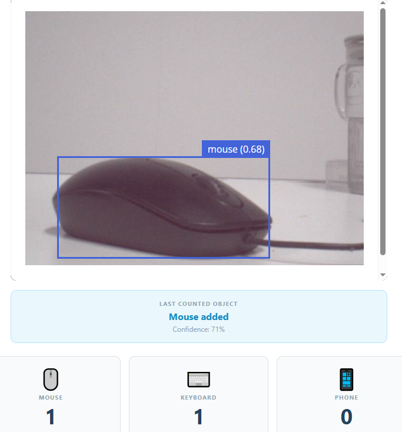

.. include:: /index.rst
   :start-after: start_hello_message
   :end-before: end_hello_message

05 AI Object Counter
======================

The gesture project read *you* — one hand signal, one LED. This project goes back to watching the world, but asks a different kind of question: not *what is it?* but *how many?* Many real systems need a running tally: how many boxes passed on a conveyor belt, how many people walked through a door. In this lesson, you'll build an AI counter. The UNO Q watches the camera and counts how many times three everyday objects appear — a computer **mouse**, a **keyboard**, and a **cell phone** — showing the totals live in a Web UI and announcing every new count out loud.

In this lesson, you will learn to:

* Filter detection results down to exactly three target classes
* Count detection **events**, not video frames — the core trick behind any AI counter
* Use re-arm state so the same object is never counted twice in one appearance
* See live counts in the Web UI and reset them with a button
* Announce each new count with online text-to-speech

1. Setup
----------

**What You Need**

.. list-table::
   :widths: 25 25 25 25
   :header-rows: 0

   * - 1 * Pan Tilt Kit
     - 1 * USB-C Cable
     - -
     - -
   * - |list_pan_tilt|
     - |list_usb_cable|
     - -
     - -

All the hardware is already on the kit: the camera sees the objects, and the Multimedia Carrier's built-in speaker does the talking — no breadboard wiring needed.

To test the project, gather three objects you probably already have nearby: a computer **mouse**, a **keyboard**, and a **cell phone**. The spoken announcements use an online text-to-speech voice, so the UNO Q also needs an **internet connection**.

.. note::

   Before using the camera, make sure external carriers are enabled on your UNO Q — this is a one-time setup: :ref:`enable_external_carriers`.

2. Code
----------

**Import the Code**

#. Open **Arduino App Lab**, go to **Apps**. Click the dropdown arrow next to **Create new app +** and select **Import App**.

   .. image:: /img/app_import_app.png
      :width: 600
      :align: center

#. Select **Import from Computer**.

   .. image:: /img/app_import_pc.png
      :width: 600
      :align: center

#. Navigate to the ``unoq-ai-kit/edge_ai/`` folder and select ``05 AI Object Counter.zip``.

#. The app appears in **Apps** — click it to open.

**Run the Code**

#. Click the **Run** button (▶). The output console prints:

   ``AI Object Counter is running. Show one mouse, keyboard, or cell phone at a time.``

   The sketch in this project is just an empty stub — every part that matters runs on the Linux MPU.

#. While the TTS engine prepares itself, the console prints ``TTS ready.``

   .. note::

      The first time you run a TTS example on this UNO Q, App Lab needs to download and prepare the TTS runtime and audio dependencies. This may take half an hour or more, depending on your network connection. Keep the UNO Q connected to the Internet and wait for the setup to complete. This setup only happens once — after it finishes, every TTS example starts much faster.

#. Open the **Web UI** tab. You'll see the live camera feed, three counter cards — MOUSE, KEYBOARD, and PHONE, all at 0 — and a **TOTAL OBJECTS** counter. The panel above the cards reads "Show one object to the camera".

#. Hold a computer mouse in front of the camera. When the model reaches **60% confidence**, the mouse counter changes from 0 to 1 with a +1 flash, the panel reads **Mouse added** with the confidence percentage, the speaker says *"Mouse detected"*, and the console prints a line like:

   ``Counted mouse: 1 (87%)``

#. Keep the mouse in view — the counter stays at 1 no matter how long it stays. Move the mouse away completely and show it again: the counter goes to 2, then 3, and so on for every new appearance. Repeat with a keyboard and a cell phone — each has its own counter, and the speaker announces *"Keyboard detected"* and *"Cell phone detected"*.

#. Click **RESET COUNTS** — all three counters and the total return to 0.

**The Code**

**Python (main.py)** — runs on the Linux MPU: detection, counting logic, Web UI, and speech

.. code-block:: python
   :linenos:

   # SPDX-FileCopyrightText: Copyright (C) Arduino s.r.l. and/or its affiliated companies
   # SPDX-License-Identifier: MPL-2.0

   """AI Object Counter.

   Detect mice, keyboards, and cell phones and count each new appearance once.
   An object must leave the camera view before the same class can be counted again.
   Each new count is also announced through online text-to-speech.
   """

   import queue
   import threading

   from arduino.app_utils import App
   from arduino.app_bricks.web_ui import WebUI
   from arduino.app_bricks.video_objectdetection import VideoObjectDetection
   from arduino.app_peripherals.camera import Camera
   from sunfounder_tts import EdgeTTS

   TARGETS = ("mouse", "keyboard", "cell phone")
   CONFIDENCE_THRESHOLD = 0.60
   MISSING_FRAMES_TO_REARM = 10
   TTS_VOICE = "en-US-JennyNeural"
   TTS_VOLUME = 50

   SPEECH_TEXT = {
       "mouse": "Mouse detected",
       "keyboard": "Keyboard detected",
       "cell phone": "Cell phone detected",
   }

   ui = WebUI()

   camera = Camera(adjustments=lambda frame: frame[::-1, :])
   camera.start()

   detection = VideoObjectDetection(
       camera,
       confidence=CONFIDENCE_THRESHOLD,
       debounce_sec=0.2,
   )

   state_lock = threading.Lock()
   counts = {label: 0 for label in TARGETS}
   armed = {label: True for label in TARGETS}
   missing_frames = {label: 0 for label in TARGETS}
   last_detection = None
   speech_queue = queue.Queue()

   def speech_worker():
       """Play queued messages without blocking object detection."""
       try:
           tts = EdgeTTS()
           tts.set_voice(TTS_VOICE)
           tts.set_volume(TTS_VOLUME)
           print("TTS ready.", flush=True)

           while True:
               text = speech_queue.get()

               try:
                   tts.say(text)
               except Exception as error:
                   print(
                       f"TTS error: {type(error).__name__}: {error}",
                       flush=True,
                   )
               finally:
                   speech_queue.task_done()

       except Exception as error:
           print(
               f"TTS startup failed: {type(error).__name__}: {error}",
               flush=True,
           )

   def speak(label):
       """Queue the spoken name for a newly counted object."""
       speech_queue.put(SPEECH_TEXT[label])

   def public_state():
       """Return the counter state for the Web UI."""
       with state_lock:
           return {
               "counts": dict(counts),
               "total": sum(counts.values()),
               "last_detection": (
                   dict(last_detection) if last_detection else None
               ),
           }

   def publish_state():
       ui.send_message("counter_state", public_state())

   def reset_counts():
       """Reset all counters without changing the current detection locks."""
       global last_detection

       with state_lock:
           for label in TARGETS:
               counts[label] = 0
           last_detection = None

       publish_state()
       return public_state()

   ui.expose_api("GET", "/state", public_state)
   ui.expose_api("POST", "/reset-counts", reset_counts)

   def on_detection(detections: dict):
       """Count a target once, then wait until it leaves before rearming."""
       global last_detection

       counted_items = []

       with state_lock:
           for label in TARGETS:
               instances = detections.get(label, [])
               best_confidence = max(
                   (
                       instance.get("confidence", 0)
                       for instance in instances
                   ),
                   default=0,
               )
               present = best_confidence >= CONFIDENCE_THRESHOLD

               if present:
                   missing_frames[label] = 0

                   if armed[label]:
                       counts[label] += 1
                       armed[label] = False
                       counted_items.append((label, best_confidence))
               elif not armed[label]:
                   missing_frames[label] += 1

                   if missing_frames[label] >= MISSING_FRAMES_TO_REARM:
                       armed[label] = True
                       missing_frames[label] = 0

           if counted_items:
               counted_label, counted_confidence = counted_items[-1]
               last_detection = {
                   "object": counted_label,
                   "confidence": round(counted_confidence * 100),
               }

       if counted_items:
           for counted_label, counted_confidence in counted_items:
               speak(counted_label)
               print(
                   f"Counted {counted_label}: "
                   f"{counts[counted_label]} "
                   f"({counted_confidence:.0%})",
                   flush=True,
               )

           publish_state()

   detection.on_detect_all(on_detection)

   threading.Thread(target=speech_worker, daemon=True).start()

   print(
       "AI Object Counter is running. "
       "Show one mouse, keyboard, or cell phone at a time.",
       flush=True,
   )

   App.run()

**How it Works**

.. code-block:: text

   CSI camera
       │
       ▼
   VideoObjectDetection brick (confidence ≥ 0.60, debounce 0.2 s)
       │
       ▼
   on_detection() — one pass per target class (mouse, keyboard, cell phone)
       │
       ├── present (best confidence ≥ 60%)?
       │       └── class armed?  →  count + 1, disarm, speak, publish
       │
       └── absent and disarmed?
               └── missing_frames + 1
                       │
                       ▼
               missing_frames ≥ 10  →  rearm the class
       │
       ▼
   Web UI: counter_state event → card +1, TOTAL update, "Mouse added"
   Speech:  queue → worker thread → EdgeTTS says "Mouse detected"

* **Counting events, not frames** — The detector processes many video frames every second. If the program incremented a counter on every frame where a mouse appeared, a single mouse sitting on the desk would rack up hundreds of counts. So ``on_detection()`` first decides *presence*: a class is present when its best instance confidence in this frame is at least ``CONFIDENCE_THRESHOLD`` (0.60) — the same 60% you saw printed in the console. Only a change in that presence state is worth counting.

* **The armed / re-arm pattern** — Each class starts ``armed``. The first time a present class is seen while armed, its counter goes up by one and the class is *disarmed*. From then on, the only thing that matters is absence: the class must be missing from the frame for ``MISSING_FRAMES_TO_REARM`` (10) consecutive detection passes before it is rearmed and can be counted again. In plain language: the object must fully leave the camera view before the same class earns another count. This is the heart of the lesson — a small state machine that turns noisy, frame-by-frame detections into clean, human-meaningful events.

* **The Web UI as a live dashboard** — ``publish_state()`` sends a ``counter_state`` socket.io event carrying the per-class counts, the total, and the most recently counted object with its confidence, so the browser can show the +1 animation and the "Mouse added" panel. The state is also exposed as web APIs: the page fetches ``GET /state`` when it connects, and the **RESET COUNTS** button posts to ``POST /reset-counts``. Notice that reset deliberately leaves the armed flags untouched — if an object is still on screen when you reset, it won't be counted again until it leaves the view and comes back. The Web UI is pure presentation; it could never cheat the count, because the counting itself happens only in Python.

* **Speech that never blocks vision** — Announcing every count by calling the TTS engine directly in the detection callback would pause detection while the audio renders. Instead, ``speak()`` only puts text into a ``speech_queue``, and a separate worker thread consumes the queue — ``EdgeTTS`` synthesizes each phrase with the ``en-US-JennyNeural`` voice at volume 50 while detection keeps running. EdgeTTS is an online service: it needs internet access but no API key, and if speech fails for any reason the console prints a ``TTS error: ...`` or ``TTS startup failed: ...`` line while counting and the Web UI continue working.

* **Everything is tunable** — The behavior of the whole project lives in five constants at the top of ``main.py``: ``TARGETS`` (which classes appear in the Web UI), ``CONFIDENCE_THRESHOLD`` (how sure the model must be), ``MISSING_FRAMES_TO_REARM`` (how long an object must be gone), ``TTS_VOICE``, and ``TTS_VOLUME``. Change a value, click Run again, and watch how the counter behaves differently.

3. Experiment
----------------

**Count Each Target Object**

Show the objects to the camera one at a time and check the results:

.. list-table::
   :header-rows: 1
   :widths: 30 70

   * - What you do
     - Expected result
   * - Hold up a computer mouse until it counts
     - Mouse counter +1; panel shows "Mouse added"; speaker says "Mouse detected"
   * - Hold up a keyboard
     - Keyboard counter +1; panel shows "Keyboard added"; speaker says "Keyboard detected"
   * - Hold up a cell phone
     - Phone counter +1; panel shows "Cell Phone added"; speaker says "Cell phone detected"
   * - Keep the same object in view for a long time
     - Its counter stays exactly where it was — no repeat counting
   * - Remove the object completely, then show it again
     - Its counter goes up by one more for every new appearance
   * - Click **RESET COUNTS**
     - All counters and the total return to 0

**Challenge: Where Does the Counter Stop?**

Walk backwards while holding a mouse until the model's confidence drops below 60% — that's the moment counting stops. Try each object: which one stays recognizable from the farthest distance? Then repeat in dim light and note how much closer you have to stand. The 60% line is not a wall; confidence drifts with distance, lighting, and angle, and the counter only trusts detections above the line.

**Challenge: Two Targets at Once**

Show a mouse and a keyboard together in the same frame. Each class has its own armed state, so both counters rise together — one count each. Now hold up two mice at the same time: only one count appears, because the *class* is counted, not individual instances. What happens if you remove one mouse while the other stays? Watch the counter card and try to predict the rearm behavior.

4. Troubleshooting
--------------------

**The counters never increase, even with an object in view**

* **Cause:** The model's confidence stays below the 60% threshold — the object is too far, too small, poorly lit, or not one of the three target classes.
* **Solution:** Hold the object 0.5–1.5 m from the camera, roughly centered, in good light. Only mice, keyboards, and cell phones are counted — a notebook or coffee cup will never move a counter, by design.

**An object counts twice while it never left the view**

* **Cause:** The object briefly left the frame — or was only half-visible at the edge — for the 10-frame rearm window, so the class armed itself again.
* **Solution:** Keep the object fully and continuously in view for one appearance. For a clean sequence, remove it completely between appearances, as the Web UI hint says: "Remove the object from view before counting another one."

**Counting works in the Web UI, but there is no voice**

* **Cause:** The TTS runtime is still being prepared on the first run, the internet connection is down, or the TTS engine failed to start.
* **Solution:** Wait for the one-time TTS setup described in the note above and keep the UNO Q online — EdgeTTS synthesizes speech in the cloud, so it needs internet on every run. Watch the console: it should print ``TTS ready.``; if it prints ``TTS startup failed: ...`` instead, check the network and run the app again. Counting and the Web UI keep working either way.

**RESET COUNTS returns to zero, but the object on screen isn't counted again**

* **Cause:** Reset zeroes the counters but deliberately leaves the armed states untouched.
* **Solution:** Remove the object from view and show it again — once it has been absent long enough to rearm, the next appearance counts as a fresh event.

**The Web UI shows a black screen or "Disconnected"**

* **Cause:** The camera is not enabled, the app stopped running, or the board disconnected.
* **Solution:** Enable external carriers (see :ref:`enable_external_carriers`) and check the camera's FFC ribbon cable — the blue side faces up and both ends must click securely. Then click **Run** in App Lab and check the USB-C cable is firmly connected at both ends.

5. Summary
-------------

You built your first AI *event counter* — not just a classifier, but a small state machine that turns a stream of frames into meaningful events. In this lesson, you learned:

* How to filter detections to the three classes your project targets
* Why counting events instead of frames matters, and how the armed/rearm pattern makes it work
* How to expose live state and actions to a Web UI through socket.io events and web APIs
* How a speech worker thread adds voice feedback without ever blocking detection

In the next project, gestures come back — and this time they do more than switch a light. One gesture tilts the camera, another returns it to the centre, another takes a photo, and the UNO Q tells you out loud what it just did.
