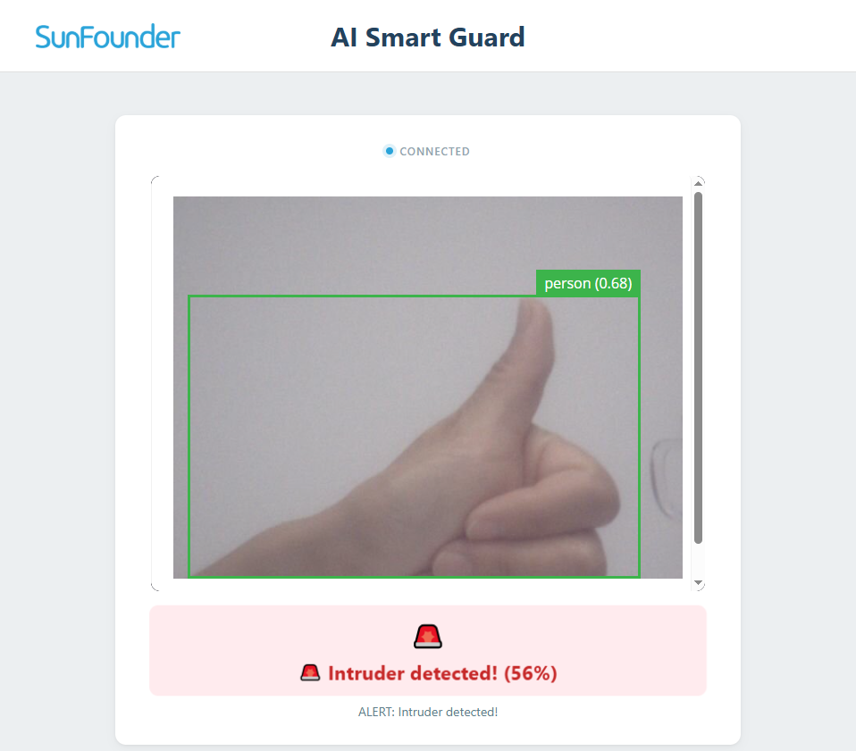

.. include:: /index.rst
   :start-after: start_hello_message
   :end-before: end_hello_message

08 AI Smart Guard
=================

You've watched your camera detect faces, track them, and speak — now it's time to give it a job. In this lesson you'll build the **AI Smart Guard**: a complete security sentry that patrols the room by sweeping its camera back and forth, and the moment it spots an intruder — a whole **person**, not just a face — it turns red, screams an alarm, and announces the intruder out loud. When the coast is clear, it settles back into green, silent patrol. It is the largest vision project in this module: detection, motion, light, sound, and voice, all fused into one autonomous system.

In this lesson, you will learn to:

* Detect **people** (full bodies) with a general object-detection model — not just faces
* Build a two-state system — **patrolling** and **alarming** — shared across Python and the sketch
* Coordinate three outputs at once: servo scanning, an RGB LED, and a buzzer
* Rate-limit spoken alerts so the guard warns without nagging
* Auto-recover: return to patrol after the intruder has been gone for 3 seconds

1. Setup
----------

**What You Need**

.. list-table::
   :widths: 25 25
   :header-rows: 0

   * - 1 * Pan Tilt Kit
     - 1 * :ref:`cpn_rgb_led` (common cathode)
   * - 3 * :ref:`cpn_resistor` (220Ω)
     - 1 * :ref:`cpn_buzzer` (active)
   * - |list_pan_tilt|
     - |list_rgb_led|
   * - |list_220ohm|
     - |list_active_buzzer|

**Software Requirements**

This project uses the following Bricks and sketch library:

* Bricks (declared in ``app.yaml``):
  * ``video_object_detection`` — runs the **general object-detection** model on every camera frame
  * ``web_ui`` — serves the Web UI with the live camera feed and guard status
  * ``sunfounder_tts`` — text-to-speech for the voice alerts (EdgeTTS)
* Libraries (declared in ``sketch.yaml``):
  * ``Arduino_HardwareServo`` (0.0.1) — drives the servos with hardware PWM

.. note::

   Before using the camera, make sure external carriers are enabled on your UNO Q — this is a one-time setup: :ref:`enable_external_carriers`.

.. note::

   The first time you run a TTS example on this UNO Q, App Lab needs to download and prepare the TTS runtime and audio dependencies. This may take half an hour or more, depending on your network connection. Keep the UNO Q connected to the Internet and wait for the setup to complete. This setup only happens once — after it finishes, every TTS example starts much faster.

**Wiring Diagram**

Wire the RGB LED with the same layout as the color mixing project earlier: the **common cathode** (the longest leg) goes to **GND**, and the red, green, and blue anodes go to **D8**, **D7**, and **D6** — each through its own 220Ω resistor. The active buzzer's **+** leg goes to **D5** and its **−** leg to **GND**. The pan and tilt servos plug straight into **D9** and **D10** on the Robot Shield's servo headers; they need no breadboard wiring.

.. image:: /img/wiring/wiring_smart_guard.png
   :width: 600
   :align: center

**Person Detection vs. Face Detection**

Why does the guard watch for whole people instead of faces? Because the two jobs need two different models. The **face-detection** model you used earlier only fires on a clear view of a face — eyes, nose, and mouth. The **general object-detection** model this project uses reports a "person" class for a full body, so it still works when someone faces away, wears a mask or sunglasses, or is partly hidden. A greeter wants faces; a guard wants intruders — and an intruder usually doesn't cooperate by facing the camera.

2. Code
----------

**Import the Code**

#. Open **Arduino App Lab**, go to **Apps**. Click the dropdown arrow next to **Create new app +** and select **Import App**.

   .. image:: /img/app_import_app.png
      :width: 600
      :align: center

#. Select **Import from Computer**.

   .. image:: /img/app_import_pc.png
      :width: 600
      :align: center

#. Navigate to the ``unoq-ai-kit/edge_ai/`` folder and select ``08 AI Smart Guard.zip``.

#. The app appears in **Apps** — click it to open.

**Run the Code**

#. The pan-tilt servos draw more power than the USB port alone can provide, so connect the battery pack to the Robot Shield.

#. Click the **Run** button (▶). The RGB LED glows **green** and the pan servo starts sweeping slowly from side to side like a watchman. The sketch prints its banner, ``=== AI Smart Guard Ready ===``, over the serial connection, and the Console shows ``🛡️  AI Smart Guard is running.`` followed by ``🔊 TTS ready.`` once the speech engine is up.

#. Open the **Web UI** tab. The live camera feed fills the page, and the guard panel shows a green dot — **All clear — scanning** — with the note "AI Smart Guard protecting the perimeter."

#. Walk in front of the camera. The guard snaps to **red**, the buzzer starts beeping, the scanning stops, and you hear the voice alert: *"Intruder detected. Intruder detected."* The Web UI switches to the red alert panel: **🚨 Intruder detected! (100%)**.

#. Step out of view and count to four. After about 3 seconds without seeing you, the guard returns to **green**, the buzzer falls silent, the servo resumes its patrol sweep, and the speaker announces *"All clear."*

**The Code**

The project has two files that run on two different processors:

* ``sketch/sketch.ino`` — runs on the STM32 MCU and owns all the hardware: servo sweep, RGB LED, buzzer
* ``python/main.py`` — runs on the Linux MPU: person detection, the alarm decisions, and the voice alerts

.. code-block:: cpp
   :linenos:

   /*
    * AI Smart Guard
    *
    * Full security system: servo scanning, RGB status, buzzer alarm.
    * All controlled from Python via Bridge:
    *   alarm_on()       → red LED + buzzer + stop scan
    *   alarm_off()      → green LED + buzzer off + resume scan
    *   guard_status()   → Python polls this for current state
    *
    * Hardware:
    *   D9 = pan servo, D10 = tilt servo
    *   D8=R, D7=G, D6=B  (RGB LED)
    *   D5 = active buzzer
    */

   #include <Arduino_RouterBridge.h>
   #include <Arduino_HardwareServo.h>

   HardwareServo panServo;
   HardwareServo tiltServo;

   const int RED_LED_PIN = 8;
   const int GREEN_LED_PIN = 7;
   const int BLUE_LED_PIN = 6;
   const int BUZZER_PIN = 5;
   const int PAN_SERVO_PIN = 9;
   const int TILT_SERVO_PIN = 10;

   const int MIN_PAN_ANGLE = 45;
   const int MAX_PAN_ANGLE = 135;
   const int CENTER_ANGLE = 90;
   const int SCAN_STEP = 1;
   const unsigned long scanInterval = 40;

   int panAngle = CENTER_ANGLE, scanDir = 1;
   bool scanning = true, alarming = false;
   unsigned long lastScan = 0, lastBeep = 0;
   bool beepState = false;

   void setRgb(int red, int green, int blue) {
       analogWrite(RED_LED_PIN, red);
       analogWrite(GREEN_LED_PIN, green);
       analogWrite(BLUE_LED_PIN, blue);
   }

   // ---- Bridge commands ----

   void alarm_on() {
       if (alarming) return;
       alarming = true;
       scanning = false;

       // Red LED
       setRgb(255, 0, 0);
   }

   void alarm_off() {
       if (!alarming) return;
       alarming = false;
       scanning = true;
       digitalWrite(BUZZER_PIN, LOW);

       // Green LED (all clear)
       setRgb(0, 255, 0);
   }

   // ---- Setup ----

   void setup() {
       Serial.begin(115200);

       panServo.attach(PAN_SERVO_PIN);
       tiltServo.attach(TILT_SERVO_PIN);
       panServo.write(CENTER_ANGLE);
       tiltServo.write(CENTER_ANGLE);

       pinMode(RED_LED_PIN, OUTPUT);
       pinMode(GREEN_LED_PIN, OUTPUT);
       pinMode(BLUE_LED_PIN, OUTPUT);
       pinMode(BUZZER_PIN, OUTPUT);
       digitalWrite(BUZZER_PIN, LOW);

       // Start with green (all clear)
       setRgb(0, 255, 0);

       Bridge.begin();
       Bridge.provide("alarm_on", alarm_on);
       Bridge.provide("alarm_off", alarm_off);

       Serial.println("=== AI Smart Guard Ready ===");
   }

   // ---- Loop ----

   void loop() {
       if (alarming) {
           // Beep pattern: 150ms on / 150ms off
           unsigned long now = millis();
           if (now - lastBeep >= 150) {
               lastBeep = now;
               beepState = !beepState;
               digitalWrite(BUZZER_PIN, beepState ? HIGH : LOW);
           }
           return;
       }

       // Scanning mode
       if (!scanning) { delay(20); return; }

       unsigned long now = millis();
       if (now - lastScan < scanInterval) return;
       lastScan = now;

       panAngle += scanDir * SCAN_STEP;
       if (panAngle >= MAX_PAN_ANGLE) {
           panAngle = MAX_PAN_ANGLE;
           scanDir = -1;
       }
       else if (panAngle <= MIN_PAN_ANGLE) {
           panAngle = MIN_PAN_ANGLE;
           scanDir = 1;
       }

       panServo.write(panAngle);
   }

.. code-block:: python
   :linenos:

   # SPDX-FileCopyrightText: Copyright (C) Arduino s.r.l. and/or its affiliated companies
   #
   # SPDX-License-Identifier: MPL-2.0

   """
   AI Smart Guard

   A complete security system:
     - Servo scans left/right (green LED = all clear)
     - Person detected → red LED, buzzer alarm, servo tracks,
       TTS announces "Intruder detected"
     - Person lost for 3 seconds → returns to green/scanning
   """

   import queue
   import threading
   import time
   from datetime import datetime, UTC

   from arduino.app_utils import App, Bridge
   from arduino.app_bricks.web_ui import WebUI
   from arduino.app_bricks.video_objectdetection import VideoObjectDetection
   from arduino.app_peripherals.camera import Camera
   from sunfounder_tts import EdgeTTS

   # ---- Web UI ----
   ui = WebUI()

   # ---- Camera + Detection ----
   camera = Camera(adjustments=lambda frame: frame[::-1, :])
   camera.start()

   detection = VideoObjectDetection(
       camera,
       confidence=0.4,
       debounce_sec=0.5,
   )

   # ---- State ----
   intruder_visible = False
   last_intruder_time = 0.0
   state_lock = threading.Lock()
   LOST_TIMEOUT = 3.0  # seconds before all-clear
   last_spoke_alert = 0.0     # prevent TTS spam

   # ---- Voice ----
   ALERT_TEXT = "Intruder detected. Intruder detected."
   CLEAR_TEXT = "All clear."
   speech_queue = queue.Queue()

   def speech_worker():
       """Background TTS worker."""
       try:
           tts = EdgeTTS()
           tts.set_voice("en-US-JennyNeural")
           tts.set_volume(50)

           print("🔊 TTS ready.")

           while True:
               text = speech_queue.get()
               try:
                   tts.say(text)
               except Exception as e:
                   print(f"TTS error: {e}")
               finally:
                   speech_queue.task_done()
       except Exception as e:
           print(f"TTS init failed: {e}")

   def speak(text):
       if text:
           speech_queue.put(str(text))

   # ---- Detection callback ----

   def person_detected():
       """Called each time the model detects a person."""
       global intruder_visible, last_intruder_time, last_spoke_alert

       now = time.monotonic()

       with state_lock:
           last_intruder_time = now

           if not intruder_visible:
               intruder_visible = True
               Bridge.call("alarm_on")

       # Only speak once every 8 seconds to avoid spamming
       if now - last_spoke_alert > 8.0:
           last_spoke_alert = now
           speak(ALERT_TEXT)

       ui.send_message("guard_status", {
           "alert": True,
           "confidence": 100,
           "message": "🚨 Intruder detected!",
           "timestamp": datetime.now(UTC).isoformat(),
       })

   def monitor_guard():
       """Background: return to all-clear after timeout."""
       global intruder_visible

       while True:
           should_clear = False

           with state_lock:
               if intruder_visible:
                   if time.monotonic() - last_intruder_time >= LOST_TIMEOUT:
                       intruder_visible = False
                       should_clear = True

           if should_clear:
               Bridge.call("alarm_off")
               speak(CLEAR_TEXT)

               ui.send_message("guard_status", {
                   "alert": False,
                   "confidence": 0,
                   "message": "✅ All clear — scanning",
                   "timestamp": datetime.now(UTC).isoformat(),
               })

           time.sleep(0.2)

   # ---- Start ----

   detection.on_detect("person", person_detected)

   threading.Thread(target=speech_worker, daemon=True).start()
   threading.Thread(target=monitor_guard, daemon=True).start()

   print("🛡️  AI Smart Guard is running.")

   App.run()

**How it Works**

.. code-block:: text

   Two states, decided in Python, executed in the sketch:

   PATROLLING (green LED, buzzer silent)
   ├── sketch sweeps the pan servo 45° → 135° → 45°, 1° every 40 ms
   ├── Python detects a "person" (confidence > 0.4) → alarm_on
   └── Bridge.call("alarm_on")

   ALARMING (red LED, buzzer beeping, servo frozen)
   ├── sketch: RGB red, buzzer toggles every 150 ms, no scanning
   ├── Python: speak "Intruder detected. Intruder detected."
   │           (throttled to once per 8 s) → Web UI: 🚨 Intruder detected! (100%)
   └── monitor thread: no person seen for 3 s → Bridge.call("alarm_off")
              └── back to PATROLLING: green LED, buzzer off, servo resumes sweep
                   └── speak "All clear."

**The sketch owns the hardware** — All three outputs live in one file on the STM32 MCU. During normal patrol, ``loop()`` sweeps the pan servo between 45° and 135° by moving it one degree every 40 ms (``scanInterval``) — the tilt servo just holds its 90° center. When ``alarm_on()`` arrives over Bridge, the sketch flips two flags: ``alarming = true`` (the loop now spends its time toggling the buzzer every 150 ms — a classic beep-beep-beep alarm, without any ``delay()`` blocking) and ``scanning = false`` (the servo freezes, locking the camera on the intruder's position). ``alarm_off()`` reverses everything: it silences the buzzer, sets the RGB back to green, and lets the sweep resume. Guard functions inside the sketch also prevent double-triggering: calling ``alarm_on()`` twice in a row does nothing.

**The RGB LED doubles as a status lamp** — ``setRgb()`` writes three channels with ``analogWrite()``: red on **D8**, green on **D7**, blue on **D6**. Green means *patrolling — all clear*; red means *intruder!* Because this is a common-cathode LED, a channel lights when its pin goes high, so full brightness is 255. The buzzer on **D5** is an *active* buzzer — it generates its own tone, so the sketch only needs to switch its power on and off.

**Python decides, the sketch executes** — The `person_detected()` callback fires each time the model reports a person, and it is the heart of the guard logic. A person was already being watched? Then nothing happens — the flags are guarded. But the **first** sighting flips ``intruder_visible`` and fires ``Bridge.call("alarm_on")``. The detection config itself is tuned for security: confidence threshold **0.4** (generous enough to catch people at a distance) and a **0.5 s** debounce (brief flickers in the model output are ignored). The ``VideoObjectDetection`` brick is used *without* a ``face-detection`` model this time, so the underlying general model reports any of its ~80 classes — and Python subscribes only to **"person"** with ``detection.on_detect("person", person_detected)``.

**The guard never nags** — Speaking takes seconds, and the intruder stays in view — if Python announced the alert on every detection, the speaker would be screaming continuously. A timestamp, ``last_spoke_alert``, throttles the voice: the message "Intruder detected. Intruder detected." is spoken at most **once every 8 seconds**, no matter how many detections arrive. The alert text is deliberately repeated so it stays audible above the buzzer. The Web UI panel updates on every detection, showing **🚨 Intruder detected! (100%)**.

**All clear, automatically** — A background monitor thread checks every 0.2 s whether any person detection has refreshed ``last_intruder_time`` within the last **3 seconds**. When the intruder leaves (or hides) long enough, the thread flips the state back: ``Bridge.call("alarm_off")``, a spoken *"All clear."*, and the Web UI's green **All clear — scanning** panel. The guard is then ready for its next intruder — no button, no human in the loop.

3. Experiment
----------------

**Test the Guard**

Try each of these scenarios with the app running and watch the whole system respond:

.. list-table::
   :header-rows: 1
   :widths: 40 60

   * - What you do
     - What the system does
   * - Walk into the camera's view
     - RGB turns red, buzzer beeps, servo freezes, voice alert plays, Web UI shows the red alert panel
   * - Keep moving around in front of the camera
     - Stays red and beeping; the voice repeats at most once every 8 seconds
   * - Leave the view and stay away
     - After 3 seconds: green LED, silent buzzer, scanning resumes, "All clear." is spoken
   * - Walk in with your **back** to the camera
     - Still triggers — person detection sees full bodies, not just faces
   * - Put a coat or backpack on a chair in view
     - May trigger — person-shaped objects can fool the model (that's what the next experiment is about)

**Challenge: Reduce False Alarms**

Hang a coat on a chair and place it in the camera's view. Does the guard raise an alarm on it? The sensitivity lives in one number in ``main.py``: ``confidence=0.4``. Try raising it to ``0.6`` and then ``0.8`` — run the app after each change and test both the coat and a real person walking by. Find the lowest confidence value where the coat stops triggering while a real person still does. What's the trade-off you're making at each threshold?

**Challenge: Test the Recovery Time**

Have a friend walk through the frame and keep walking until they're out of view. Time the gap between them disappearing and the buzzer stopping — is it really about 3 seconds? The timer lives in ``LOST_TIMEOUT = 3.0``. Try setting it to ``10.0`` and think about which is better for a real security system: a guard that stands down quickly after a false alarm, or one that stays alert a little longer?

4. Troubleshooting
--------------------

**The RGB LED colors are wrong (or nothing lights up)**

* **Cause:** Channels are swapped, a resistor is missing, or the common cathode isn't grounded.
* **Solution:** Check the wiring: red anode → **D8**, green anode → **D7**, blue anode → **D6**, each through its own 220Ω resistor, and the longest leg (common cathode) → **GND**. Never connect an RGB channel to a pin without its resistor — it burns out the LED.

**The buzzer doesn't sound during an alarm**

* **Cause:** The buzzer legs are reversed, or it's a passive buzzer.
* **Solution:** Connect the buzzer's **+** leg to **D5** and **−** leg to **GND**. This project needs an *active* buzzer — it beeps by itself when powered. A passive buzzer needs a tone signal to make any sound at all.

**The guard raises false alarms on empty rooms**

* **Cause:** The model sees person-like shapes — coats, shadows, curtains moving in a draft — and the 0.4 confidence threshold is generous on purpose.
* **Solution:** Raise ``confidence=0.4`` in ``main.py`` to ``0.6`` or ``0.7`` and re-run. Point the camera away from windows and doors where shadows move. You can also increase ``debounce_sec`` so the model must agree over a longer time before a detection counts.

**The guard never triggers, even when someone walks by**

* **Cause:** The person is too far away or too dimly lit, or the servo sweep aims the camera at the wrong area at the wrong moment.
* **Solution:** Stay within 1–3 meters of the camera and keep the room reasonably lit. Remember the camera *scans* — an intruder who crosses while the camera is aimed the other way is simply not in the frame yet. Test by standing still in view for a moment while the sweep passes over you.

**The servos don't sweep after an alarm ends**

* **Cause:** The battery is weak, or the pan servo plug has worked loose.
* **Solution:** Connect (or recharge) the battery pack — the sweep keeps drawing power continuously. Check that the pan servo is firmly plugged into **D9** with the cable's brown wire toward the outside edge of the header.

**No voice alerts, though the lights and buzzer work**

* **Cause:** The TTS runtime is still being prepared, or the board has no Internet access.
* **Solution:** The first TTS run can take half an hour to download dependencies — watch the Console for ``🔊 TTS ready.`` before expecting speech. EdgeTTS synthesizes audio online, so keep the UNO Q connected to the Internet.

5. Summary
-------------

You just built a fully autonomous security guard — it patrols on its own, raises the alarm on its own, and stands down on its own. In this lesson, you learned:

* How a general object-detection model catches whole people, not just faces
* How a two-state system (patrolling / alarming) keeps the logic simple and reliable
* How Python decides and the sketch executes — clean cooperation across the two processors
* How a spoken alert is throttled so the guard warns without nagging
* How a timeout state returns the system to patrol after 3 quiet seconds

Your UNO Q can now watch a room like a security professional. Every project in this module so far has started with the camera — but your board has a second sense you haven't used yet. In the next project, you'll stop showing it things and start **talking** to it: a wake word, a spoken command, and an LED that obeys your voice.
