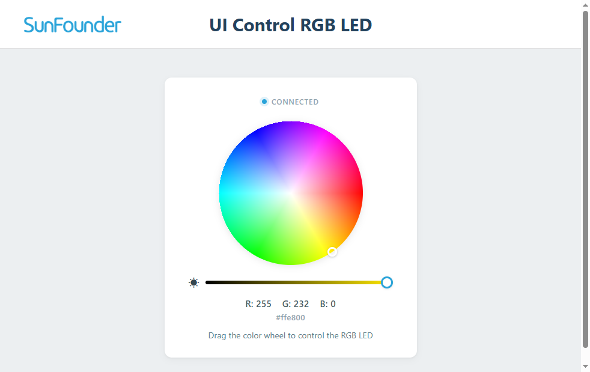

.. include:: /index.rst
   :start-after: start_hello_message
   :end-before: end_hello_message

3. AI Color Light
===================

In the face alarm project, the AI answered a yes-or-no question — is a face there? — and the buzzer had exactly one response. But real-world AI usually has to answer a richer question: not just *is something there*, but *what is it?* That is exactly what this project does. Point the camera at an apple, a banana, a water bottle, or a person — the model identifies the object, and the UNO Q lights an **RGB LED** in a matching color. Apple → red, banana → yellow, broccoli → green.

In this lesson, you will learn to:

* Filter the object-detection results down to the objects your project cares about
* Map each recognized object to a **color code** and send it to the sketch over Bridge
* Turn that single code number into three PWM brightness values that mix the right color
* Watch the Web UI report the object name, color, and confidence in real time

1. Setup
----------

**What You Need**

.. list-table::
   :widths: 25 25 25 25
   :header-rows: 0

   * - 1 * Pan Tilt Kit
     - 1 * :ref:`cpn_rgb_led`
     - 3 * :ref:`cpn_resistor` (220Ω)
     - 1 * USB-C Cable
   * - |list_pan_tilt|
     - |list_rgb_led|
     - |list_220ohm|
     - |list_usb_cable|

.. note::

   Before using the camera, make sure external carriers are enabled on your UNO Q — this is a one-time setup: :ref:`enable_external_carriers`.

**Wiring Diagram**

The RGB LED has **four legs**: the longest one is the **common cathode** — connect it to **GND** — and the other three are the red, green, and blue anodes, going to **D8**, **D7**, and **D6** respectively, each through its own 220Ω resistor. Never connect a channel directly to a pin without its resistor, or the LED can burn out.

.. image:: /img/wiring/wiring_rgb_led.png
   :width: 500
   :align: center

2. Code
----------

**Import the Code**

#. Open **Arduino App Lab**, go to **Apps**. Click the dropdown arrow next to **Create new app +** and select **Import App**.

   .. image:: /img/app_import_app.png
      :width: 600
      :align: center

#. Select **Import from Computer**.

   .. image:: /img/app_import_pc.png
      :width: 600
      :align: center

#. Navigate to the ``unoq-ai-kit/edge_ai/`` folder and select ``03 AI Color Light.zip``.

#. The app appears in **Apps** — click it to open.

**Run the Code**

#. Click the **Run** button (▶). The sketch starts with the LED switched off, then the app boots the camera and loads the AI model — give it a few seconds before the video appears.

#. Once running, open the **Web UI** tab. The live camera feed appears in the left card, with the connection status changing from **Connecting** to **Connected** and the hint text reading *"Edge AI is detecting objects locally"*. The **AI Result** card on the right starts at **Waiting...** / **Off** / **--** and lists the six supported examples: Apple, Banana, Orange, Broccoli, Bottle, Person.

#. Hold a real apple up to the camera. When the model reaches at least 45% confidence, the LED glows **red**, and the AI Result card updates with the object name (``apple``), the color (``Red``), and the confidence percentage (for example ``92%``). The color swatch in the card turns red too.

#. Try a banana, then a water bottle, then have a friend stand in front of the camera. Each mapped object lights its own color: yellow, blue, and white.

#. Take the object out of the camera's view. After about **2 seconds** with no mapped object, the LED switches off and the card reports **No mapped object** / **Off**.

**The Code**

**Sketch (sketch.ino)** — runs on the STM32 MCU and owns the RGB LED

.. code-block:: cpp
   :linenos:

   /*
    * AI Object Color Light
    *
    * The Linux application detects an object and sends a color code
    * to this sketch through Router Bridge.
    *
    * RGB LED connections:
    * R -> D8
    * G -> D7
    * B -> D6
    */

   #include <Arduino_RouterBridge.h>

   const int redPin = 8;
   const int greenPin = 7;
   const int bluePin = 6;

   void writeRgb(int red, int green, int blue) {
       analogWrite(redPin, red);
       analogWrite(greenPin, green);
       analogWrite(bluePin, blue);
   }

   void setColor(int colorCode) {
       switch (colorCode) {
           case 1:  // Red
               writeRgb(255, 0, 0);
               break;

           case 2:  // Yellow
               writeRgb(255, 180, 0);
               break;

           case 3:  // Orange
               writeRgb(255, 64, 0);
               break;

           case 4:  // Green
               writeRgb(0, 255, 0);
               break;

           case 5:  // Blue
               writeRgb(0, 0, 255);
               break;

           case 6:  // White
               writeRgb(255, 255, 255);
               break;

           default:  // Off
               writeRgb(0, 0, 0);
               break;
       }
   }

   void setup() {
       pinMode(redPin, OUTPUT);
       pinMode(greenPin, OUTPUT);
       pinMode(bluePin, OUTPUT);

       setColor(0);

       Bridge.begin();
       Bridge.provide("set_color", setColor);
   }

   void loop() {
       delay(20);
   }

**Python (main.py)** — runs on the Linux MPU: object detection, color mapping, and Web UI

.. code-block:: python
   :linenos:

   # SPDX-FileCopyrightText: Copyright (C) Arduino s.r.l. and/or its affiliated companies
   #
   # SPDX-License-Identifier: MPL-2.0

   """
   AI Object Color Light

   The object-detection model runs locally on the UNO Q. When a mapped
   object is detected, the application sends a color code to the sketch
   and updates the custom Web UI.
   """

   from datetime import datetime, UTC
   import threading
   import time

   from arduino.app_utils import App, Bridge
   from arduino.app_bricks.web_ui import WebUI
   from arduino.app_bricks.video_objectdetection import VideoObjectDetection
   from arduino.app_peripherals.camera import Camera

   ui = WebUI()

   camera = Camera(adjustments=lambda frame: frame[::-1, :])
   camera.start()

   detection = VideoObjectDetection(camera, confidence=0.45, debounce_sec=0.3)

   # Object name: (color code, display name, HEX color)
   OBJECT_COLORS = {
       "apple": (1, "Red", "#ef5350"),
       "banana": (2, "Yellow", "#fbc02d"),
       "orange": (3, "Orange", "#fb8c00"),
       "broccoli": (4, "Green", "#43a047"),
       "bottle": (5, "Blue", "#29a3d9"),
       "person": (6, "White", "#ffffff"),
   }

   NO_OBJECT_TIMEOUT = 2.0
   last_detection_time = 0.0
   current_object = None
   state_lock = threading.Lock()

   def set_color(color_code: int):
       """Send a color code to the Arduino sketch."""
       Bridge.call("set_color", color_code)

   def publish_state(object_name, color_name, hex_color, confidence=0):
       ui.send_message(
           "object_color",
           message={
               "object": object_name,
               "color": color_name,
               "hex": hex_color,
               "confidence": confidence,
               "timestamp": datetime.now(UTC).isoformat(),
           },
       )

   def send_detections(detections: dict):
       """Choose the highest-confidence mapped object in the current frame."""
       global last_detection_time, current_object

       best_object = None
       best_confidence = 0.0

       for class_name, instances in detections.items():
           if class_name not in OBJECT_COLORS:
               continue

           for instance in instances:
               confidence = float(instance.get("confidence", 0.0))
               if confidence > best_confidence:
                   best_object = class_name
                   best_confidence = confidence

       if best_object is None:
           return

       color_code, color_name, hex_color = OBJECT_COLORS[best_object]

       with state_lock:
           last_detection_time = time.monotonic()
           changed = best_object != current_object
           current_object = best_object

       if changed:
           set_color(color_code)

       publish_state(
           best_object,
           color_name,
           hex_color,
           round(best_confidence * 100),
       )

   def clear_when_object_is_lost():
       """Turn the LED off after no mapped object has been seen for a while."""
       global current_object

       while True:
           should_clear = False

           with state_lock:
               if (
                   current_object is not None
                   and time.monotonic() - last_detection_time > NO_OBJECT_TIMEOUT
               ):
                   current_object = None
                   should_clear = True

           if should_clear:
               set_color(0)
               publish_state("No mapped object", "Off", "#dfe6e9", 0)

           time.sleep(0.2)

   detection.on_detect_all(send_detections)

   threading.Thread(target=clear_when_object_is_lost, daemon=True).start()

   App.run()

**How it Works**

.. code-block:: text

   CSI camera
       │
       ▼
   VideoObjectDetection brick (confidence ≥ 0.45, debounce 0.3 s)
       │
       ├── video stream → port 4912 → <iframe> in Web UI
       │
       └── detections → Python: pick the highest-confidence
           object that is in the OBJECT_COLORS mapping
           │
           ├── Bridge.call("set_color", color_code)
           │       │
           │       ▼
           │   sketch setColor() switch → analogWrite() on D8/D7/D6
           │
           └── ui.send_message("object_color", …)
                   │
                   ▼
               AI Result card + color swatch update
       │
       ▼
   no mapped object for 2 s → set_color(0) → LED off, card shows "No mapped object"

This project is a two-process team, and each process does what it is good at. On the Linux MPU, **Python decides what the camera sees**. The ``VideoObjectDetection`` brick runs a general object-detection model locally on every frame — no cloud, no internet required — and hands the results to Python. On the STM32 MCU, the **sketch decides how the LED should light**, because it owns the pins. The bridge between them is a single small number: the color code.

* **Picking the best object** — The general model recognizes far more categories than this project needs, so ``send_detections()`` ignores every class that is not in the ``OBJECT_COLORS`` mapping — the six that matter: apple, banana, orange, broccoli, bottle, and person. When several mapped objects share the frame, only the instance with the highest confidence wins. If an apple and a banana are both visible, the one the model is more sure about drives the LED.

* **Sending a code, not colors** — Python never sends raw red/green/blue values across Bridge. For each object it looks up a tiny integer code (1–6) and calls ``Bridge.call("set_color", code)``. The sketch's ``setColor()`` switch turns that code into the PWM brightness values with ``analogWrite()``. Notice the mix doesn't always use full brightness: yellow is ``(255, 180, 0)`` and orange is ``(255, 64, 0)`` — tuned so the colors read clearly on the LED instead of washing together. Python also tracks which object is current and only calls Bridge when the object actually *changes*, so the same apple doesn't spam the bridge on every frame.

* **Keeping the Web UI in sync** — With every mapped detection, ``publish_state()`` sends an ``object_color`` socket.io event carrying the object name, color name, a HEX color for the swatch (for example ``#ef5350`` for Red), and the confidence as a percentage. The browser just renders what it receives — no model runs in the page.

* **The auto-off watchdog** — A background thread wakes every 0.2 seconds and checks ``NO_OBJECT_TIMEOUT``: if the last mapped detection was more than 2 seconds ago, it sends code 0 (off) and publishes **No mapped object** / **Off** to the Web UI. This is why the LED lingers for a moment after you remove the object, then switches itself off.

3. Experiment
----------------

**Test the Mapped Objects**

Show each object to the camera and check the result:

.. list-table::
   :header-rows: 1
   :widths: 30 70

   * - Object
     - Expected Result
   * - A real apple
     - LED glows red; card shows ``apple`` / Red
   * - A banana
     - LED glows yellow; card shows ``banana`` / Yellow
   * - An orange
     - LED glows orange; card shows ``orange`` / Orange
   * - Broccoli
     - LED glows green; card shows ``broccoli`` / Green
   * - A water bottle
     - LED glows blue; card shows ``bottle`` / Blue
   * - A friend standing in front of the camera
     - LED glows white; card shows ``person`` / White

**What About Objects That Aren't in the List?**

Light the LED red with an apple, then remove it and hold up a book or a coffee cup instead. The LED stays red for about 2 seconds, then switches off and the card shows **No mapped object** / **Off** — even though the model probably recognizes the cup. The mapping filters it out, and the watchdog timer runs out. This is a useful habit for any AI project: decide up front which classes deserve a physical response.

**Challenge: Two Objects at Once**

Hold an apple and a banana side by side in front of the camera. Watch the LED — it takes the color of whichever object the model is more confident about in the current frame, so it may hop between red and yellow as the confidence scores jitter. Watch the Confidence number in the Web UI while you move one object closer or further away — can you predict which color wins?

**Challenge: Distance and Lighting**

Move a mapped object slowly away from the camera. The Confidence percentage falls as the object gets smaller. Find the distance where the LED stops responding (confidence drops below 45%). Then repeat in a dim room — edge AI models were trained on well-lit photos, so poor lighting usually makes the model less certain.

4. Troubleshooting
--------------------

**The Web UI shows a black screen (no camera feed)**

* **Cause:** The camera is not enabled, or the camera cable is loose.
* **Solution:** Enable external carriers (see :ref:`enable_external_carriers`), then check the camera's FFC ribbon cable — the blue side faces up and both ends must click securely.

**The Web UI detects the object, but the LED never lights**

* **Cause:** The RGB LED is wired wrong.
* **Solution:** Check the legs: the longest leg is the common cathode and must go to GND; the red, green, and blue anodes go to D8, D7, and D6, each through its own 220Ω resistor. If you skipped a resistor, the LED may already be damaged — replace it.

**The LED lights the wrong color**

* **Cause:** The three channels are swapped — for example the red anode is on D6 instead of D8.
* **Solution:** Re-check each anode against its pin: Red → D8, Green → D7, Blue → D6. Note that the anode order along the LED body doesn't have to match the pin order — what matters is which leg ends up on which pin.

**Some objects are never recognized**

* **Cause:** The model only knows the categories in the training data, and the project only responds to the six mapped ones.
* **Solution:** Test with real, well-lit objects that look like the training photos — a real apple rather than a toy, a clear water bottle rather than a metal flask — held 0.5–2 m from the camera and roughly centered. A cup or a book will never trigger the LED; that's the filter working as designed.

5. Summary
-------------

You just built a complete AI decision chain: the camera sees, the model classifies, Python chooses, and the LED obeys. In this lesson, you learned:

* How to filter detection results down to the classes your project responds to
* How to map each object to a single color code sent over Bridge — a small message that means a clear color
* How the sketch's ``setColor()`` switch turns the code into PWM values on three channels
* How a watchdog thread turns the LED off automatically when the object leaves

In the next lesson, the question changes from *what is it?* to *how many times did it appear?* — you'll count objects as they come and go, and let the UNO Q announce each count out loud.
