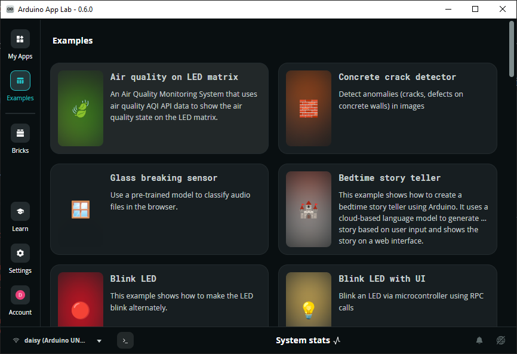
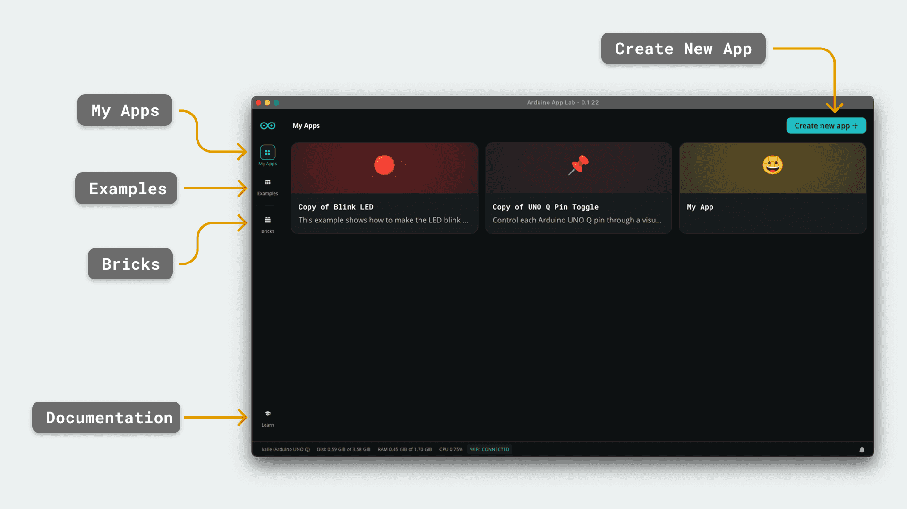

.. include:: /index.rst
   :start-after: start_hello_message
   :end-before: end_hello_message

.. _arduino_app_lab:

Arduino App Lab
=======================

What is **Arduino App Lab**?
---------------------------------------------

**Arduino App Lab** is an integrated development environment designed for the **UNO Q hybrid platform**. It allows developers to create applications that combine **Linux-based software** running on the main processor with **real-time control** running on the microcontroller.

Unlike the traditional Arduino workflow that focuses only on microcontroller sketches, App Lab provides a **full application framework**. An App Lab project can include multiple components such as:

- **Bricks**: reusable software modules for hardware or system functions  
- **Libraries**: additional functionality that can be imported into projects  
- **Assets**: files such as images, models, or configuration data  
- **Python**: scripts running on the Linux side of the board  
- **Sketch**: Arduino code running on the microcontroller  

This structure makes it easier to build **complex applications** that interact with sensors, displays, networking services, and AI capabilities.

In this course, **Arduino App Lab** will be used as the primary tool for running examples, developing applications, and interacting with the UNO Q hardware.

You can access the official **Arduino App Lab** tutorial from the link below:

* |link_app_get_start|

--------------------------------------------------

Install & Set Up **Arduino App Lab**
-----------------------------------------

#. Navigate to |link_arduino_software| and download **Arduino App Lab** for your OS.

   .. image:: img/app_download.png
      :width: 600
      

#. Install **Arduino App Lab** according to your operating system.

   * On **macOS**: run the ``.dmg`` file from your **Downloads** folder and move it to your **Applications** folder.

     .. image:: img/app_macos.png

   * On **Windows**: run the installer from your **Downloads** folder and complete the installation.

     .. image:: img/app_windows.png

   * On **Linux (Ubuntu-based)**: extract the downloaded file (``.tar.gz``), navigate to the folder, and run the application.

     After extracting the folder, we recommend moving it to ``$HOME/Desktop`` or ``$HOME/Applications``:

     .. code-block:: bash
 
         tar -xf ArduinoAppLab*.tar.gz 
         mv ArduinoAppLab*/ ~/Desktop
 
     .. note::
       
         You will need ``libwebkit2gtk-4.1`` installed on your machine to successfully run **Arduino App Lab**. Install it by running:
 
         Debian / Ubuntu:
 
         .. code-block:: bash
 
             sudo apt install libwebkit2gtk-4.1-0
 
         Arch:
 
         .. code-block:: bash
 
            sudo pacman -S webkit2gtk-4.1

--------------------------------------------------

Connecting UNO Q to **Arduino App Lab**
-----------------------------------------------------

#. Connect the UNO Q to your PC using a USB cable.

   .. image:: img/unoq_connect_pc.png

#. You can also use the UNO Q in the following two |link_board_mode|:

   * Over a local Wi-Fi® network (Network Mode):

     * First configure the board name, password, and Wi-Fi using your PC.  
     * Once the UNO Q and your computer are on the same local network, you can access the board remotely from any computer (e.g., via SSH or App Lab).

   * As a Single Board Computer (SBC Mode):
   
     * Connect a monitor, keyboard, and mouse via a USB dongle.  
     * You can then use the UNO Q directly like a computer and interact with it through the connected display.

#. Open **Arduino App Lab**.

   .. image:: img/app_open.png
      :width: 600

#. Set your language and name.

   .. image:: img/app_set_name.png
      :width: 600

#. Enter your Wi-Fi network name and password.

   .. image:: img/app_set_wifi.png
      :width: 600
      
#. The system will automatically check for updates and install them.

   .. image:: img/app_updates.png
      :width: 600

#. Set a password for remote access (used for SSH (``ssh arduino@<boardname>.local``) and network mode login). The username is ``arduino`` and cannot be changed.

   .. image:: img/app_password.png
      :width: 600

#. After setup, you will enter the **Arduino App Lab** home screen, where various example applications are available.

   .. image:: img/app_home.png
      :width: 600

--------------------------------------------------

**Arduino App Lab** UI Overview
-------------------------------------

**Arduino App Lab** is designed as both an editor and a resource manager for creating and deploying applications.

* **Apps** – Displays created or duplicated applications. Click an app to edit and run it.  
* **Examples** – Official examples provided by Arduino®, including audio classification, object detection, and GPIO control.  
* **Bricks** – Modular code building blocks that simplify the creation of advanced applications.  
* **Learn** – Built-in documentation to help you understand App Lab features.  

--------------------------------------------------

Summary
-------------------------------

**Arduino App Lab** extends the traditional Arduino workflow into a hybrid development model, enabling seamless integration between high-level Linux applications and low-level microcontroller control. This makes it a powerful tool for building modern embedded systems and AI-enabled applications.