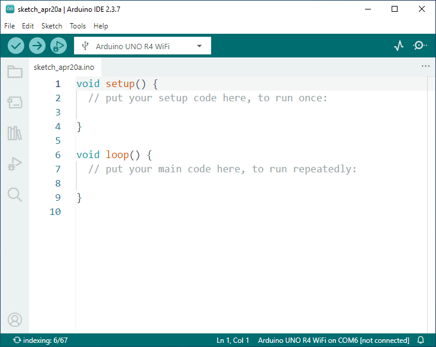

.. include:: /index.rst
   :start-after: start_hello_message
   :end-before: end_hello_message
   
.. _arduino_ide:

Play with Arduino IDE (Optional)
============================================

This optional section introduces how to use the Arduino IDE with UNO Q and how it differs from Arduino App Lab. You will also install the core and run a simple Blink example.

Arduino IDE vs Arduino App Lab (Optional)
--------------------------------------------------

Arduino UNO Q works with the standard Arduino IDE, allowing you to program using C/C++.

The board has two processors:

- **STM32U585 (microcontroller)** – Arm® Cortex®-M33 up to 160 MHz, running Zephyr OS, designed for real-time and low-power control  
- **Qualcomm® QRB2210 (Linux processor)** – quad-core Arm® Cortex®-A53 @ 2.0 GHz with Adreno™ 702 GPU, running Debian Linux, designed for high-level applications such as vision, AI, and networking  

.. image:: img/unoq_chips.png
   :width: 600
   :align: center

The Arduino IDE **only programs the STM32 microcontroller**.

**Arduino IDE**

Arduino UNO Q works with the standard Arduino IDE, allowing you to program using C/C++.

The board has two processors:

- **STM32 (microcontroller)** – for real-time control  
- **Linux processor** – for high-level applications  

The Arduino IDE **only programs the STM32 microcontroller**.

**Use Arduino IDE when:**

- Working with GPIO or sensors  
- Needing real-time control  
- Building simple, lightweight projects  

--------------------------------------------------

**Arduino App Lab**

Arduino App Lab is designed for the **UNO Q hybrid platform**.

.. image:: img/app_home.png
    :width: 700
    :align: center

It lets you build applications using:

- **Python (Linux side)**  
- **Arduino (microcontroller side)**  

**Use Arduino App Lab when:**

- You need networking, UI, or AI features  
- Your project is more complex  
- You want to build complete applications  

Install UNO Q Core
----------------------------

To get started, you must install the board support package (core) for UNO Q (based on Zephyr).

#. Open **Arduino IDE 2.0**. Go to the **Boards Manager** from the left sidebar and search for **UNO Q**.  
   Find **Arduino UNO Q** and click **Install**.

   .. image:: img/ide_install_board.png
      :width: 600

#. Open the **Library Manager** from the left sidebar. Search for ``Arduino_RouterBridge`` and install it.

   .. image:: img/ide_install_library.png
      :width: 600

#. During installation, make sure to install all required dependencies.

   .. image:: img/ide_install_all.png
      :width: 600

--------------------------------------------------

Hello World (Blink)
--------------------------

After installing the core, you can verify everything by uploading the classic **Blink** sketch.

#. Open the example: go to **File > Examples > 01.Basics > Blink**.

   .. image:: img/ide_open_blink.png
      :width: 600

#. Connect the UNO Q to your PC using a USB cable.

   .. image:: img/unoq_connect_pc.png

#. Select **Arduino UNO Q (COMxx)** from the board/port menu.

   .. image:: img/ide_choose_board.png
      :width: 600

#. Click the **Upload** button to upload the sketch to the UNO Q.

   .. image:: img/ide_upload.png
      :width: 600

#. After uploading successfully, the **LED 3** on the UNO Q will blink red.

   .. image:: img/unoq_led3.png
      :width: 600

-------

**Summary**

In this section, you have:

- Compared **Arduino IDE** and **Arduino App Lab**  
- Learned that Arduino IDE is used for programming the **STM32 microcontroller only**  
- Installed the UNO Q board core and required libraries  
- Successfully uploaded and ran the **Blink** example  

You now have a working Arduino IDE setup for UNO Q and can start building simple hardware control projects. For more advanced applications involving Linux, networking, or AI, you can switch to **Arduino App Lab**.