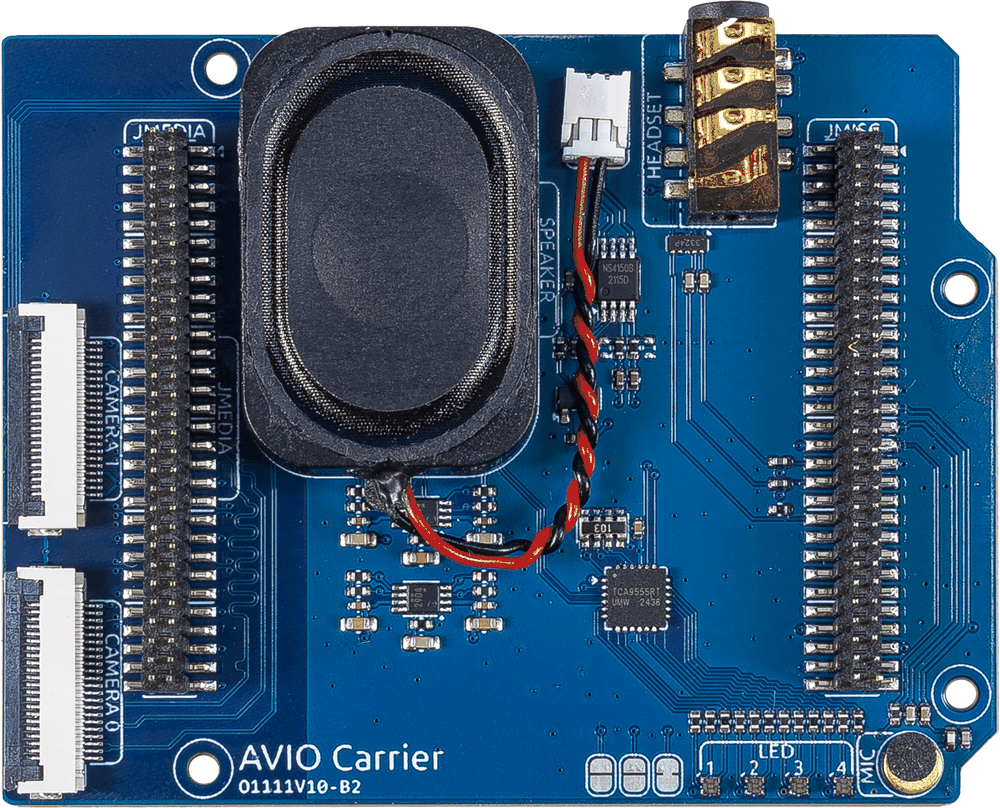
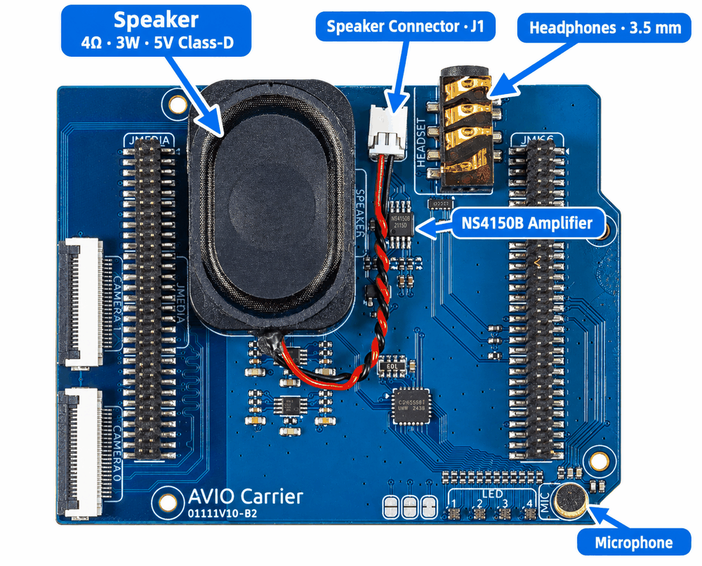
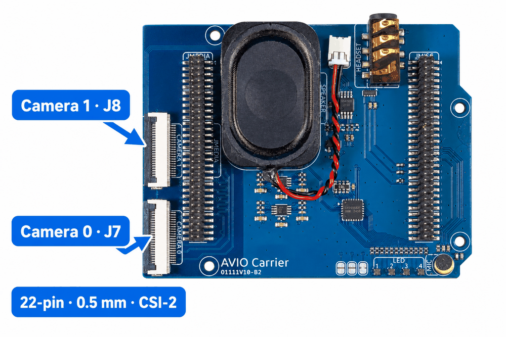
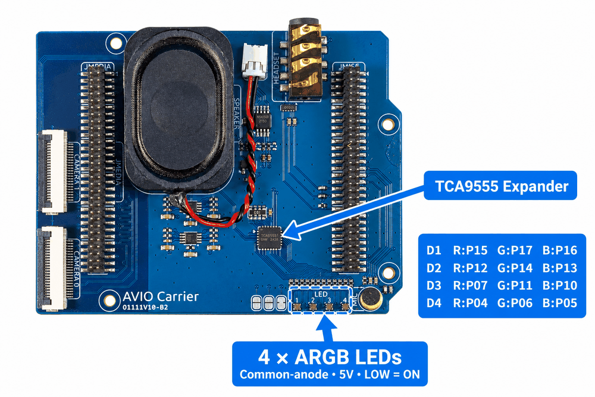

.. include:: /index.rst
   :start-after: start_hello_message
   :end-before: end_hello_message

.. _cpn_avio_carrier:

AVIO Carrier
=================

The **AVIO Carrier** (Audio Video Input Output Carrier) is the multimedia expansion board for the Arduino UNO Q. It adds everything the board needs to hear, speak, see, and light up, and it plugs straight into the UNO Q's high-speed connectors.

Together with the UNO Q and the Robot Shield, the AVIO Carrier is one of the boards the Pan Tilt Kit is built from. Every camera, voice, and audio lesson in this course uses it.

Specifications
----------------

.. list-table::
   :header-rows: 1
   :widths: 22 53 25

   * - Item
     - Specification
     - Connector
   * - Power
     - Supplied directly by the Arduino UNO Q (5V / 3.3V)
     - -
   * - Audio amplifier
     - NS4150B, Class-D, 5V / 3W into 4Ω
     - -
   * - Speaker
     - 2030 chamber speaker, 4Ω 3W
     - J1 (MX1.25 2P)
   * - Microphone
     - Electret, 4 x 1.5 mm, differential input
     - MK1
   * - Headphone jack
     - 3.5 mm 4-pin socket (PJ-393A), L/R/GND contacts; the fourth contact is unused
     - J6
   * - Camera
     - 2 x CSI-2, 22-pin, 0.5 mm flip-lock FFC; takes the IMX219 camera supplied with the kit
     - J7 (CAMERA 0), J8 (CAMERA 1)
   * - RGB LEDs
     - 4 x ARGB 1010 common-anode, driven by TCA9555 GPIO
     - LED 1–4
   * - I²C IO expander
     - TCA9555, 16 GPIO, address 0x26; also drives the camera reset/status lines
     - -
   * - Level shifting
     - PCA9306 x2, I²C 3.3V <-> 5V
     - -
   * - ESD protection
     - TPD4E02B04DQA, ±15kV, on the high-speed camera signals
     - -
   * - UNO Q interface
     - 2 x 2x30P 1.27 mm dual-row sockets
     - JMEDIA / JMISC

Audio
--------

The audio chain is built around the **NS4150B** Class-D amplifier and its **4Ω 3W** speaker. The microphone is wired differentially, which keeps background noise low, and the amplifier can be shut down in software when it is not needed — its standby current is only about 0.1µA.

* **Speaker** — connect the chamber speaker to J1. The amplifier runs at 5V and delivers 3W into 4Ω at 10% THD, with about 85% efficiency.
* **Microphone** — the electret capsule feeds a differential input; keep the polarity correct when re-seating it.
* **Headphones** — plug into the 3.5 mm jack for private listening. The jack shares the amplifier output, so keep the volume moderate.

Camera
---------

The AVIO Carrier exposes **two CSI-2 camera channels**, silkscreened CAMERA 0 and CAMERA 1. Both are 22-pin, 0.5 mm pitch, flip-lock FFC connectors and are compatible with the standard Raspberry Pi 22-pin CSI camera modules — including the IMX219 camera included in this kit.

* Insert the FFC cable with the contacts facing the correct way, then close the flip lock until it clicks.
* Camera 0 (J7) is the channel used by the camera lessons in this course; Camera 1 (J8) is available for dual-camera projects.
* Reset/enable and status-LED control for both channels comes from the TCA9555 expander, so no extra GPIO pins are consumed on the UNO Q.

RGB LEDs
-----------

Four **ARGB 1010 common-anode LEDs** sit along the bottom edge of the board. Unlike serial WS2812 LEDs, each colour channel is a separate GPIO on the TCA9555 expander, and the common anode is tied to 5V.

.. list-table::
   :header-rows: 1
   :widths: 25 25 25 25

   * - LED
     - Red
     - Green
     - Blue
   * - D1
     - P15
     - P17
     - P16
   * - D2
     - P12
     - P14
     - P13
   * - D3
     - P07
     - P11
     - P10
   * - D4
     - P04
     - P06
     - P05

Because the LEDs are common-anode, driving a GPIO **LOW** turns that colour **on**. All 16 TCA9555 pins are used: 12 for the four LEDs (P04–P07 and P10–P17) and 4 for the camera control lines (P00–P03).

The AVIO Carrier is used throughout **Module B (Multimedia)**, **Module D (Edge AI)**, and the camera and voice projects in the later modules.
