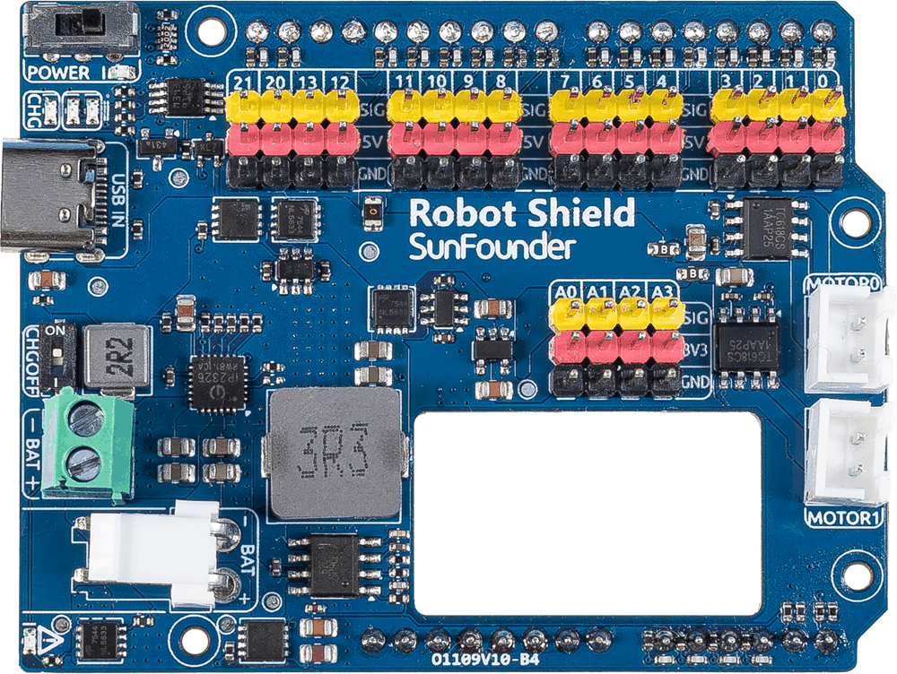
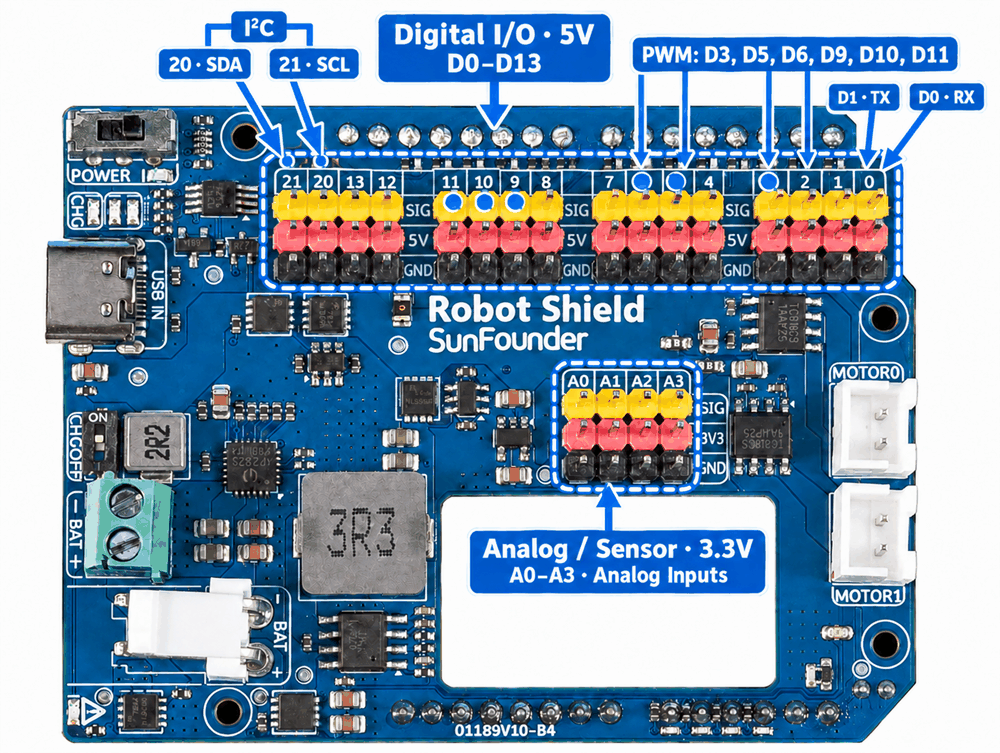
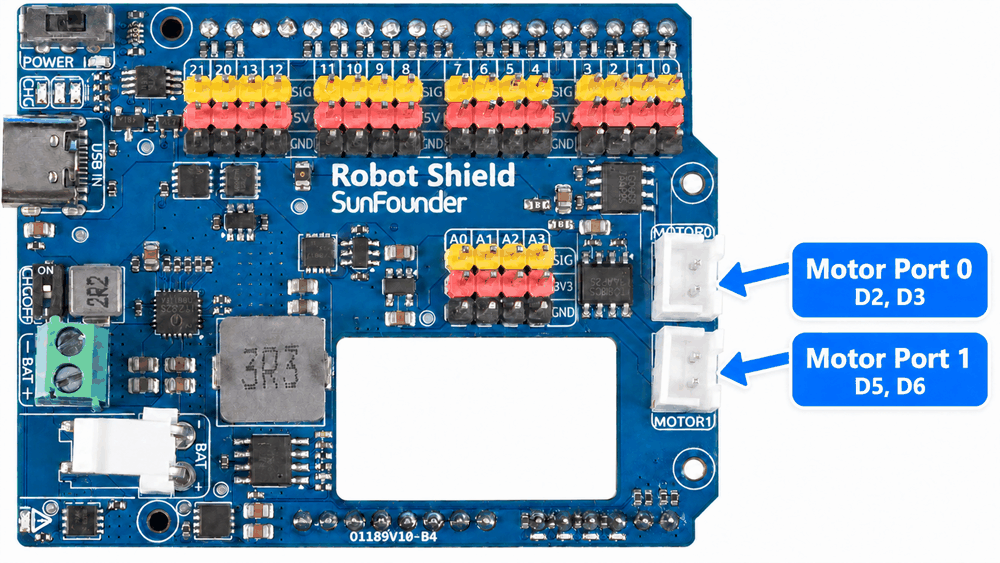
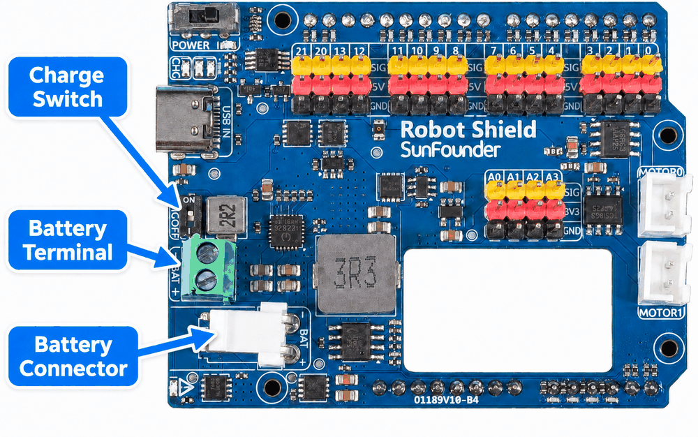

.. include:: /index.rst
   :start-after: start_hello_message
   :end-before: end_hello_message

.. _cpn_robot_shield:

Robot Shield
=================

The **Robot Shield** is the expansion board that turns the Arduino UNO Q into a complete robotics controller. It stacks directly onto the UNO Q headers and adds two motor channels, a full power and battery-charging system, and a set of labelled 3-pin headers for servos, sensors, and breadboard circuits.

Almost every hands-on lesson in this kit is powered through the Robot Shield: the board brings out the UNO Q's digital, PWM, and analog pins, supplies 5V and 3.3V to the breadboard rails, and keeps the electronics running from either USB-C or a battery.

Specifications
----------------

.. list-table::
   :header-rows: 1
   :widths: 30 70

   * - Item
     - Specification
   * - Compatible board
     - Arduino UNO Q (stack-on expansion board)
   * - Battery
     - 7.4V (2S) lithium-ion, two cells in series — **not included**, sold separately
   * - System voltage
     - 5V (battery step-down or direct USB supply)
   * - USB-C (onboard)
     - Power + charging (5V input, do not exceed about 5.5V); data pins unused
   * - USB-C (via UNO Q)
     - Power only, no charging
   * - Battery connector
     - KF350 2P and VH3.96 2P terminals
   * - Motor drive
     - 2 channels (5V), about 1.8A each, H-bridge with forward/reverse + PWM
   * - Motor connector
     - 2 x XH2.54 2P, upright
   * - IO logic level
     - 3.3V
   * - Indicators
     - Power (green), charging (red), reverse polarity (red), battery level (orange x2)
   * - Power switch
     - Slide switch (dual-PMOS hard cutoff)

.. note::

   The Robot Shield has no processor of its own. Every pin is wired straight through to the UNO Q, so all of the control logic is written in your sketches on the UNO Q.

Interfaces
-------------

.. list-table::
   :header-rows: 1
   :widths: 30 70

   * - Interface
     - Description
   * - Battery input
     - KF350 / VH3.96 terminal for a 7.4V (2S) lithium battery (not included) — one of the power inputs
   * - Onboard Type-C
     - Power + charging; if no battery is connected, the charge indicator blinks to show that charging is unavailable
   * - Power switch
     - Slide switch: ON powers the board, OFF cuts the whole board (no leakage)
   * - Motor outputs x2
     - XH2.54 2P connectors for two DC motors (MOTOR0 and MOTOR1)
   * - Digital / PWM headers
     - 2.54 mm headers carrying the UNO Q digital IO at 5V
   * - Analog / sensor headers
     - A0–A3 at 3.3V for sensors; A4 and A5 are used internally for battery status
   * - Status pins
     - A4 = battery voltage ÷ 3, A5 = charging status

Pin Headers
--------------

The digital / PWM header carries the UNO Q pins at 5V and is best used for outputs such as PWM speed control, motor and servo signals, and digital outputs.

* **D0–D13** — digital IO (D0 = RX, D1 = TX). ``analogWrite()`` PWM works on every one of them except **D4**; the documented PWM pins are **D3, D5, D6, D9, D10, and D11**.
* **20 (SDA) and 21 (SCL)** — I²C data and clock.

The analog / sensor header runs at 3.3V and is the right place to connect sensors.

* **A0–A3** — analog sensor inputs.
* **A4 and A5** — not broken out to a header. Internally, A4 is the battery voltage divided by 3 (multiply by 3 to get the battery voltage) and A5 is the charging status (HIGH = charging, LOW = not charging).

Motor Outputs
----------------

The Robot Shield drives two DC motors through H-bridge chips. Each output is controlled by a pair of UNO Q pins.

.. list-table::
   :header-rows: 1
   :widths: 35 65

   * - Motor output
     - Control pins
   * - MOTOR0
     - D2 / D3
   * - MOTOR1
     - D5 / D6

The H-bridge responds to the two pins like this.

.. list-table::
   :header-rows: 1
   :widths: 25 25 50

   * - Pin A
     - Pin B
     - Motor state
   * - HIGH
     - LOW
     - Forward (speed set by the PWM duty cycle)
   * - LOW
     - HIGH
     - Reverse (speed set by the PWM duty cycle)
   * - LOW
     - LOW
     - Coast — the outputs are high-impedance and the motor free-wheels
   * - HIGH
     - HIGH
     - Brake — the motor terminals are shorted and the motor stops

Each motor channel is protected by a self-resetting fuse (1A hold / 2A trip), and the 5V rail by a 4A / 8A self-resetting fuse.

Power and Charging
--------------------

.. note::

   The battery is **not included** with this kit and must be purchased
   separately. Use a **7.4V (2S) lithium-ion** pack — two cells in series —
   connected to the KF350 or VH3.96 terminal. A purchase link will be added
   here soon.

The photo above marks the three battery parts:

* **Charge switch** — the **CHG OFF** switch, which turns the two charging indicators on and off (see **The Charge Switch** below).
* **Battery terminal** — the screw terminal; clamp the battery leads here.
* **Battery connector** — the plug-in connector, for a battery that comes with a matching plug.

You can connect up to three power sources at the same time. The board uses ideal-diode ORing to automatically pick the highest one, with almost no voltage drop and no reverse current between sources.

.. list-table::
   :header-rows: 1
   :widths: 35 65

   * - Source
     - Notes
   * - Lithium battery (7.4V 2S)
     - Battery terminal — battery not included; supplies the whole board through the 5V step-down when external power is removed
   * - Onboard USB-C
     - Preferred 5V input for both power and charging — plug it in to run the board and charge the battery
   * - Arduino UNO Q USB-C
     - Connects through a Schottky diode (slight voltage drop); best for computer power and communication

**Charging**

Plug a standard 5V supply (do not exceed about 5.5V) into the onboard USB-C. The onboard charger brings the pack to a constant 8.4V at roughly 1.45A, and charging is protected against under-voltage, over-voltage, and over-temperature. A reversed battery will not damage the board — it simply disconnects and lights the red reverse-polarity indicator.

**When to use the battery**

The battery is optional for low-current projects: sensors, LEDs, and the onboard matrix all run from USB-C alone. For servos and motors, connect the battery or an external 5V supply to the onboard USB-C — the UNO Q's own USB-C is not meant for that current.

**Good to know**

* All three sources can be connected at once. Below about 15W the external input powers the system directly and can top up the battery at the same time.
* With no battery and only the onboard USB-C connected, the charge and battery-level indicators blink — see **The Charge Switch** below.
* The UNO Q's USB-C also handles upload and serial communication, but its Schottky drop makes it a poor choice for high-current loads such as servos and motors.

**Indicators**

.. list-table::
   :header-rows: 1
   :widths: 35 65

   * - LED
     - Meaning
   * - Green
     - 5V power ready
   * - Red
     - Charging
   * - Red
     - Battery connected in reverse (only when reversed)
   * - Orange x2
     - Battery level: two lit = high, one lit = medium, none lit = low (charge soon)

**The Charge Switch**

The **CHG OFF** switch on the left edge of the board controls the two charging indicators. It has two positions: **ON** (indicators on) and **–** (indicators off).

* **With a battery connected** — plug a USB-C cable into the Robot Shield's onboard USB-C. Charging starts on its own, and both the charge indicator and the battery-level indicators light up.
* **With no battery connected** — the charger has nothing to charge, so the charge indicator and the battery-level indicators blink. Slide the **CHG OFF** switch to **–** to switch both indicators off, and slide it back to **ON** to bring them back.

