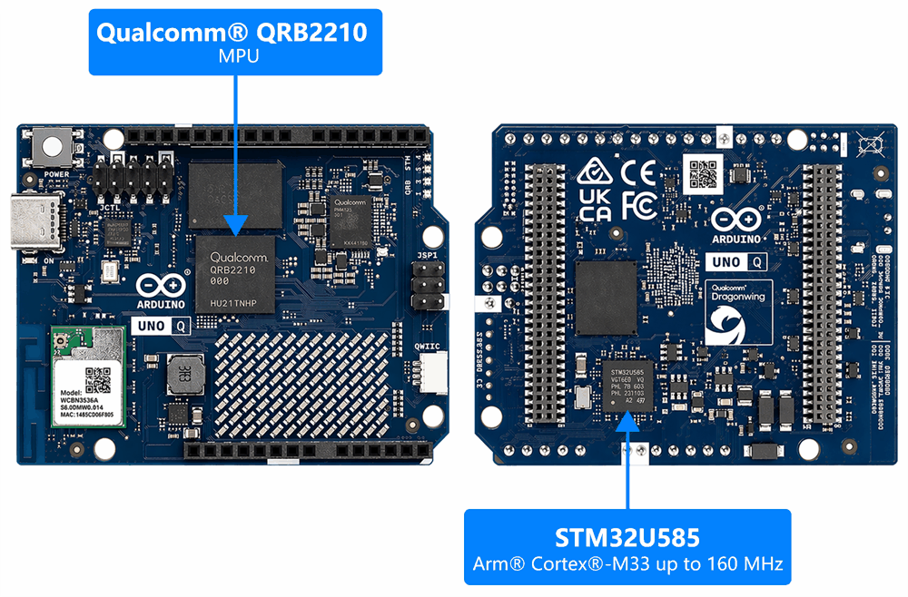
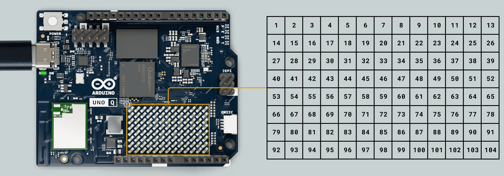
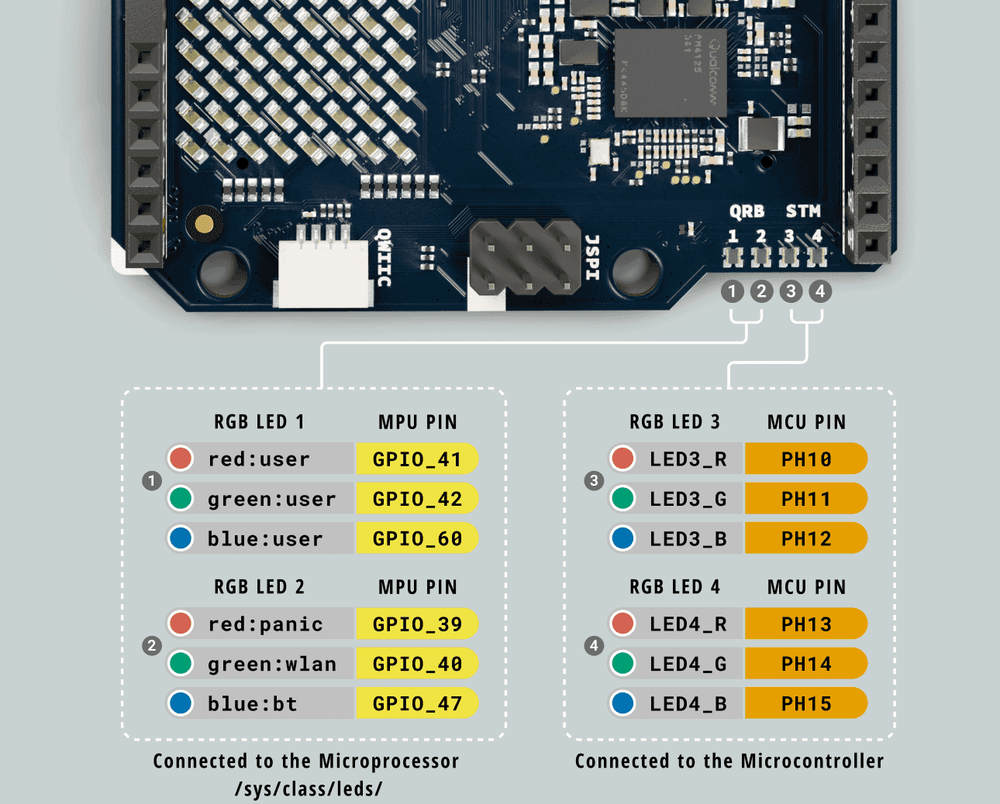
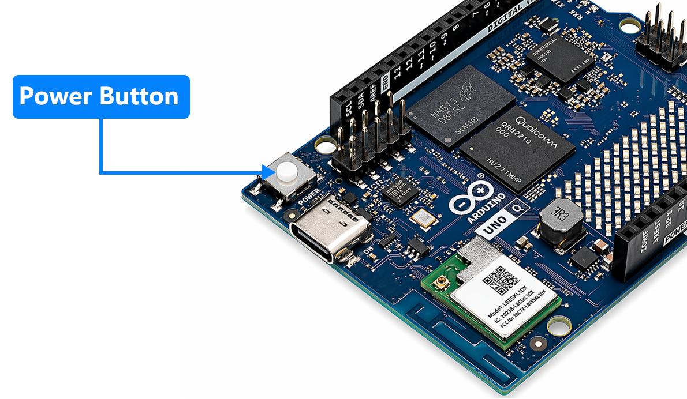
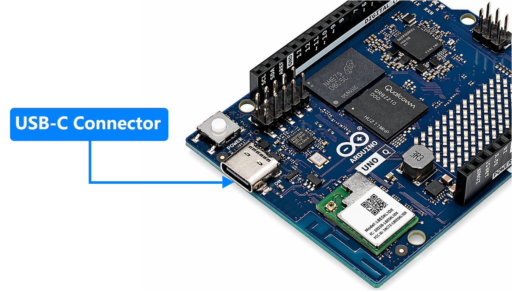
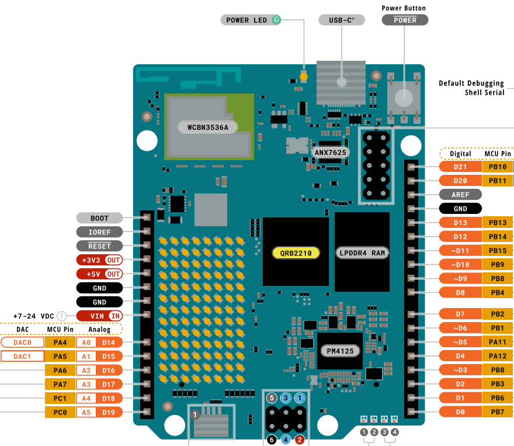
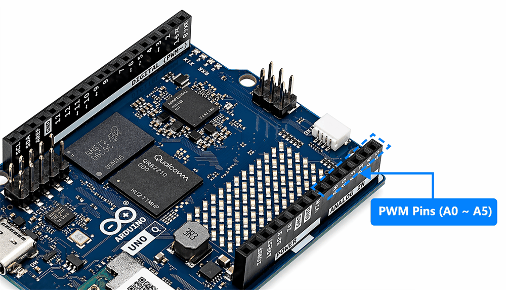
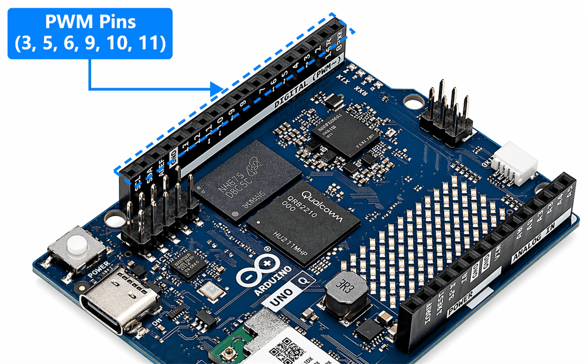
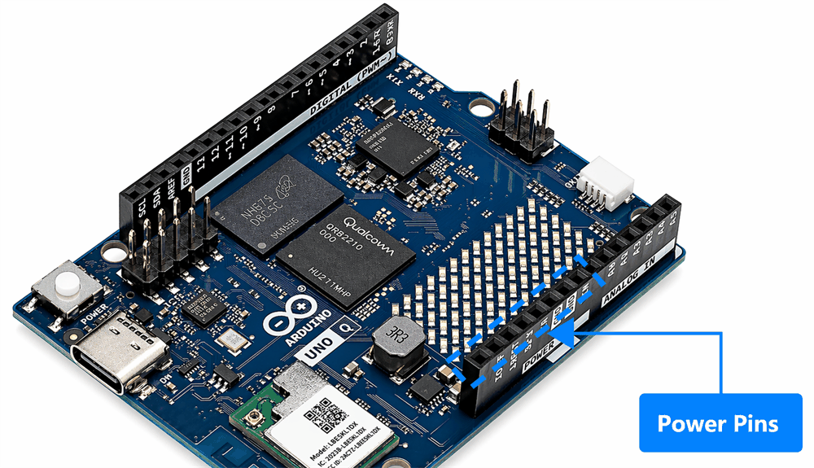
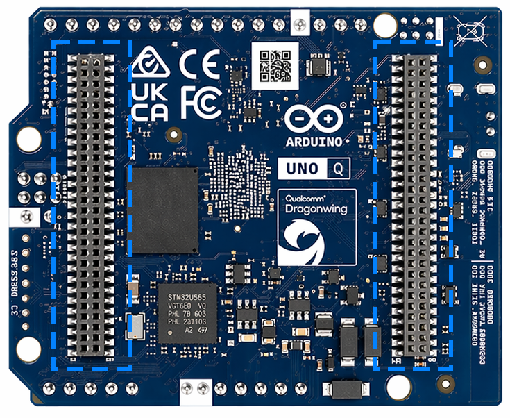

.. include:: /index.rst
   :start-after: start_hello_message
   :end-before: end_hello_message

.. _cpn_uno_q:

Arduino Uno Q
======================================

  
The Arduino UNO Q unlocks a new level of performance for the Arduino ecosystem, blending robust computing power from Qualcomm’s advanced QRB2210 Microprocessor (MPU) running a full Debian Linux OS with upstream support, and the real-time responsiveness of a dedicated STM32U585 Microcontroller (MCU) running Arduino sketches over Zephyr OS — all on a single-board computer.

The board can be programmed using **Arduino App Lab**, which provides an integrated environment for developing hybrid applications. Users can also develop MCU-side programs using the **Arduino IDE** when needed.

* |link_unoq_manual|

* |link_unoq_full_pinout|

Onboard User Interface
---------------------------

The Arduino UNO Q includes several onboard components that make it easy to interact with the board and monitor its status. These built-in interfaces allow users to quickly test features, display information, and control the device without adding extra hardware.

**LED Matrix**

One of the most distinctive features of the UNO Q is its **8 × 13 blue LED matrix**, which is controlled by the STM32 microcontroller.

This matrix can be used to display icons, numbers, text patterns, and simple animations. It is especially useful for providing visual feedback in interactive projects, such as showing system status, sensor readings, or basic game graphics.

Because the display is built directly into the board, users can quickly create visual outputs without connecting an external screen.

**RGB LEDs**

The UNO Q includes **four onboard RGB LEDs** that provide visual feedback for system status and user applications.

Two LEDs (**LED #1 and #2**) are controlled by the **Qualcomm microprocessor (MPU)** and are mainly used for system and connectivity indicators.

The other two LEDs (**LED #3 and #4**) are controlled by the **STM32 microcontroller (MCU)** and can be used in Arduino programs.

**Power Button**

The UNO Q includes a **power button** that can be used to reboot the board.

- **Long press (5+ seconds):** Reboots the Linux system running on the board.
- The board **does not require the button to power on**. It automatically boots when power is supplied.

**USB-C Connector**

The UNO Q includes a **USB-C connector** that provides multiple functions. It can be used to power the board, upload programs, and connect the board to other devices.

In addition to basic programming and power supply, the USB-C port also enables advanced connectivity features.

The table below summarizes the main capabilities of the USB-C interface.

.. list-table:: USB-C Interface Specifications
   :header-rows: 1

   * - Feature
     - Description
   * - USB Power (Sink)
     - 5VDC, 3A (15W)
   * - USB Standard
     - USB 3.1 Gen 1 (5 Gb/s)
   * - Display over USB-C
     - DisplayPort

By connecting a **USB-C adapter or hub**, the UNO Q can access additional multimedia and peripheral features.

.. list-table:: Multimedia Capabilities
   :header-rows: 1

   * - Feature
     - Description
   * - Video Output
     - HDMI support
   * - Video Input
     - USB camera support
   * - Audio
     - USB or 3.5 mm headset (speaker + microphone)
   * - Ethernet
     - Internet connectivity through Ethernet
   * - HID
     - USB keyboard, mouse, and other HID devices
   * - Storage
     - External microSD card or USB drive support

Pins
-------------

The UNO Q provides two types of connectors for hardware expansion.  
On the **top side**, it keeps the classic **Arduino UNO-style headers**, which are ideal for prototyping and debugging and ensure full compatibility with many Arduino UNO shields and accessories.  
On the **bottom side**, the board includes **high-speed header connectors**, designed for integration with dedicated UNO Q carrier boards and advanced peripherals.

These connectors give developers flexibility: the UNO headers support traditional Arduino workflows, while the bottom connectors enable high-performance applications such as multimedia, AI, and advanced expansion modules.

**Digital Pins**

The UNO Q includes **47 digital pins** controlled by the STM32 microcontroller.  
Among them, **22 pins are available through the UNO-style headers**, while the remaining **25 pins are accessible through the JMISC connector**.

These pins can be configured as **general-purpose input/output (GPIO)** and may also support communication interfaces such as UART, SPI, or CAN depending on the pin.

The mapping between the microcontroller pins and the Arduino-style digital pins is shown below.

.. list-table:: Pin Mapping
   :header-rows: 1

   * - Arduino Pin Mapping
     - Pin Functionality
   * - D0 / RX
     - GPIO / UART RX
   * - D1 / TX
     - GPIO / UART TX
   * - D2
     - GPIO
   * - D3
     - GPIO / OPAMP OUT
   * - D4 / FDCAN1_TX
     - GPIO / CAN Bus TX
   * - D5 / FDCAN1_RX
     - GPIO / CAN Bus RX
   * - D6
     - GPIO
   * - D7
     - GPIO
   * - D8
     - GPIO
   * - D9
     - GPIO
   * - D10 / SS
     - GPIO / SPI SS
   * - D11 / MOSI
     - GPIO / SPI MOSI
   * - D12 / MISO
     - GPIO / SPI MISO
   * - D13 / SCK
     - GPIO / SPI SCK
   * - D14 / DAC0
     - GPIO / ADC / DAC
   * - D15 / DAC1
     - GPIO / ADC / DAC
   * - D16
     - GPIO / ADC / OPAMP IN +
   * - D17
     - GPIO / ADC / OPAMP IN -
   * - D18 / SDA2
     - GPIO / ADC / I2C SDA
   * - D19 / SCL2
     - GPIO / ADC / I2C SCL
   * - D20 / SDA
     - GPIO / I2C SDA
   * - D21 / SCL
     - GPIO / I2C SCL

**Analog Pins**

The UNO Q provides the familiar **analog input pins** through the **JANALOG connector**.

These pins are connected to a **14-bit Analog-to-Digital Converter (ADC)** in the STM32 microcontroller, allowing the board to read analog signals from sensors such as light sensors, temperature sensors, or potentiometers.

Some analog pins also support additional functions such as **DAC output, operational amplifier inputs, or I²C communication**.

The analog pin mapping is shown below.

.. list-table:: Analog Pin Mapping
   :header-rows: 1

   * - Arduino Pin Mapping
     - Pin Functionality
   * - A0
     - GPIO / ADC / DAC
   * - A1
     - GPIO / ADC / DAC
   * - A2
     - GPIO / ADC / OPAMP IN +
   * - A3
     - GPIO / ADC / OPAMP IN -
   * - A4
     - GPIO / ADC / I2C SDA
   * - A5
     - GPIO / ADC / I2C SCL

**PWM Pins**

PWM (Pulse Width Modulation) lets the board simulate an analog output using digital signals, which is useful for controlling LED brightness, motor speed, or other devices that require variable output levels.

In your sketch, ``analogWrite(pin, value)`` works on **D0 through D13 with the single exception of D4** — D4 (PA12) has no PWM timer. The six pins Arduino documents as PWM, marked with a **~** on the board, are **D3, D5, D6, D9, D10, and D11**; prefer those when the quality of the PWM signal matters.

**Power Pins**

The UNO Q provides several power and control pins on the standard UNO header. These pins are used to power external modules, provide reference voltage, and reset the board.

The available power and control pins are summarized below.

.. list-table:: Power and Control Pins
   :header-rows: 1

   * - Pin
     - Description
   * - 5V
     - Provides regulated 5V power for external modules. Can also be used to supply the board with a regulated 5V source.
   * - 3.3V
     - Provides 3.3V power for low-voltage sensors and devices.
   * - VIN
     - External power input (7–24V). The board converts this voltage internally to the system 5V rail.
   * - RESET
     - Allows external circuits to reset the board by pulling the pin LOW.
   * - IOREF
     - Provides the reference voltage used by the board’s I/O pins for shield compatibility.

**Bottom High-Speed Connectors**

In addition to the standard Arduino UNO headers on the top, the UNO Q also includes **high-speed connectors on the bottom side** of the board.

These connectors are designed to work with dedicated **UNO Q carrier boards**, such as the AVIO Carrier. They provide access to advanced interfaces like camera, display, audio, and additional high-speed peripherals.

This expansion interface enables the UNO Q to support more advanced applications such as multimedia processing and AI-based projects.

