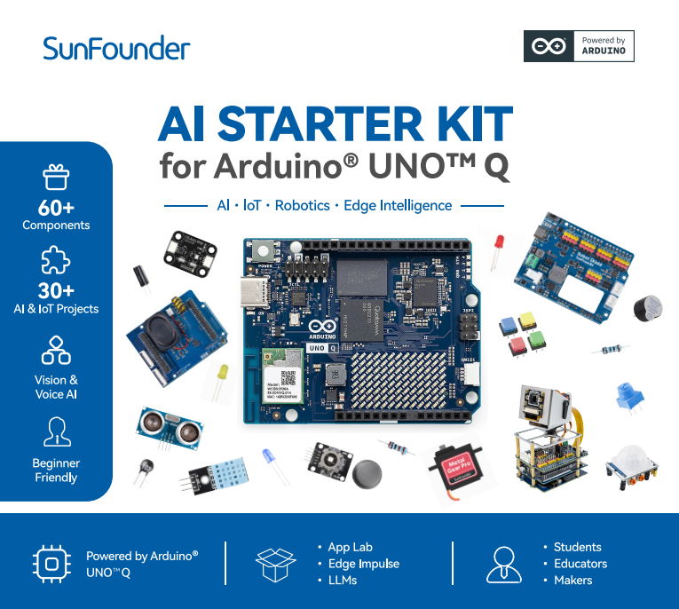

.. start_hello_message

.. note::

    Welcome to the SunFounder Raspberry Pi, Arduino, and ESP32 Community on Facebook!

    Why join?

    - Get technical support from the SunFounder team and community members
    - Learn from shared projects, tips, and tutorials
    - Preview upcoming products and new features
    - Access exclusive discounts and promotions
    - Participate in community events and giveaways

    👉 Join us on Facebook: [|link_sf_facebook|]

.. end_hello_message

SunFounder AI Starter Kit for Arduino UNO Q
===========================================

Thank You for Choosing the SunFounder AI Starter Kit.

.. note::
    This document is available in the following languages.
        * |link_german_tutorials|
        * |link_jp_tutorials|
        * |link_en_tutorials|

Product Overview
----------------

The SunFounder AI Starter Kit for Arduino Uno Q is an all-in-one learning platform for AI, programming, and interactive electronics. It combines modular hardware, a ready-to-use software environment App Lab, and step-by-step lessons to help users build hands-on projects with computer vision, voice interaction, and multi-LLM AI technologies.

Main Content
------------

Features the Robot Shield, Multimedia carrier, camera, pan-tilt module, sensors, and electronic components, enabling hands-on AI projects with vision recognition, voice interaction, and hardware control.

Target Users
------------

Aged 10+ students, educators, makers, and engineers.

Application
-----------

Object recognition, face recognition, gesture recognition, voice interaction and control, pan-tilt tracking systems, multi-LLM interactive applications, and smart home systems.

.. toctree::
    :maxdepth: 1

    About this Kit <self>
    get_start/get_start
    basic/basic
    media/media
    iot/iot
    edge_ai/edge_ai

**Copyright Notice**

All contents including but not limited to texts, images, and code in this manual are owned by the SunFounder Company. You should only use it for personal study,investigation, enjoyment, or other non-commercial or nonprofit purposes, under therelated regulations and copyrights laws, without infringing the legal rights of the author and relevant right holders. For any individual or organization that uses these for commercial profit without permission, the Company reserves the right to take legal action.

