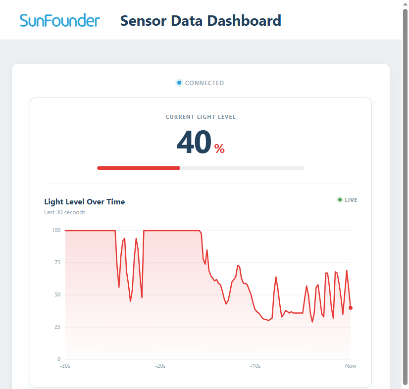

.. include:: /index.rst
   :start-after: start_hello_message
   :end-before: end_hello_message

03 Sensor Data Dashboard
==========================

So far, data flowed **from** the browser **to** your hardware — click a button, the LED obeys. Now you'll reverse the direction: a sensor reads the real world, and its data flows **from** the hardware **to** the browser as a live-updating dashboard. A photoresistor measures the light in your room, and a web page shows the current level plus a scrolling chart of the last 30 seconds — watch the curve react the moment you cover the sensor with your hand.

In this lesson, you will learn to:

* Read an analog sensor and convert its raw value to a meaningful 0–100% level
* Push data from the sketch to Python with ``Bridge.notify()``
* Forward sensor data from Python to the browser in real time
* Visualize a live data stream with a scrolling chart

1. Build the Circuit
----------------------

**Components Needed**

.. list-table::
   :widths: 25 25 25 25
   :header-rows: 0

   * - 1 * :ref:`Arduino Uno Q <cpn_uno_q>`
     - 1 * :ref:`cpn_photoresistor`
     - 1 * :ref:`cpn_resistor` (10kΩ)
     - Several :ref:`cpn_wires`
   * - |list_uno_q|
     - |list_photoresistor|
     - |list_10kohm|
     - |list_wire|
   * - 1 * USB Cable
     -
     -
     -
   * - |list_usb_cable|
     -
     -
     -

**Wiring Diagram**

Connect the photoresistor between **3.3V** and **A0**, and the 10kΩ resistor between **A0** and **GND** — the two resistors form a voltage divider, and the UNO Q reads the divided voltage on A0.

.. image:: /img/wiring/wiring_photo.png
   :width: 500
   :align: center

2. Run the App
----------------

#. In App Lab, go to **Apps** → **Create new app** → **Import App** → **Import from Computer**.

#. Navigate to ``unoq-ai-kit/iot/`` and select ``03 Sensor Data Dashboard.zip``. Open it.

#. Click the **Run** button (▶). A **Web UI** tab opens showing the current light level, a level bar, and a trend chart.

#. Cover the photoresistor with your hand — the percentage drops and the chart curves downward. Uncover it, or shine a flashlight on it — the curve climbs back up.

**How it Works**

The data flows in one direction — hardware → Python → browser — but it never stops:

* ``03 Sensor Data Dashboard/`` — the app folder

  * Files

    * ``assets/``

      * ``index.html`` — dashboard layout
      * ``app.js`` — Chart rendering and UI updates
      * ``style.css`` — Visual styling

    * ``python/``

      * ``main.py`` — Bridge receiver and Web UI relay

    * ``sketch/``

      * ``sketch.ino`` — Sensor reading on the microcontroller

    * ``app.yaml`` — App metadata (name, icon, bricks used)

.. mermaid::

   sequenceDiagram
       participant S as Sketch (sketch.ino)
       participant P as Python (main.py)
       participant B as Browser (HTML/JS)

       loop every 200 ms
           S->>S: analogRead(A0) → map to 0–100%
           S-->>P: Bridge.notify("update_light_level", value)
           P-->>B: ui.send_message("light_level", {value})
           B->>B: update level bar + chart
       end

Here's what each component does:

**Sketch (sketch.ino)** — runs on the STM32 MCU
  * Reads the photoresistor on A0 every 200 ms with ``analogRead()``
  * Maps the raw 0–1023 value to a 0–100% light level with ``map()``
  * ``Bridge.notify("update_light_level", lightLevel)`` pushes each reading to Python — the reverse of ``Bridge.provide()``

**Python (main.py)** — runs on the Linux MPU
  * ``Bridge.provide("update_light_level", ...)`` receives readings from the sketch
  * ``ui.send_message("light_level", {"value": light_level})`` forwards them to every connected browser

**Browser (HTML/JS)** — runs in the user's browser
  * Updates the current-value label and the level bar width
  * Appends each sample to a 150-point buffer and redraws the chart — 150 samples × 200 ms = about 30 seconds of history
  * Shows a status dot: green when connected, red with an error banner when the connection is lost

**The 200 ms sample interval**

The sketch uses ``millis()`` instead of ``delay()`` to pace the readings — the board stays responsive to Bridge events between samples. 200 ms per sample (5 readings per second) is fast enough to look "live" while keeping the Bridge traffic light.

3. Experiment
----------------

**Change the Chart Window**

The browser keeps the last 150 samples. In ``app.js``, change ``MAX_POINTS``:

.. list-table::
   :header-rows: 1
   :widths: 30 70

   * - Value
     - Effect
   * - ``50``
     - Shorter window — only the last 10 seconds, chart reacts faster
   * - ``150``
     - Default — about 30 seconds of history
   * - ``600``
     - Two minutes of history — longer trends visible

**Flip the Direction**

Depending on your photoresistor circuit, brighter light may produce either a higher or lower reading. If your percentage goes **down** when you shine a flashlight on the sensor, reverse the mapping in ``sketch.ino``:

.. code-block:: cpp

   int lightLevel = map(rawValue, 0, 1023, 100, 0);

4. Troubleshooting
--------------------

**The dashboard shows 0% or 100% and never changes**

* **Cause:** The voltage divider is wired incorrectly, or the mapping direction is backwards.
* **Solution:** Check the voltage divider: photoresistor between 3.3V and A0, 10kΩ resistor between A0 and GND. If the value is pinned at one extreme, try the reversed mapping described in the Experiment section — your circuit may output a higher voltage in the dark.

**The chart is empty on first load**

* **Cause:** The chart buffer starts empty and fills over time.
* **Solution:** Wait a few seconds — with 5 samples per second, the chart fills within moments. The current-value label should update immediately.

**The page shows "Disconnected"**

* **Cause:** The Python app stopped, or the browser cannot reach the UNO Q.
* **Solution:** Refresh the page. If the error banner persists, restart the App in App Lab and reopen the Web UI.

**Values update but the chart doesn't scroll**

* **Cause:** A JavaScript error in the chart drawing code.
* **Solution:** Open the browser's Developer Tools (F12) and check the Console tab. Verify that ``app.js`` loads after the ``canvas`` element exists in ``index.html``.

5. Summary
-------------

You've built your first hardware-to-browser data pipeline! In this lesson, you learned:

* How ``Bridge.notify()`` pushes data from the sketch to Python — the reverse of ``Bridge.provide()``
* How to convert raw ADC values into meaningful percentages with ``map()``
* How to forward a live data stream from Python to the browser
* How to visualize streaming data with a scrolling chart and a sample buffer

In the next lesson, you'll turn the data flow into something more playful — a physical joystick that controls a maze game running in your browser.
