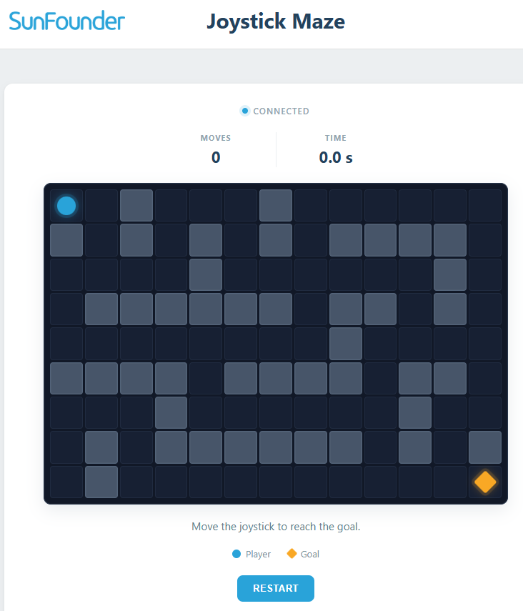

.. include:: /index.rst
   :start-after: start_hello_message
   :end-before: end_hello_message

04 UI Joystick Maze
=====================

Your UNO Q has been dutifully reporting data — now it's time to play. In this lesson, you'll use a physical **joystick** to guide an explorer through a maze that runs in your browser. Push the stick and the character moves one cell; reach the yellow goal and the page shows your move count and completion time. The joystick is just two potentiometers at right angles — but combined with a browser game, it becomes a real game controller.

In this lesson, you will learn to:

* Read a two-axis analog joystick and auto-calibrate its center position
* Use a dead zone to filter tiny voltage fluctuations around center
* Send discrete game events ("left", "up", …) through ``Bridge.notify()``
* Keep the game logic in the browser while the sketch only reports input

1. Build the Circuit
----------------------

**Components Needed**

.. list-table::
   :widths: 25 25 25 25
   :header-rows: 0

   * - 1 * Pan Tilt Kit
     - 1 * :ref:`cpn_joystick`
     - Several :ref:`cpn_wires`
     - 1 * USB Cable
   * - |list_pan_tilt|
     - |list_joystick_module|
     - |list_wire|
     - |list_usb_cable|

**Wiring Diagram**

Connect the joystick's **VRx** to **A3**, **VRy** to **A2**, **SW** to **D4**, **VCC** to **3.3V** (the UNO Q's analog inputs measure 0–3.3V), and **GND** to **GND**.

.. image:: /img/wiring/wiring_joystick.png
   :width: 600
   :align: center

2. Run the App
----------------

#. In App Lab, go to **Apps** → **Create new app** → **Import App** → **Import from Computer**.

#. Navigate to ``unoq-ai-kit/iot/`` and select ``04 UI Joystick Maze.zip``. Open it.

#. Click the **Run** button (▶). A **Web UI** tab opens showing a maze with a blue explorer and a yellow goal.

#. Push the joystick up, down, left, or right — the explorer moves one cell per push. Reach the yellow goal and a **Maze Complete!** dialog shows your moves and completion time. Press the joystick button (or click **Play Again**) to restart.

**How it Works**

The sketch turns continuous joystick voltages into discrete game moves; the browser handles everything else:

* ``04 UI Joystick Maze/`` — the app folder

  * Files

    * ``assets/``

      * ``index.html`` — game canvas and result dialog
      * ``app.js`` — Maze layout, movement, collision, scoring
      * ``style.css`` — Visual styling

    * ``python/``

      * ``main.py`` — Bridge receiver and Web UI relay

    * ``sketch/``

      * ``sketch.ino`` — Joystick reading and edge detection

    * ``app.yaml`` — App metadata (name, icon, bricks used)

.. mermaid::

   sequenceDiagram
       participant J as Joystick (Hardware)
       participant S as Sketch (sketch.ino)
       participant P as Python (main.py)
       participant B as Browser (Game)

       J->>S: Push right (VRx voltage rises)
       S->>S: offset > dead zone, joystickReady
       S-->>P: Bridge.notify("joystick_move", "right")
       P-->>B: ui.send_message("joystick_move", {direction})
       B->>B: move player one cell (wall? goal?)

       J->>S: Press SW button
       S-->>P: Bridge.notify("reset_game")
       P-->>B: ui.send_message("reset_game")
       B->>B: restart the maze

Here's what each component does:

**Sketch (sketch.ino)** — runs on the STM32 MCU
  * Calibrates the joystick center at startup: averages 20 X/Y readings in ``setup()`` — every joystick rests at a slightly different voltage
  * Computes the offset from center and ignores anything inside the ±150 dead zone
  * Sends **one** direction per push: after ``Bridge.notify("joystick_move", ...)``, ``joystickReady`` turns false until the stick returns to center
  * Detects the button's falling edge and sends ``Bridge.notify("reset_game")``

**Python (main.py)** — runs on the Linux MPU
  * ``Bridge.provide("joystick_move", ...)`` validates the direction and forwards it to the browser
  * ``Bridge.provide("reset_game", ...)`` forwards the restart event

**Browser (HTML/JS)** — runs in the user's browser
  * Tries to move the player one maze cell; walls block movement
  * Counts moves and completion time; shows the **Maze Complete!** dialog at the goal
  * Restarts on the joystick button or the **Play Again** button

**Why one cell per push?**

Without the ``joystickReady`` lock, a single push would fire dozens of "right" events while the stick is held — the player would teleport across the maze. Requiring the stick to return to center between moves keeps the game fair and deliberate. For diagonal pushes, the stronger axis wins.

3. Experiment
----------------

**Tune the Feel**

The sketch has two tuning knobs — ``DEAD_ZONE`` and the calibration sample count:

.. list-table::
   :header-rows: 1
   :widths: 30 70

   * - Change
     - Effect
   * - ``DEAD_ZONE = 80``
     - More sensitive — small nudges already count as moves
   * - ``DEAD_ZONE = 300``
     - Deliberate pushes required — better for shaky hands
   * - 20 → 50 calibration samples
     - Slower startup, slightly more accurate center

**Change the Maze**

The maze layout lives in ``assets/app.js`` as a grid of cells. Replace the maze definition with your own design — make sure there is still a path from the start to the goal, or the game becomes unwinnable!

4. Troubleshooting
--------------------

**The explorer moves by itself or wanders between cells**

* **Cause:** The joystick center drifted, or the dead zone is too small.
* **Solution:** The sketch calibrates the center at startup — restart the App without touching the joystick for the first second. If drift continues, increase ``DEAD_ZONE`` to 300.

**Pushing the stick moves the explorer in the wrong direction**

* **Cause:** The joystick axes are swapped, or the module is rotated 90°.
* **Solution:** Check VRx → A3 and VRy → A2. If directions are rotated (push up → moves right), swap the two wires. If a single axis is inverted, swap that axis's VCC/GND orientation — or negate the offset in code.

**One push moves the explorer multiple cells**

* **Cause:** The ``joystickReady`` lock was removed or the dead zone check is inverted.
* **Solution:** Confirm the sketch only sends when ``joystickReady`` is true, and that it is set back to true only when both offsets return inside the dead zone.

**The joystick button doesn't restart the game**

* **Cause:** The SW pin wiring, or the button uses the wrong trigger edge.
* **Solution:** Check SW → D4 with ``INPUT_PULLUP``. The sketch detects the falling edge (``lastButtonState == HIGH && buttonState == LOW``) — holding the button down restarts only once, on the press.

5. Summary
-------------

You've turned the UNO Q into a game controller! In this lesson, you learned:

* How to read a two-axis joystick and auto-calibrate its center at startup
* How a dead zone filters analog noise into clean, deliberate input
* How to send discrete events through ``Bridge.notify()`` from sketch to browser
* How separating concerns — hardware reports input, browser runs the game — keeps both sides simple

In the next lesson, you'll take your projects beyond your local network — using Arduino Cloud to control a buzzer's pitch from anywhere with internet access.
