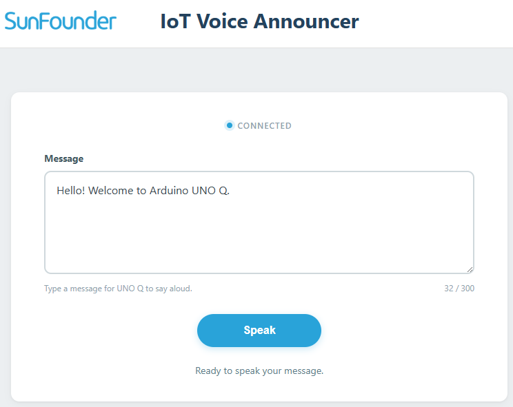

.. include:: /index.rst
   :start-after: start_hello_message
   :end-before: end_hello_message

05 IoT Voice Announcer
==========================

You've built web controls that make LEDs blink, colors change, and games move. Now the UNO Q will **speak**: type a message in a Web UI, click **Speak**, and the board reads your text aloud through the speaker. The browser becomes a keyboard for the board's voice.

In this lesson, you will learn to:

* Send text from a Web UI to Python with a custom UI event
* Convert text to speech with the ``sunfounder_tts`` Brick
* Send status updates back to the browser while the board is speaking
* Guard the TTS engine against empty or oversized messages

1. Build the Circuit
----------------------

**Components Needed**

.. list-table::
   :widths: 25 25
   :header-rows: 0

   * - 1 * Pan Tilt Kit
     - 1 * USB Cable
   * - |list_pan_tilt|
     - |list_usb_cable|

No breadboard wiring is needed — the speaker is built into the Multimedia Carrier.

2. Run the App
----------------

#. Open **Arduino App Lab**, import ``05 IoT Voice Announcer.zip`` from the ``unoq-ai-kit/iot/`` folder.

#. Click **Run** (▶). The Output window shows:

   *"=== IoT Voice Announcer ==="*

#. Open the **Web UI** tab, type a short message — for example, "Hello from my UNO Q" — and click **Speak**. The status changes to **Speaking...**, the board reads your message aloud, and the status returns to **Ready to speak another message.**

.. note::

   The first time you run a TTS example on this UNO Q, App Lab needs to download and prepare the TTS runtime and audio dependencies. This may take half an hour or more, depending on your network connection. Keep the UNO Q connected to the Internet and wait for the setup to complete. This setup only happens once — after it finishes, every TTS example starts much faster.

   .. image:: img/5_voice_announcer.png
      :width: 80%
      :align: center

**How it Works**

The data path from your typed text to the spoken sentence:

.. mermaid::

   sequenceDiagram
       participant B as Browser (HTML/JS)
       participant P as Python (main.py)

       B->>P: socket.emit('speak_message', text)
       P->>P: check text (empty? too long?)
       P-->>B: speak_status: "Speaking..."
       P->>P: tts.say(text)
       Note over P: EdgeTTS converts text and plays audio
       P-->>B: speak_status: "Ready to speak another message."

**Python (main.py)** — runs on the Linux MPU

* ``ui.on_message("speak_message", speak_message)`` registers a handler for the browser's **Speak** button. Every event carries a ``text`` field with the typed message.
* Empty messages are rejected with **Please enter a message.**, and long messages are trimmed to 300 characters — one click never triggers a huge announcement.
* ``tts.say(text)`` blocks while the board speaks, then Python broadcasts **Ready to speak another message.** so the button can be used again.
* If the TTS engine fails, the browser shows **Unable to play the message.** instead of hanging silently.

**Sketch (sketch.ino)** — runs on the STM32 MCU

The sketch is intentionally empty — all the logic of this lesson lives in Python, because the speaker and the TTS Brick run on the Linux side.

3. Experiment
----------------

**Try Different Messages**

Type different kinds of messages and observe the status flow:

.. list-table::
   :header-rows: 1
   :widths: 45 55

   * - You do
     - Expected result
   * - Type "Hello" and click **Speak**
     - Status shows **Speaking...**, the board says "Hello", then **Ready to speak another message.**
   * - Click **Speak** with an empty box
     - Status shows **Please enter a message.** — nothing is spoken
   * - Paste a very long paragraph
     - Only the first 300 characters are spoken

**Change the Voice**

In ``main.py``, try a different voice character:

.. code-block:: python

   tts.set_voice("en-GB-SoniaNeural")   # British English female

Run again — the same message now speaks with a British accent.

**Challenge: Change the Ready Message**

After speaking, the status returns to **Ready to speak another message.** Find this string in ``main.py`` and change it to something friendlier, such as **All done — type another one!** The button stays the same; only the status text changes.

4. Troubleshooting
--------------------

**The board speaks nothing after clicking Speak**

* **Cause:** The TTS runtime is still being prepared on the first run, or the message box was empty.
* **Solution:** On the first run, wait for the TTS runtime download to finish — it can take half an hour or more. Check that the Multimedia Carrier is firmly attached, and that the message box isn't empty.

**The status stays on "Speaking..." forever**

* **Cause:** The TTS engine raised an error during playback.
* **Solution:** Check the Output window for a **TTS error** message. Stop the app and run it again — the UNO Q needs Internet access for the EdgeTTS engine.

**Only part of my long message is spoken**

* **Cause:** Messages are intentionally trimmed to 300 characters.
* **Solution:** This is by design — change the ``text[:300]`` limit in ``main.py`` if you want longer announcements.

**The Web UI button does nothing**

* **Cause:** The page lost its connection to the Python app.
* **Solution:** Refresh the browser tab. If the problem persists, stop and run the app again.

5. Summary
-------------

Your UNO Q can now speak whatever you type! In this lesson, you learned:

* How to send typed text from the browser to Python with a UI event
* How the ``sunfounder_tts`` Brick turns text into speech
* How status updates flow back to the browser during playback
* How to reject empty and oversized messages safely

In the next lesson, the web stops being local — you'll control hardware from anywhere with **Arduino Cloud**.
