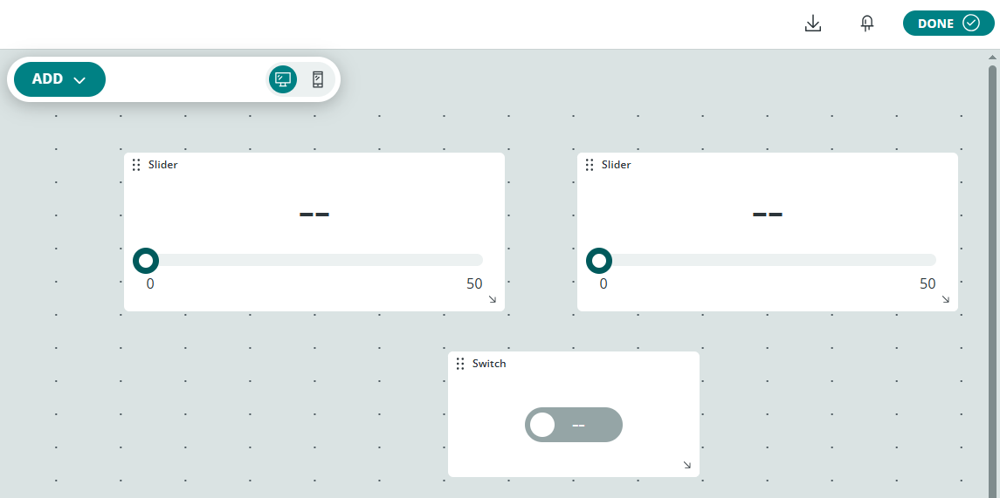

.. include:: /index.rst
   :start-after: start_hello_message
   :end-before: end_hello_message

07 Arduino Cloud Environment Monitor
======================================

In the previous lesson, commands flowed **from** the cloud **to** your device. Now you'll reverse the flow — uploading temperature and humidity data **from** your UNO Q **up to** Arduino Cloud, where you can view it as live gauges. You'll also add a cloud switch that controls an LED on your desk from anywhere in the world. This is the core pattern of IoT: devices report, cloud stores and visualizes.

In this lesson, you will learn to:

* Upload sensor data (DHT11 temperature and humidity) to Arduino Cloud
* Create cloud dashboards with value widgets and a switch
* Use ``Bridge.notify()`` to push sketch data to Python
* Control an LED remotely via a cloud switch

1. Build the Circuit
----------------------

**Components Needed**

.. list-table::
   :widths: 25 25 25 25
   :header-rows: 0

   * - 1 * Pan Tilt Kit
     - 1 * :ref:`cpn_humiture_sensor`
     - 1 * :ref:`cpn_led` (Red)
     - 1 * :ref:`cpn_resistor` (220Ω)
   * - |list_pan_tilt_kit|
     - |list_dht11|
     - |list_red_led|
     - |list_220ohm|
   * - 1 * USB Cable
     -
     -
     -
   * - |list_usb_cable|
     -
     -
     -

**Wiring Diagram**

Connect the DHT11: VCC to 3.3V, DATA to pin D4, GND to GND. Connect the LED through a 220Ω resistor to pin D5.

.. image:: /img/wiring/wiring_dht11_led.png
   :width: 500
   :align: center

2. Setup
---------------

**1. Create a Device**

#. Navigate to the  |link_arduino_cloud|  page and log in or create an account.

#. Go to the  |link_cloud_devices|  page and create a device.

   .. image:: img/3_cloud_new_device.png
      :width: 90%

#. Select **Arduino UNO Q** under **Manual Setup**.

   .. image:: img/3_cloud_device_q.png
      :width: 90%

#. Follow the on-screen instructions, enter a **Device Name**, then click **Continue**.

   .. note::

      We recommend clicking **Download** to save the generated **Device ID** and **Secret Key**, as you will need them later when configuring the Arduino Cloud Brick.

   .. image:: img/3_cloud_device_id.png
      :width: 90%

**2. Create a Thing**

#. Go to the  |link_cloud_things|  page and create a new thing. Name it "Environment Monitor".

   .. image:: img/3_cloud_new_thing.png
      :width: 90%

#. Inside the thing, create a new **Floating Point Number** variable and name it "temperature".

   .. image:: img/4_cloud_thing_envirn.png
      :width: 90%

#. Create two more variables the same way:

   * ``humidity`` — Floating Point Number
   * ``led`` — Boolean

   .. image:: img/4_cloud_humidity_led.png
      :width: 90%

#. Associate the device you created with this thing:

   * Inside the thing, select **Associated Device**.

    .. image:: img/4_cloud_thing_associated.png

   * Click **Choose from your list**

     .. image:: img/4_cloud_thing_choose.png

   * Select the device you created and click **CONFIRM**

     .. image:: img/4_cloud_thing_device.png

**3. Create a Dashboard**

#. Navigate to the  |link_cloud_dashboards|  page and create a dashboard named "Environment Dashboard".

   .. image:: img/3_cloud_dashboard_new.png
      :width: 90%

#. Inside the dashboard, click on **Edit**.

   .. image:: img/4_cloud_dashboard_edit.png
      :width: 90%

#. Select the **Thing** tab and select the Thing you just created.

   * Set the ``temperature`` and ``humidity`` widgets to **Value**.
   * Set the ``led`` widget to **Switch**.
   * Click **CREATE WIDGETS**.

   .. image:: img/4_cloud_dashboard_thing.png
      :width: 90%

#. Select a widget and click **Open settings** to customize its name and range.

   .. image:: img/4_cloud_widget_setting.png
      :width: 90%

#. In the settings panel, give the widget a meaningful name and adjust the display options.

   .. image:: img/4_cloud_widget_set_name.png
      :width: 90%

#. You should now see all three widgets on your dashboard. Click **DONE**.

   .. image:: img/4_cloud_dashboard_finish.png
      :width: 90%

3. Run the App
----------------

#. Download :download:`07 Arduino Cloud Environment Monitor.zip <https://github.com/sunfounder/unoq-ai-kit/releases/latest/download/07.Arduino.Cloud.Environment.Monitor.zip>`.
#. In App Lab, go to **Apps** → **Create new app** → **Import App** → **Import from Computer**, and open the package you downloaded.
#. Click on the "Arduino Cloud" Brick, then click the "Brick Configuration" button.

   .. image:: img/03_cloud_brick_configure.png
      :width: 90%

#. Enter the **Device ID** and **Secret Key** you saved when creating the device.

   .. image:: img/3_cloud_brick_secret_id.png

#. Click the **Run** button (▶). Open the cloud dashboard — you'll see live temperature and humidity readings updating every 5 seconds. Flip the LED switch to turn the LED on or off remotely.

   .. image:: img/4_cloud_result.png
      :width: 90%

**How it Works**

The environment monitor is a multi-file app — the sketch reads the DHT11, and Python carries data between the sketch and the cloud:

* ``07 Arduino Cloud Environment Monitor/`` — the app folder

  * Bricks

    * Arduino Cloud

  * Files

    * ``python/``

      * ``main.py`` — Cloud variable registration and callbacks

    * ``sketch/``

      * ``sketch.ino`` — DHT11 reading and LED control

    * ``app.yaml`` — App metadata (name, icon, bricks used)

.. mermaid::

   sequenceDiagram
       participant S as Sketch (sketch.ino)
       participant P as Python (main.py)
       participant C as Arduino Cloud Dashboard

       loop every 5s
           S->>S: dht.readTemperature() / readHumidity()
           S-->>P: Bridge.notify("update_environment_cloud", 26.3, 58.2)
           P->>P: iot_cloud.temperature = 26.3
           P->>P: iot_cloud.humidity = 58.2
           P->>C: Dashboard gauges update
       end

       C-->>P: User flips LED switch
       P->>S: Bridge.call("set_led_state", True)
       S->>S: digitalWrite(5, HIGH)

Here's what each component does:

**Sketch (sketch.ino)** — runs on the STM32 MCU
  * Reads the DHT11 every 5 seconds with a non-blocking ``millis()`` timer (``SENSOR_INTERVAL = 5000``)
  * ``Bridge.notify("update_environment_cloud", temperature, humidity)`` **pushes** each reading up to Python — unlike ``Bridge.provide()`` which waits to be called, ``notify()`` actively sends data when the sketch has something to report
  * ``Bridge.provide("set_led_state", setLedState)`` exposes the LED control function for Python

**Python (main.py)** — runs on the Linux MPU
  * Registers three cloud variables: ``temperature`` and ``humidity`` (device → cloud) and ``led`` (cloud → device)
  * ``update_environment_cloud()`` receives sketch readings and assigns them to the cloud variables — assigning to a registered variable automatically uploads it, no explicit update call needed
  * ``led_callback()`` fires when the dashboard switch changes — it calls ``Bridge.call("set_led_state", led_state)`` to control the LED on D5

This lesson introduces **bidirectional cloud communication**: sensor data flows up every 5 seconds, LED commands flow down the moment you flip the switch.

4. Experiment
----------------

**Adjust the Upload Interval**

Change ``SENSOR_INTERVAL`` in the sketch: 2000 ms for rapid updates, 10000 ms for battery-friendly logging.

**Challenge: Add an Alert Threshold**

In ``update_environment_cloud``, check if temperature exceeds 30°C. If so, set ``iot_cloud.led = True`` automatically — the LED becomes a high-temperature warning light without any cloud interaction.

5. Troubleshooting
--------------------

**Dashboard shows stale or no data**

* **Cause:** ``Bridge.notify()`` isn't reaching Python, or Wi-Fi is disconnected.
* **Solution:** Open the Serial Monitor — the sketch prints readings every 5 seconds. If readings appear but the dashboard doesn't update, check the cloud connection credentials.

**Sensor reads always return "error"**

* **Cause:** DHT11 wiring issue, or the sensor needs time to stabilize.
* **Solution:** Check VCC → 3.3V, DATA → pin D4, GND → GND. Wait 1–2 seconds after power-on for the first valid reading.

**Cloud switch doesn't control the LED**

* **Cause:** The function names don't match between Python and sketch.
* **Solution:** Verify ``Bridge.provide("set_led_state", ...)`` in the sketch uses the exact same name as ``Bridge.call("set_led_state", ...)`` in Python.

6. Summary
-------------

Your UNO Q is a bidirectional cloud-connected device! In this lesson, you learned:

* How to upload sensor data from sketch to cloud using ``Bridge.notify()``
* How to control hardware remotely via cloud switch and ``Bridge.call()``
* How ``iot_cloud.register()`` creates cloud variables with automatic synchronization
* How to create cloud dashboards with multiple widget types

In the next lesson, you'll build a smart doorbell — a push button, a camera, and a web page that announces visitors.
