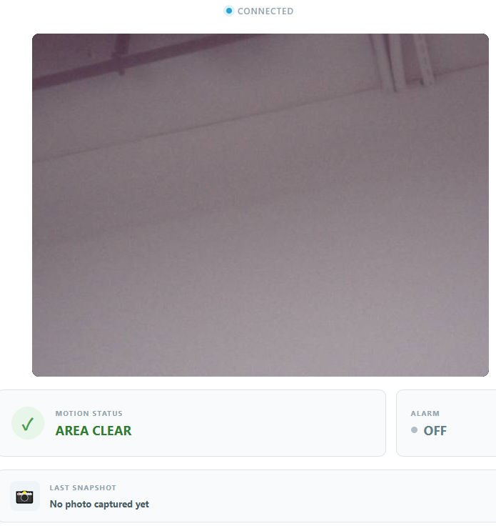

.. include:: /index.rst
   :start-after: start_hello_message
   :end-before: end_hello_message

08 IoT Security Monitor
==========================

A doorbell waits for a visitor. A security system **watches** — continuously. In this lesson, you'll build the most complex project in this module: a PIR motion sensor watches the room, a live camera preview streams to your browser, a two-tone siren sounds when motion is detected, snapshots are saved automatically, and every event is logged with a timestamp. Motion, camera, alarm, and event log — all working together.

In this lesson, you will learn to:

* Read a PIR motion sensor and latch its state with a hold time
* Generate a two-tone siren with ``tone()`` using non-blocking ``millis()`` timing
* Save security snapshots automatically — immediately on detection, then periodically while motion continues
* Build a monitoring system with states (MOTION DETECTED / AREA CLEAR) shared across sketch, Python, and browser

1. Build the Circuit
----------------------

**Components Needed**

.. list-table::
   :widths: 25 25 25 25
   :header-rows: 0

   * - 1 * :ref:`Arduino Uno Q <cpn_uno_q>`
     - 1 * Multimedia Carrier (with camera)
     - 1 * :ref:`cpn_pir`
     - 1 * Passive :ref:`cpn_buzzer`
   * - |list_uno_q|
     - |list_uno_q|
     - |list_pir|
     - |list_passive_buzzer|
   * - 1 * :ref:`cpn_breadboard`
     - Several :ref:`cpn_wires`
     - 1 * USB Cable
     -
   * - |list_breadboard|
     - |list_wire|
     - |list_usb_cable|
     -

.. note::

   You used the Multimedia Carrier and camera in Module B — they should already be attached. The PIR sensor needs about 30 seconds after power-on to calibrate to the background infrared level before it detects reliably.

**Wiring Diagram**

Connect the PIR sensor: **VCC** → **3.3V**, **GND** → **GND**, **OUT** → **D2**. Connect the passive buzzer between **D5** and **GND**.

.. image:: /img/wiring/wiring_pc_buzzer_pir.png
   :width: 500
   :align: center

2. Run the App
----------------

#. In App Lab, go to **Apps** → **Create new app** → **Import App** → **Import from Computer**.

#. Navigate to ``unoq-ai-kit/iot/`` and select ``08 IoT Security Monitor.zip``. Open it.

#. Click the **Run** button (▶). The Web UI opens with the live camera preview, a motion status, an alarm status, and an event log.

#. Wait for the PIR to warm up, then walk in front of the sensor — the status flips to **MOTION DETECTED**, the buzzer sounds a two-tone siren, and a snapshot is saved. Stand still for 10 seconds and the status returns to **AREA CLEAR**.

**How it Works**

The sketch watches the PIR sensor and owns the security state; Python handles the camera; the browser displays everything:

* ``08 IoT Security Monitor/`` — the app folder

  * Files

    * ``assets/``

      * ``index.html`` — camera view, status panel, event log
      * ``app.js`` — Socket.IO events and UI updates
      * ``style.css`` — Visual styling

    * ``python/``

      * ``main.py`` — Camera streaming, snapshot saving, event relay

    * ``sketch/``

      * ``sketch.ino`` — PIR polling, motion hold, siren alarm

    * ``app.yaml`` — App metadata (name, icon, bricks used)

.. mermaid::

   sequenceDiagram
       participant PIR as PIR (Hardware)
       participant S as Sketch (sketch.ino)
       participant P as Python (main.py)
       participant B as Browser (HTML/JS)

       PIR->>S: Motion → OUT HIGH
       S->>S: latch MOTION DETECTED, start siren
       S-->>P: Bridge.notify("motion_state", true)
       P->>P: save photos/security_001.jpg
       P-->>B: motion_status + security_photo
       B->>B: red banner, event logged

       Note over S: 10 s with no motion
       S->>S: latch AREA CLEAR, stop siren
       S-->>P: Bridge.notify("motion_state", false)
       P-->>B: motion_status (clear)

Here's what each component does:

**Sketch (sketch.ino)** — runs on the STM32 MCU
  * Polls the PIR sensor every 20 ms — ``digitalRead(PIR_PIN) == HIGH`` means motion
  * Latches the security state: motion sets it immediately, but clearing requires **10 continuous seconds** without motion (``MOTION_HOLD_TIME = 10000``) — brief PIR dropouts don't end the alarm
  * ``setMotionState()`` alternates the siren between 800 Hz and 1200 Hz every 300 ms using ``tone()`` — and because the timing uses ``millis()``, PIR polling and Bridge calls continue while the alarm sounds
  * ``Bridge.notify("motion_state", active)`` keeps Python in sync

**Python (main.py)** — runs on the Linux MPU
  * ``Bridge.provide("motion_state", motion_state)`` receives the latched state; the callback is short — it only flags a snapshot request
  * The App's ``loop()`` streams the camera at about 5 FPS and saves snapshots as ``photos/security_001.jpg``, ``security_002.jpg``, and so on
  * The first motion event saves a photo immediately; while motion continues, another photo is saved every 2 minutes (``REPEAT_PHOTO_SECONDS = 120.0``)
  * Sends ``motion_status`` and ``security_photo`` events (filename + capture time) to the browser

**Browser (HTML/JS)** — runs in the user's browser
  * Shows the live camera preview, a motion status banner, and the latest snapshot
  * Logs every event — motion detected and area clear — with its timestamp

**The motion hold time — why 10 seconds?**

Real PIR sensors sometimes flicker LOW for a moment even when a person is still in the room. Without the hold time, the alarm would stutter on and off. The 10-second rule means "the area is clear" only when the sensor has been quiet for a while — exactly how real security systems behave.

3. Experiment
----------------

**Tune the Hold Time**

``MOTION_HOLD_TIME`` controls how long the system waits before declaring the area clear:

.. list-table::
   :header-rows: 1
   :widths: 30 70

   * - Value
     - Effect
   * - 3000
     - Alarm clears quickly — good for testing
   * - 10000
     - Default — 10 seconds of quiet before AREA CLEAR
   * - 30000
     - Very conservative — a room that stays quiet for 30 seconds

**Change the Siren**

The siren alternates ``ALARM_LOW_FREQ`` (800 Hz) and ``ALARM_HIGH_FREQ`` (1200 Hz) every ``ALARM_TONE_TIME`` (300 ms). Try 500/1000 Hz for a police-car feel, or raise the tone time to 500 ms for a slower wail.

**Challenge: Add a Motion Count**

Add a counter in the sketch that increments each time motion is detected (each AREA CLEAR → MOTION DETECTED transition). Send it to Python with the motion state and display "Motion events today: N" in the browser.

4. Troubleshooting
--------------------

**The alarm triggers constantly even when nothing moves**

* **Cause:** The PIR sensor is still warming up, or a heat source or draft is in view.
* **Solution:** Wait 30 seconds after power-on. Keep the sensor away from sunny windows, air vents, and heat sources — PIR sensors react to infrared changes, not just people.

**The status never returns to AREA CLEAR**

* **Cause:** The hold time is too long, or the PIR keeps triggering.
* **Solution:** Verify ``MOTION_HOLD_TIME`` is set as expected. If the sensor's own delay potentiometer is set high, it keeps OUT HIGH for a long time after motion — turn the delay potentiometer counterclockwise to shorten it.

**No snapshot is saved when motion is detected**

* **Cause:** The camera isn't connected, or the app loop isn't running.
* **Solution:** Check the camera FFC cable (blue side up) and that the live preview works. The snapshot logic lives in the ``loop()`` passed to ``App.run(user_loop=loop)`` — without it, photos are never saved.

**The siren sounds but the browser shows AREA CLEAR**

* **Cause:** The Bridge state message didn't reach Python, or the browser disconnected.
* **Solution:** Check that ``Bridge.notify("motion_state", active)`` and ``Bridge.provide("motion_state", ...)`` match exactly. Refresh the browser page — it re-requests the initial state on reconnect.

5. Summary
-------------

You've built a complete IoT security monitor — motion detection, siren alarm, live camera, automatic snapshots, and an event log! In this lesson, you learned:

* How to latch a sensor state with a hold time so alarms don't stutter
* How to generate a two-tone siren with non-blocking ``millis()`` timing
* How to save snapshots on demand and periodically while a condition persists
* How one shared state (motion/clear) drives the alarm, the camera, and the browser together

In the final lesson of this module, you'll connect your UNO Q to Telegram — controlling your hardware through chat messages from anywhere in the world.
