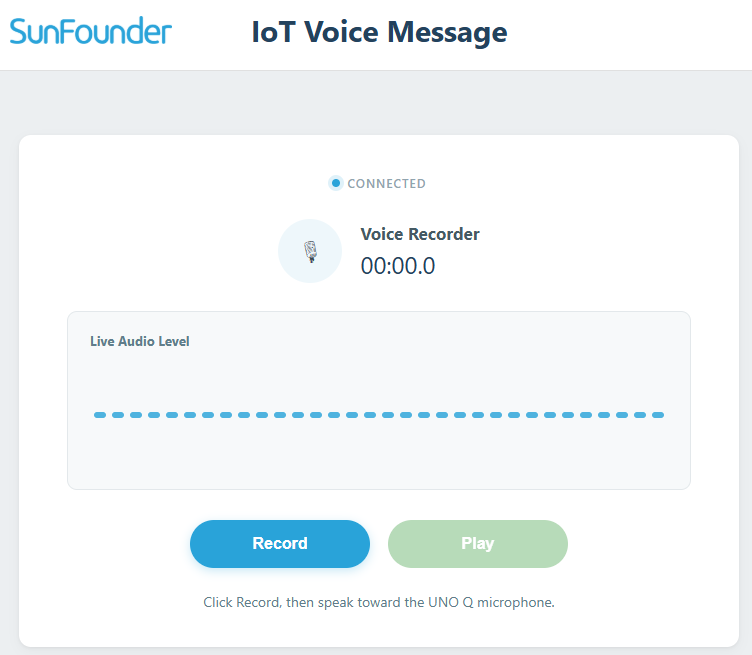

.. include:: /index.rst
   :start-after: start_hello_message
   :end-before: end_hello_message

10 IoT Voice Message
=========================

Earlier in this module, you typed messages and the board spoke them. Now the flow reverses: **record your real voice** with the UNO Q's microphone, watch the live audio level in the Web UI, and play the recording back through the speaker — a voice memo app, controlled entirely from the browser.

In this lesson, you will learn to:

* Record microphone audio with the STT Brick's recording API
* Stream the live audio level to the Web UI from a background thread
* Play and pause a recorded WAV file with the TTS Brick
* Coordinate several browser events (record, stop, play, pause) in one app

1. Build the Circuit
----------------------

**Components Needed**

.. list-table::
   :widths: 25 25
   :header-rows: 0

   * - 1 * :ref:`Arduino Uno Q <cpn_uno_q>`
     - 1 * USB Cable
   * - |list_uno_q|
     - |list_usb_cable|

No breadboard wiring is needed — the microphone and speaker are built into the Multimedia Carrier.

2. Run the App
----------------

#. Open **Arduino App Lab**, import ``10 IoT Voice Message.zip`` from the ``unoq-ai-kit/iot/`` folder.

#. Click **Run** (▶). The Output window shows:

   *"=== IoT Voice Message ==="*

#. Open the **Web UI** tab and try the full workflow:

   * Click **Record** and speak into the microphone — the audio level bar moves with your voice.
   * Click **Stop** to save the recording.
   * Click **Play** — the speaker plays your recording; **Pause** pauses it, and **Play** resumes it.

   .. image:: img/10_voice_message.png
      :width: 80%
      :align: center

**How it Works**

.. mermaid::

   sequenceDiagram
       participant B as Browser (HTML/JS)
       participant P as Python (main.py)

       B->>P: socket.emit('record_start')
       P->>P: tts.stop_audio() first
       P->>P: stt.start_recording()
       P-->>B: voice_status: "recording"
       loop every 0.12 s while recording
           P->>P: stt.get_audio_level()
           P-->>B: voice_level: level, duration
       end
       B->>P: socket.emit('record_stop')
       P->>P: stt.stop_recording(RECORDING_FILE)
       P-->>B: voice_status: has_recording
       B->>P: socket.emit('play_recording')
       P->>P: tts.play_audio(RECORDING_FILE)
       P-->>B: voice_status: "playing"
       B->>P: socket.emit('pause_recording')
       P->>P: tts.pause_audio()

**Python (main.py)** — runs on the Linux MPU

* The **STT Brick is used only for recording** — ``stt.start_recording()`` opens the microphone and ``stt.stop_recording(RECORDING_FILE)`` saves the audio as a WAV file. No speech-recognition model is loaded in this lesson.
* The **TTS Brick is used only for playback** — ``tts.play_audio(RECORDING_FILE)`` plays the saved file, ``tts.pause_audio()`` pauses it, and ``tts.resume_audio()`` resumes a paused track.
* A background thread (``level_worker``) streams the microphone level to the Web UI about 8 times per second while recording, and watches the playback state when idle.
* Starting a recording stops any playback first, so the two never mix.

**Sketch (sketch.ino)** — runs on the STM32 MCU

The sketch is intentionally empty — the microphone, speaker, and both Bricks run on the Linux side, so this lesson needs no sketch logic at all.

3. Experiment
----------------

**Record a Series of Messages**

Try the full workflow several times and watch the status:

.. list-table::
   :header-rows: 1
   :widths: 45 55

   * - You do
     - Expected result
   * - Click **Record** and speak
     - The audio level bar moves with your voice
   * - Click **Stop**
     - The recording is saved; **Play** becomes available
   * - Click **Play**, then **Pause**, then **Play**
     - Playback pauses and resumes from where it stopped
   * - Click **Record** while playing
     - Playback stops and a new recording starts

**Change the Playback Volume**

In ``main.py``, change the speaker volume:

.. code-block:: python

   tts.set_volume(80)   # louder playback

Run again — the recording plays louder.

**Challenge: Show the Recording Duration**

The Web UI receives a ``duration`` field in the status updates, but right now it only shows the level bar. Open ``assets/app.js`` and display the recording duration (in seconds) next to the status text — the data is already on its way, you just need to render it.

4. Troubleshooting
--------------------

**The audio level bar never moves while recording**

* **Cause:** The microphone isn't picking up sound, or the background thread isn't running.
* **Solution:** Speak closer to the microphone and check that the Multimedia Carrier is firmly attached. In the Output window, look for **Audio status error** messages.

**The recording plays back silent**

* **Cause:** The recording was too short, or the microphone level was very low.
* **Solution:** Record for at least a second and speak clearly. Check that the Multimedia Carrier is firmly attached to the UNO Q.

**Playback doesn't start when I click Play**

* **Cause:** No recording has been saved in this run.
* **Solution:** Record a message first — the Play button only works after **Stop** has saved a recording.

**The status shows errors like "Unable to save the recording."**

* **Cause:** The STT recording API failed to write the WAV file.
* **Solution:** Stop the app and run it again. The recording is written to a shared audio folder — make sure the app has enough free space on the board.

5. Summary
-------------

You've built a browser-controlled voice memo app! In this lesson, you learned:

* How to record microphone audio with the STT Brick's recording API
* How a background thread streams live audio levels to the Web UI
* How the TTS Brick plays and pauses a recorded WAV file
* How several UI events coordinate into one workflow

In the next lesson, your hardware leaves the local network again — you'll control it from a **Telegram bot** on your phone.
