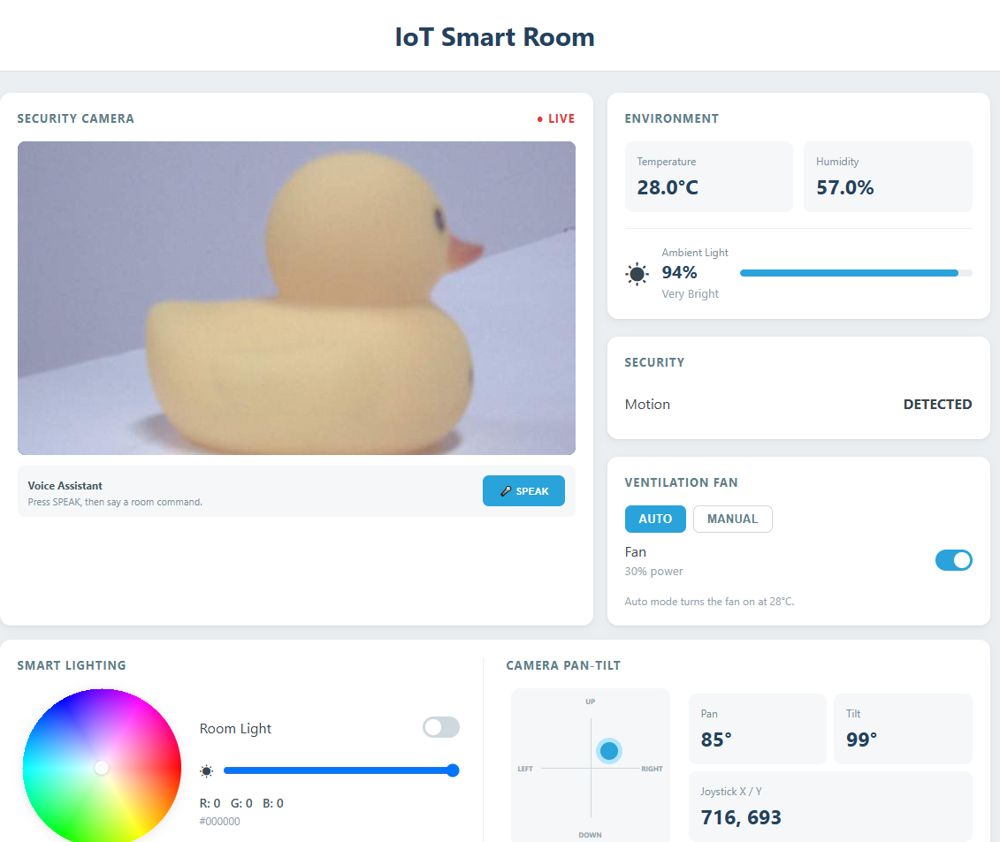

.. include:: /index.rst
   :start-after: start_hello_message
   :end-before: end_hello_message

12 IoT Smart Room
======================

This is the finale of the IoT module — everything you've learned in one room. Sensors watch the environment, a fan ventilates automatically, the camera streams live video, a joystick and your voice aim the pan-tilt, an RGB LED lights the room in any color, and the board answers you aloud. Welcome to your **IoT Smart Room**.

In this lesson, you will learn to:

* Combine sensors, actuators, camera, and voice control in one project
* Build an automatic control loop (fan turns on at 28°C) with manual override
* Handle many UI events and voice commands in one Python app
* Coordinate two processors: sensors and motors on the sketch, UI and AI on Python

1. Build the Circuit
----------------------

**Components Needed**

.. list-table::
   :widths: 25 25 25 25
   :header-rows: 0

   * - 1 * Pan Tilt Kit
     - 1 * :ref:`cpn_humiture_sensor`
     - 1 * :ref:`cpn_pir`
     - 1 * :ref:`cpn_rgb_led`
   * - |list_pan_tilt|
     - |list_dht11|
     - |list_pir|
     - |list_rgb_led|
   * - 1 * :ref:`cpn_photoresistor`
     - 1 * :ref:`cpn_joystick`
     - 1 * :ref:`cpn_breadboard`
     - Several :ref:`cpn_wires`
   * - |list_photoresistor|
     - |list_joystick_module|
     - |list_breadboard|
     - |list_wire|
   * - 3 * :ref:`cpn_resistor` (220Ω)
     - 1 * :ref:`cpn_resistor` (10kΩ)
     - 1 * USB Cable
     - -
   * - |list_220ohm|
     - |list_10kohm|
     - |list_usb_cable|
     - -

.. note::

   The Pan Tilt Kit includes the two servos, the camera, and the Multimedia Carrier. Before using the camera, make sure external carriers are enabled on your UNO Q — this is a one-time setup: :ref:`enable_external_carriers`.

**Wiring Diagram**

- Motor **IN1** → **D0**, Motor **IN2** → **D1**
- PIR **OUT** → **D4**, DHT11 **DATA** → **D5**
- RGB LED **R/G/B** → **D6/D7/D8**, each through a 220Ω resistor
- Pan servo → **D9**, Tilt servo → **D10**
- Photoresistor → **A0** (with a 10kΩ fixed resistor to GND)
- Joystick **X** → **A3**, Joystick **Y** → **A2**, Joystick **VCC** → **3.3V**, **GND** → **GND**

2. Run the App
----------------

#. Open **Arduino App Lab**, import ``12 IoT Smart Room.zip`` from the ``unoq-ai-kit/iot/`` folder.

#. Click **Run** (▶). The Output window shows:

   *"IoT Smart Room ready."*

#. Open the **Web UI** tab. You'll see the live camera feed, temperature and humidity, light level, PIR motion status, and the joystick position. Try the controls:

   * Move the physical joystick — the pan-tilt follows, and the indicator moves on the page.
   * Pick a color from the color wheel — the RGB LED changes to match.
   * Set the fan to **MANUAL** and toggle it on — the fan spins at 30% power.
   * Click the **voice** button and say a command, for example *"Set light blue"* or *"System status"* — the board confirms aloud.

   .. image:: img/iot_smart_room.png
     :width: 600
     :align: center

**How it Works**

.. mermaid::

   sequenceDiagram
       participant B as Browser (HTML/JS)
       participant P as Python (main.py)
       participant S as Sketch (sketch.ino)

       loop every 1 s
           S->>S: read DHT11, PIR, photoresistor
           S-->>P: Bridge.notify("environment_update")
           P-->>B: room_state (temp, humidity, motion, light)
       end
       loop every 0.25 s
           P->>P: camera.capture() → JPEG
           P-->>B: camera_frame
       end
       loop every 60 ms
           S->>S: read joystick, move servos
           S-->>P: Bridge.notify("joystick_update")
           P-->>B: camera_control_update
       end
       B->>P: set_rgb_color (color wheel)
       P->>S: Bridge.call("set_rgb_color", r, g, b)
       Note over P: voice button pressed
       P->>P: listen 4 s → match_command()
       P->>S: Bridge.call("set_fan_enabled" / "pan_left" / ...)
       P->>P: tts.say(confirmation)

**Sketch (sketch.ino)** — runs on the STM32 MCU

* The sketch owns the sensors and actuators: it reads the DHT11, PIR, photoresistor, and joystick, and drives the fan, RGB LED, and servos with ``analogWrite()`` and the ``Arduino_HardwareServo`` library.
* ``updateFan()`` respects the **System Run** switch — when the system is off, the fan stops, the RGB LED turns off, and the servos return to the 90° center.
* The fan runs at 30% power: ``analogWrite(MOTOR_IN1_PIN, FAN_PWM)`` where ``FAN_PWM = 255 * 30 / 100``.
* Eight Bridge RPCs are registered (``set_fan_enabled``, ``set_rgb_color``, ``set_system_running``, and the five servo functions), and two ``Bridge.notify()`` streams push sensor and joystick data to Python.

**Python (main.py)** — runs on the Linux MPU

* ``environment_update`` stores the latest sensor values and runs the **automatic fan loop**: in AUTO mode, the fan turns on when the temperature reaches ``AUTO_FAN_ON_TEMP`` (28°C) and off below it.
* The camera streams about 4 frames per second (``STREAM_INTERVAL = 0.25``) as JPEG images to the Web UI.
* The **voice assistant** listens for 4 seconds, matches the recognized text against a command table, and speaks a confirmation — color names are matched with ``"set light <color>"`` phrases, and *"System status"* speaks a summary of the room: temperature, humidity, light, motion, fan, and light color.
* A custom color is remembered as ``last_nonzero_rgb``, so *"Light on"* restores the last color instead of a fixed one.
* When the app stops, Python switches the fan off, turns the light off, and stops the camera — a clean shutdown.

3. Experiment
----------------

**Control the Room by Voice**

Click the voice button and try the full command list:

.. list-table::
   :header-rows: 1
   :widths: 45 55

   * - You say
     - Expected result
   * - "Fan on"
     - The fan starts; the board says *"Fan turned on."*
   * - "Set light blue"
     - The RGB LED glows blue; the board says *"Room light set to blue."*
   * - "Light off"
     - The LED turns off; the board says *"Room light turned off."*
   * - "Look left"
     - The pan servo moves to 135°; the board says *"Turning left."*
   * - "System status"
     - The board speaks the room summary aloud

**Test the Automatic Fan**

Set the fan mode to **AUTO** and warm the DHT11 with your breath — when the reading passes 28°C, the fan starts by itself. Cool the sensor down and the fan stops. Switch to **MANUAL** and the Web UI toggle takes over.

**Challenge: Add a Voice Command**

Add a new voice command to ``main.py`` — for example, *"Good night"*: switch the system off, turn the light off, and answer *"Good night."* You'll need a new action function, a new entry in the ``COMMANDS`` table, and a call to ``Bridge.call("set_system_running", False)``.

4. Troubleshooting
--------------------

**The fan never spins**

* **Cause:** The motor wires are on the wrong pins, or the System Run switch is off.
* **Solution:** Check the motor connects to D0/D1, and that the **System Run** switch is on. In AUTO mode the fan only starts above 28°C — switch to MANUAL to test it directly.

**The servos don't move with the joystick**

* **Cause:** The joystick isn't wired to A2/A3, or the System Run switch is off.
* **Solution:** Check the joystick VCC goes to 3.3V, X to A3, Y to A2, and GND to GND. Turn the **System Run** switch on — the servos only follow the joystick while the system is running.

**Voice commands are never recognized**

* **Cause:** The recognized text doesn't match any phrase in the command table, or the microphone didn't hear you.
* **Solution:** Speak after clicking the voice button, and use the exact phrases: "fan on", "set light blue", "look left", "system status". Speak clearly and close to the microphone.

**The camera preview is frozen or black**

* **Cause:** External carriers aren't enabled, or the Carrier isn't firmly attached.
* **Solution:** Check the one-time setup at :ref:`enable_external_carriers`, then check that the Multimedia Carrier is firmly connected and run the app again.

**The Web UI shows stale sensor values**

* **Cause:** The sketch's sensor loop stopped, or the bridge connection dropped.
* **Solution:** Check the Output window for errors and run the app again. The DHT11 sometimes misses a read — the sketch simply skips the update until the next interval.

5. Summary
-------------

You've built a complete IoT Smart Room — sensors, automation, camera, voice, and light in one project! In this lesson, you learned:

* How to combine every subsystem of the UNO Q into a single app
* How an automatic control loop works with a manual override
* How one Python app juggles UI events, sensor streams, camera frames, and voice commands
* How the sketch and Python split responsibilities across two processors

This closes the IoT module — from your first web-controlled LED to a voice-controlled smart room. In the next module, the UNO Q learns to **see with AI** — recognizing faces and objects right on the edge.
