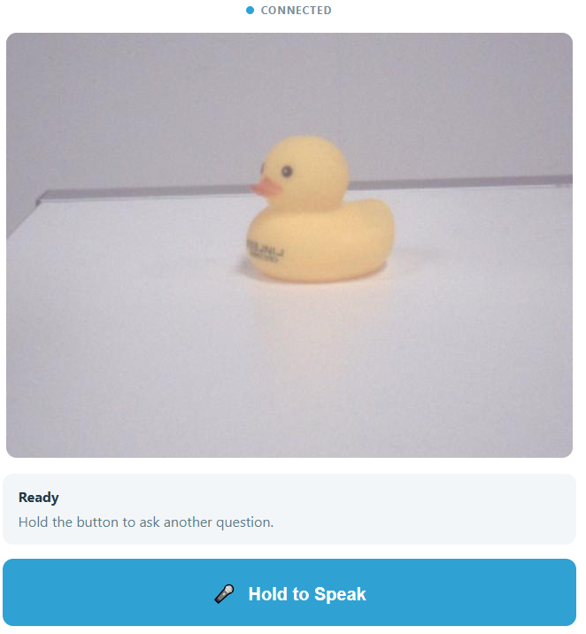

09 AI Show and Tell
====================

Every question in this module so far has been typed. This one is spoken — and the answer has to come from what the camera can actually see. Hold the button on the page, ask about the object in front of the lens — *"What is this?"*, *"What colour is it?"*, *"Is this safe for a young child?"* — and let go. The board transcribes your voice, sends the words and the picture to a vision model **together**, shows both halves of the conversation, and reads the answer out loud. Nothing here runs on the microcontroller: this is the first project in the kit that lives entirely on the Linux side.



In this lesson, you will learn to:

* Record speech only while a button is held, and decide what a release means when the recording is too short to be useful
* Send a question and a camera frame to one model in a single request, so the answer stays tied to the picture
* Write a system prompt that **refuses to guess**: answer from the image, admit what the image cannot show, and never identify a person
* Trade creativity for care — a low temperature and a short token limit turn a storyteller into a careful observer
* Build a complete App Lab project with no sketch code at all

1. Setup
-----------

**What You Need**

.. list-table::
   :widths: 25 25 25 25
   :header-rows: 0

   * - 1 * Pan Tilt Kit
     - 1 * USB-C Cable
     -
     -
   * - |list_pan_tilt|
     - |list_usb_cable|
     -
     -

**Software Requirements**

This project uses four App Lab **Bricks** — support packages that App Lab adds to your app for you:

* ``web_ui`` — serves the page and carries the button presses and the answers between the browser and Python
* ``cloud_llm`` — sends your question *and* the camera frame to a vision-capable cloud model
* ``sunfounder_stt`` — turns your recording into text. This project uses its **online** mode, so no speech model runs on the board
* ``sunfounder_tts`` — reads the answer aloud on the board's speaker

Because the model and the speech-to-text service are both reached over the internet, the project needs a key of your own. ``app.yaml`` declares ``cloud_llm`` and ``sunfounder_stt`` with empty key fields, so App Lab asks you for an **OpenAI API key** the first time you press **Run** and stores it for you. The same key works for both. The board also needs an internet connection that can actually reach OpenAI — worth testing before you blame the microphone.

The sketch declares no libraries and contains no code. Every part of this project — camera, microphone, speaker, speech recognition, and the model — belongs to the Linux side, so the microcontroller simply idles. There is nothing to flash beyond the empty sketch that ships with the app.

No breadboard wiring is needed either: the camera, the microphone, and the speaker are all built into the AVIO Carrier.

.. note::

   The first time you run a TTS example on this UNO Q, App Lab needs to download and prepare the TTS runtime and audio dependencies. This may take half an hour or more, depending on your network connection. Keep the UNO Q connected to the Internet and wait for the setup to complete. This setup only happens once — after it finishes, every TTS example starts much faster.

2. Run the App
----------------

#. Download :download:`09 AI Show and Tell.zip <https://github.com/sunfounder/unoq-ai-kit/releases/latest/download/09.AI.Show.and.Tell.zip>`.
#. Open **Arduino App Lab** and go to **Apps**. Click the dropdown arrow next to **Create new app +** and select **Import App**.

   .. image:: /img/app_import_app.png
      :width: 600

#. Select **Import from Computer**.

   .. image:: /img/app_import_pc.png
      :width: 600

#. Choose the package you downloaded. The app appears in **Apps** — click it to open.
#. With the app open, click the **Run** button (▶) in the top-right corner. The Python side opens the camera and starts the Web UI; the sketch does nothing at all, which is exactly what this project asks of it.

   .. image:: /img/app_run.png
      :width: 500
      :align: center

   .. note::

      The first time you run this project, App Lab asks for your **OpenAI API key**, because the app reaches the model through the ``cloud_llm`` brick and the speech service through ``sunfounder_stt``. Paste one key into both fields and save it — App Lab keeps it for your board, so you only do this once.

#. The Output window prints ``AI Show and Tell ready.`` and a **Web UI** tab opens by itself. The connection label reads **Connected** with a blue dot, and the live camera view fills the frame.
#. Place an object in front of the camera and hold the **🎤 Hold to Speak** button down. The panel switches to **Listening** with *"Keep holding the button while you speak."*, and the button itself changes to **Listening... Release to Send**. Ask your question while you keep holding.
#. Release the button. The panel runs through the rest of the job on its own: **Captured** with *"Question and camera image captured."*, **Recognizing Speech**, **AI Is Looking** with *"AI is examining the captured image..."*, and **Speaking** with *"Reading the answer aloud..."*. The button stays locked for the whole trip.
#. Your question appears under **You Said**, the model's answer under **AI Reply**, and the speaker reads it out. The page looks like this once the panel returns to **Ready**.

   .. image:: img/ai_show_tell.png
      :width: 600
      :align: center

#. Try the two deliberate limits before you move on. Press and release the button as fast as you can — the app refuses the request with *"Hold the button while speaking, then release it."*, because a recording shorter than a third of a second cannot contain a question. Then hold the button and keep talking: the recording stops by itself after **15 seconds**, so an accidental press or a stuck finger cannot leave the app listening forever.

**How it Works**

Here is the whole path a question travels — in through the microphone, up to the cloud with a picture attached, and back out as words.

An App Lab project is a folder of files. Here is what is inside this one:

* ``09 AI Show and Tell/`` — the app folder

  * ``app.yaml`` — app metadata: name, icon, and the four Bricks the project declares
  * ``README.md`` — a short guide to the project

  * ``python/``

    * ``main.py`` — the camera loop, the MJPEG stream, the hold-to-speak handlers, the JSON-free request to the model, and the spoken answer

  * ``sketch/``

    * ``sketch.ino`` — deliberately empty: ``setup()`` and ``loop()`` do nothing
    * ``sketch.yaml`` — sketch configuration for the UNO Q board

  * ``bricks/``

    * ``sunfounder_stt/`` — the speech-to-text brick the app ships with, in its online mode
    * ``sunfounder_tts/`` — the text-to-speech brick the app ships with: the local voice server behind ``tts.say()``

  * ``assets/``

    * ``index.html`` — the page: connection row, camera frame, status panel, the hold-to-speak button, and the two conversation cards
    * ``app.js`` — browser logic: the press and release handlers, the state panel, and the stream retry
    * ``style.css`` — the visual styling of the page
    * ``libs/socket.io.min.js`` — the Socket.IO client that carries messages between the page and the board
    * ``img/sf_logo.png`` — the logo in the page header
    * ``docs_assets/`` — the result image used by this documentation

The data path, from a button press to a spoken answer:

.. mermaid::

   sequenceDiagram
       participant B as Browser (HTML/JS)
       participant P as Python (main.py)
       participant C as Camera (AVIO Carrier)
       participant T as STT (OpenAI)
       participant L as Vision LLM (gpt-4o-mini)

       B->>P: socket.emit("start_recording")
       P->>P: stt.start_listening()
       P-->>B: "listening" - keep holding
       C->>P: camera frame, flipped and JPEG compressed
       B->>P: socket.emit("stop_recording") on release
       P->>P: check the recording length
       P->>P: copy the newest camera frame
       P-->>B: "capturing" - question and image captured
       P->>T: the recording
       T-->>P: the recognized question
       P-->>B: "thinking" with the question
       P->>L: llm.chat(question, images=[frame])
       L-->>P: one or two sentences, grounded in the picture
       P->>P: tts.say(answer)
       P-->>B: "speaking", then "ready" with question and answer

Here is what each piece does:

**Sketch (sketch.ino)** — runs on the STM32 MCU
  * Nothing. ``setup()`` is empty and ``loop()`` only pauses, because every part of this project — the camera, the microphone, the speaker, the speech service, and the model — is handled on the Linux side
  * That is a design decision, not an oversight: talk to the MCU only when you need a pin, a timer, or an interrupt, and leave the rest to Python
  * Because the sketch publishes nothing with ``Bridge.provide()``, there is no Bridge channel in this project at all

**Python (main.py)** — runs on the Linux MPU
  * ``Camera(fps=10)`` is the whole camera setup, and ``camera_loop()`` flips each frame with ``cv2.flip(frame, 0)`` and compresses it to JPEG, parking the newest one in a shared ``current_frame`` under ``frame_lock``
  * ``ui.expose_api("GET", "/stream", video_stream)`` adds the MJPEG route the page shows in an ````, so the preview and the model work from the same recording
  * ``ui.on_message("start_recording", ...)`` is the press: it refuses to start while a request is already running, resets the speech engine, calls ``stt.start_listening()``, and remembers when the press happened
  * ``ui.on_message("stop_recording", ...)`` is the release, and it does three quick checks before any work begins — a press shorter than ``0.35`` seconds is refused with a hint, and a request with no camera frame yet ends in *"The camera image is not ready yet."*
  * ``extract_stt_text(result)`` normalizes whatever the speech brick answers, because the service can return either a plain string or a dictionary with a ``text`` field
  * ``process_question()`` is the whole job in order — stop the recording, transcribe with ``stt.get_result(timeout=45)``, trim the question to ``300`` characters, ask the model, keep the answer, speak it, and report every stage with ``ui.send_message("show_tell_status", ...)``
  * ``CloudLLM(model="openai:gpt-4o-mini", system_prompt=SYSTEM_PROMPT, temperature=0.3, max_tokens=160)`` creates the link to the model, and ``llm.with_memory(max_messages=0)`` stops old pictures from piling up in the conversation
  * ``llm.chat(message=question, images=[frame])`` is the key call — the words and the JPEG travel in one request, which is what makes the answer about *your* object rather than about objects in general
  * The whole job runs in a worker thread started from ``stop_recording()``, so the live preview keeps moving while the model is thinking
  * ``tts.set_voice("en-US-JennyNeural")`` and ``tts.set_volume(50)`` configure the voice before the first answer

**Cloud LLM (behind the ``cloud_llm`` brick)** — runs on OpenAI's servers
  * The **system prompt** is what keeps this assistant honest: answer using **only** what is visible in the supplied image, say so clearly when the requested detail cannot be determined from the image, never identify a person or infer sensitive personal information, keep it age-friendly, and reply in the same language as the question
  * ``temperature=0.3`` is deliberately low. The storytelling project earlier in this module ran at 0.8, because imagination was the point; here the point is accuracy, and a low temperature keeps the answer close to the picture
  * ``max_tokens=160`` keeps the answer to a sentence or two — long enough to be useful, short enough to listen to and to read on the card

**Browser (HTML/JS)** — runs in your browser
  * ``speakButton.addEventListener('pointerdown', ...)`` starts the recording and ``pointerup`` stops it, so the button behaves like a walkie-talkie rather than a toggle
  * ``setPointerCapture()`` keeps the release event coming to the button even if your finger slides off it, and ``pointercancel``, ``lostpointercapture``, and the window's ``blur`` event all stop the recording too — a lost pointer must never leave the app listening
  * ``setTimeout(stopRecording, 15000)`` is the safety net for a press that never ends
  * ``socket.on('show_tell_status', updateState)`` repaints the panel from the ``state``, ``message``, ``question``, and ``answer`` fields, and ``stateTitles`` gives each state its label — Ready, Listening, Captured, Recognizing Speech, AI Is Looking, Speaking, Something Went Wrong
  * ``cameraStream.src = http://<hostname>:7000/stream?r=<timestamp>`` loads the MJPEG preview, and the ``error`` listener retries it every 1.5 seconds if the picture drops

Notice how little this project asks of the model. There is no JSON to parse, no lookup table, and no hardware to drive — the answer goes straight from the cloud to the screen and the speaker. What makes it work is the **constraint** in the system prompt: answer from the image, admit what the image cannot show, and never guess. A vision model with no instructions will happily tell you what an object is *usually* used for; this one is told to tell you only what it can see.

3. Experiment
----------------

**Ask Better Questions**

The same object can be a good question or a bad one. Put one object in the middle of the frame and work down the list, comparing **You Said** with **AI Reply** each time:

.. list-table::
   :header-rows: 1
   :widths: 40 60

   * - What you ask
     - What you get
   * - *"What is this?"*
     - The object's name, usually with one detail you can check at a glance
   * - *"What colour is it?"*
     - A colour — and a good test of whether the model is really looking, since the answer is easy to verify
   * - *"How many of these are there?"*
     - A count when the objects are separated, or an honest *"I can't tell from this image"* when they overlap
   * - *"Describe this in one sentence."*
     - A summary built from what is visible, with no history and no guessing
   * - Cover the object with your hand
     - The answer changes to what your hand and the background look like — proof that the picture, not your words, is the source
   * - *"What is it used for?"*
     - The interesting case: some of the answer is visible, some is general knowledge, and the prompt decides how far the model is allowed to go

**Challenge: Make It Guess**

The prompt tells the model to answer only from the image and to say so when it cannot. Try to break that promise. Ask *"How much did this cost?"*, *"Who made it?"*, *"Is it heavy?"*, or point the camera at something that could be two different objects depending on the angle. Listen for the difference between an answer that reports what is visible and one that quietly fills in the gaps.

Then change the instruction and run the same questions again. Open ``python/main.py`` and remove the sentence about answering only from the image, or soften it to *"try to be helpful"*, press **Run**, and ask the same four questions. The reply gets longer, more confident, and less trustworthy — from one line of English. Which version would you want in a project that is supposed to tell you about the real world?

**Challenge: Find the Edges of the Button**

The hold-to-speak button is where all the app's timing lives, and every limit in it was put there on purpose. Work through them: press and release in a fraction of a second and read the hint that comes back; hold the button for a full 15 seconds while staying silent and watch what stops the recording; start talking half a second after you press, and then half a second *before* you press, and compare the two transcripts. Then put the object down, hold the button, and ask about it anyway — what does the model say when you ask about something that is not in the frame?

4. Troubleshooting
--------------------

**Every attempt ends with "No speech was recognized"**

* **Cause:** The recording is not the problem — this project uses the **online** speech-to-text service, so your audio has to reach the cloud before it can become text. When the board cannot reach that service the recording is made and then discarded, which looks exactly like a broken microphone but is not one.
* **Solution:** Test the board's connection instead of the wiring. A board on a restricted network can load ordinary web pages and still fail here, because the service is a specific one. On a network where that service is unreachable, expect this message every time, no matter how clearly you speak.

**The panel turns red with "Unable to answer: ..."**

* **Cause:** The model request failed, or the skill never ran. The message prints the exception type and text, which is the fastest clue: a missing key, a rejected key, no internet, or an image the model refused to work with.
* **Solution:** Read the exception first. Anything mentioning a key or a connection points at your key or your network — check that the key is saved and still valid, that the board is online, then stop the app and press **Run** again. *"The camera image is not ready yet."* is a different message with a different fix: wait for the live view to move before you hold the button.

**The panel says "Hold the button while speaking, then release it."**

* **Cause:** The press was shorter than a third of a second. The app drops it on purpose, because the speech service cannot do anything with a recording that short.
* **Solution:** Nothing is broken — this is the app being polite. Hold the button for as long as the question takes and release when you finish the sentence.

**The camera frame stays dark and reads "Waiting for camera..."**

* **Cause:** No frames are arriving at all, which usually means the camera is not fully seated on the AVIO Carrier, or the app never reached its camera loop.
* **Solution:** Check the camera connection first, then stop the app and press **Run** again, watching the Output window as it starts. The page retries the stream by itself every 1.5 seconds, so you rarely need to reload it.

**The answer appears on the page but nothing is spoken**

* **Cause:** The picture and the voice are two separate jobs. The text-to-speech brick prepares its runtime on first use and needs a working speaker route, so the first run of any TTS project can be silent for a long time before it ever speaks.
* **Solution:** Watch the Output window during the first run — App Lab downloads and prepares the speech runtime then, which can take half an hour on a slow connection. Later runs start much faster. If the answer appears and the light of the app is otherwise healthy, the hardware is fine and the speech engine is simply not ready yet.

5. Summary
-------------

You just built an assistant that listens to a question, looks at the same object you are asking about, and answers out loud — and you did it without writing a single line for the microcontroller. In this lesson, you learned:

* A hold-to-speak button is three small decisions: start on press, stop on release, and never let a lost pointer leave the microphone open
* A question and a camera frame can travel in **one** model request, which is what keeps the answer about the object in front of you
* A system prompt can make a model refuse to guess — *answer from the image, say what you cannot see, never identify a person* — and that refusal is the feature
* Temperature is a dial between imagination and accuracy: 0.3 here, 0.8 in the storytelling project, and the difference shows in every answer
* A complete App Lab project can live entirely on the Linux side, with a sketch that does nothing at all

There is one more thing this project quietly does that the earlier ones did not: it asks a model a question whose answer it cannot check. Every previous project handed the answer to something that would reject it — a list of colours, a set of moods, a pin. Here the answer goes to a screen and a speaker, and the only guard is a sentence of English telling the model to stay inside what it can see. That is the shape most real AI devices take, and it is worth knowing exactly how much of their trustworthiness comes from the prompt.
