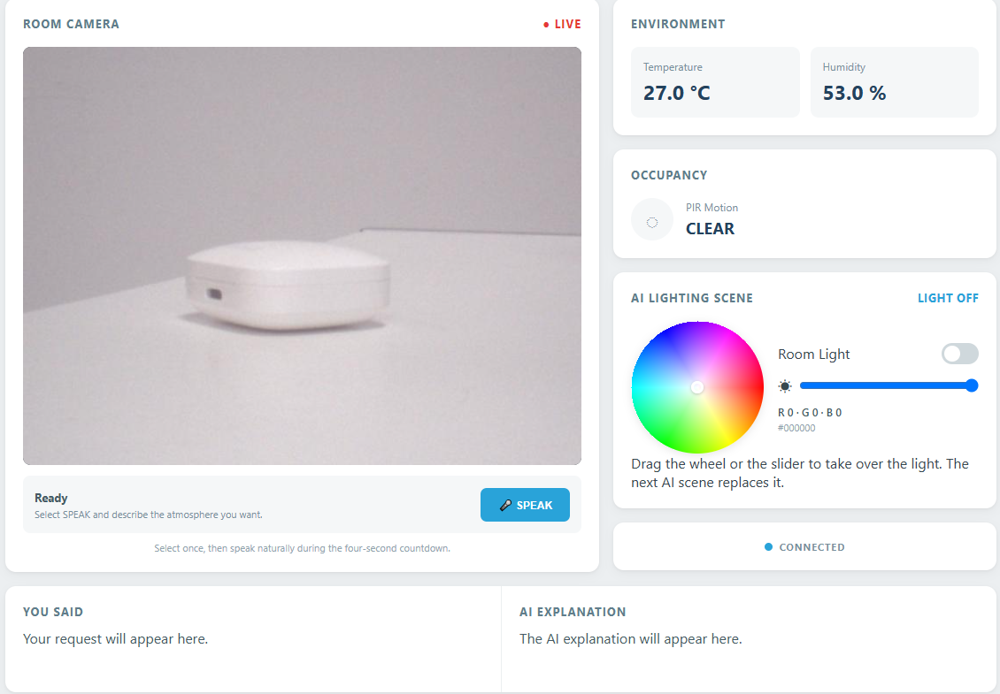

10 AI Context-Aware Room Assistant
===================================

.. include:: /index.rst
   :start-after: start_hello_message
   :end-before: end_hello_message

Every project in this module has handed the model one kind of input: a sentence to answer, a picture to describe, a story to write. This one hands it two at once — what you say, and what the room is actually doing. You tell it how you feel or what you are about to do; it reads the temperature, the humidity, and whether anybody is moving; and it answers with light. Say *"I'm in a bad mood"* and the lamp turns soft and warm and dim. Say *"I want to read a book"* and it turns cool and bright. And for the first time in this module the light is yours as well: a colour wheel, a brightness slider, and a switch sit right beside the AI's decision, so you can take over whenever you like.



In this lesson, you will learn to:

* Put two kinds of context into one request — the spoken words and the live sensor readings — and let the model weigh both
* Turn a **feeling** into hardware: describe a mood-to-light table in the system prompt instead of listing colours
* Give the model a fixed JSON contract and check every field before it reaches a pin
* Add a manual control that shares the same output as the AI, and decide what happens when the two disagree
* Recognise the failure that matters most here: an answer that is perfectly shaped and still wrong, because the prompt never taught the model what the words mean

1. Setup
-----------

**What You Need**

.. list-table::
   :widths: 25 25 25 25
   :header-rows: 0

   * - 1 * Pan Tilt Kit
     - 1 * :ref:`cpn_humiture_sensor`
     - 1 * :ref:`cpn_pir`
     - 1 * :ref:`cpn_rgb_led`
   * - |list_pan_tilt|
     - |list_dht11|
     - |list_pir|
     - |list_rgb_led|
   * - 3 * :ref:`cpn_resistor` (220Ω)
     - 1 * :ref:`cpn_breadboard`
     - Several :ref:`cpn_wires`
     - 1 * USB Cable
   * - |list_220ohm|
     - |list_breadboard|
     - |list_wire|
     - |list_usb_cable|

**Software Requirements**

This project uses four App Lab **Bricks** — support packages that App Lab adds to your app for you:

* ``web_ui`` — serves the dashboard and keeps the browser, the sensors, and the AI in step
* ``cloud_llm`` — sends your request, the room readings, and the response contract to a cloud language model
* ``sunfounder_stt`` — turns your recorded speech into text. This project uses its **online** mode, so no speech model has to run on the board
* ``sunfounder_tts`` — speaks the assistant's explanation on the board's speaker

Because both the model and the online speech-to-text are reached over the internet, the project needs a key of your own. ``app.yaml`` declares ``cloud_llm`` and ``sunfounder_stt`` with empty key fields, so App Lab asks you for an **OpenAI API key** the first time you press **Run** and stores it for you. The board also needs a working internet connection — and one that can actually reach OpenAI, which is worth testing before you blame your wiring.

The sketch declares no libraries of its own in ``sketch.yaml``. The two headers it includes — the Bridge library and the DHT sensor library — ship with the app's support packages, so there is nothing to install by hand.

**Wiring Diagram**

The PIR module's **OUT** pin goes to **D4**, the DHT11's **DATA** pin to **D5**, and the RGB LED's three anodes go to **D6** (red), **D7** (green), and **D8** (blue), each through its own **220Ω** resistor, with the longest leg — the **common cathode** — to **GND**. Never connect a colour channel straight to a pin without its resistor; the LED can burn out.

.. image:: /img/wiring/wiring_context_room.png
   :width: 600
   :align: center

.. note::

   The first time you run a TTS example on this UNO Q, App Lab needs to download and prepare the TTS runtime and audio dependencies. This may take half an hour or more, depending on your network connection. Keep the UNO Q connected to the Internet and wait for the setup to complete. This setup only happens once — after it finishes, every TTS example starts much faster.

2. Run the App
----------------

#. Download :download:`10 AI Context-Aware Room Assistant.zip <https://github.com/sunfounder/unoq-ai-kit/releases/latest/download/10.AI.Context-Aware.Room.Assistant.zip>`.
#. Open **Arduino App Lab** and go to **Apps**. Click the dropdown arrow next to **Create new app +** and select **Import App**.

   .. image:: /img/app_import_app.png
      :width: 600

#. Select **Import from Computer**.

   .. image:: /img/app_import_pc.png
      :width: 600

#. Choose the package you downloaded. The app appears in **Apps** — click it to open.
#. With the app open, click the **Run** button (▶) in the top-right corner. The sketch starts by switching the light off and reading the sensors, then the Python side opens the camera and starts the Web UI.

   .. image:: /img/app_run.png
      :width: 500
      :align: center

   .. note::

      The first time you run this project, App Lab asks for your **OpenAI API key**, because the app reaches the model through the ``cloud_llm`` brick and the speech-to-text service through ``sunfounder_stt``. Paste one key from your OpenAI account into both fields and save it — App Lab keeps it for your board, so you only do this once.

#. The Output window prints ``AI Context-Aware Room Assistant ready.`` and a **Web UI** tab opens by itself. The camera view starts moving, **Environment** fills in with the room's temperature and humidity, **Occupancy** reports **CLEAR** or **DETECTED**, and the pill at the bottom right reads **CONNECTED**.
#. Wait until the live view is moving and the sensors show real numbers — the request only carries the readings it has, and an empty card travels as *Unavailable*. Then click **SPEAK** and describe the atmosphere you want during the four-second countdown.
#. The status panel walks through the whole job: **Listening** with the seconds ticking down, **Recognizing Speech**, **Reading Sensors**, **AI Is Creating a Scene**, **Applying Light**, and finally **Speaking** while the board explains its choice out loud. The button stays locked for the whole trip.
#. The words you actually said land under **You Said**, the model's sentence lands under **AI Explanation**, and the lamp changes to match: the scene name appears next to **AI LIGHTING SCENE**, and the colour wheel, the brightness slider, and the **Room Light** switch all move to the values the model chose. The page looks like this when the panel returns to **Ready**.

   .. image:: img/ai_context_aware_room_assistant.png
      :width: 600
      :align: center

#. Now take the light back. Drag anywhere on the **colour wheel** to pick a colour, move the **brightness** slider, or flip the **Room Light** switch off and on again. The board follows your hand immediately, the RGB and hex readouts under the slider keep up, and the scene name changes to **Your Colour**. The next thing the AI decides will replace all of it — that is the deal between the two of you.

**How it Works**

Here is the whole path a request travels — in through the microphone, past the sensors, up to the cloud, and back out as light and speech.

An App Lab project is a folder of files. Here is what is inside this one:

* ``10 AI Context-Aware Room Assistant/`` — the app folder

  * ``app.yaml`` — app metadata: name, icon, and the four Bricks the project declares
  * ``README.md`` — a short guide to the project

  * ``python/``

    * ``main.py`` — the camera loop, the sensor polling, the speech request, the JSON parser, the light control, and the Bridge calls

  * ``sketch/``

    * ``sketch.ino`` — the DHT11 and PIR readers, the PWM light writer, and the three Bridge functions
    * ``sketch.yaml`` — sketch configuration for the UNO Q board

  * ``bricks/``

    * ``sunfounder_stt/`` — the speech-to-text brick the app ships with, in its online mode
    * ``sunfounder_tts/`` — the text-to-speech brick the app ships with: the local voice server behind ``tts.say()``

  * ``assets/``

    * ``index.html`` — the dashboard: camera frame, voice panel, environment, occupancy, the light control, and the two conversation cards
    * ``app.js`` — browser logic: the socket events, the colour wheel, the brightness slider, and the stream retry
    * ``style.css`` — the visual styling of the page
    * ``libs/socket.io.min.js`` — the Socket.IO client that carries messages between the page and the board
    * ``img/sf_logo.png`` — the logo in the page header
    * ``docs_assets/`` — the result image used by this documentation

The data path, from one sentence to a room that has changed colour:

.. mermaid::

   sequenceDiagram
       participant B as Browser (HTML/JS)
       participant P as Python (main.py)
       participant S as Sketch (sketch.ino)
       participant T as STT (OpenAI)
       participant L as LLM (gpt-4o-mini)

       B->>P: socket.emit("start_scene_request")
       P->>P: stt.start_listening() - four seconds of audio
       P->>T: the recording, as a file
       T-->>P: the recognized sentence
       P->>S: Bridge.call("read_dht") and Bridge.call("read_pir")
       S-->>P: "T=26.8,H=55.0" and 0 or 1
       P->>L: the sentence, the readings, and the system prompt
       L-->>P: one JSON object with scene, red, green, blue, brightness, reply
       P->>P: parse_scene() - five numbers and a colour name
       P->>S: Bridge.call("set_rgb_scene", "100,45,10,25")
       S->>S: analogWrite() on D6, D7 and D8
       P-->>B: socket "assistant_status" - scene, values, reply
       P->>P: tts.say(reply)
       B->>P: socket.emit("set_rgb_color", {r, g, b, brightness})
       P->>S: Bridge.call("set_rgb_scene", ...) - your colour wins

Here is what each piece does:

**Sketch (sketch.ino)** — runs on the STM32 MCU
  * ``setup()`` starts the DHT11, sets the three light pins as outputs, switches the light off with ``setRgbPercent(0, 0, 0, 0)``, and publishes three functions with ``Bridge.provide()``
  * ``setRgbPercent(red, green, blue, brightness)`` is the only place a pin is written: it scales brightness into a 0–100 percentage and calls ``analogWrite()`` on **D6**, **D7**, and **D8**
  * ``set_rgb_scene(values)`` splits one string — ``"red,green,blue,brightness"`` — into four numbers, so a whole scene crosses the Bridge as a single value
  * ``read_dht()`` caches the DHT11 reading for two seconds and answers ``"T=26.8,H=55.0"``, or ``"ERROR"`` when the sensor does not answer
  * ``read_pir()`` returns ``1`` or ``0`` for the PIR module on **D4**
  * ``loop()`` only pauses — every request arrives as an event

**Python (main.py)** — runs on the Linux MPU
  * ``Camera(fps=10)`` is the camera setup, and ``camera_loop()`` flips each frame, compresses it to JPEG, and parks it in a shared ``current_frame`` so the page can stream it without blocking anything else
  * ``ui.expose_api("GET", "/stream", video_stream)`` adds the MJPEG route the browser shows in an ````
  * ``sensor_loop()`` asks the sketch for the temperature, humidity, and motion every four seconds and pushes them to the page — but pauses while a request is running, so polling cannot compete with the recording
  * ``ui.on_message("start_scene_request", ...)`` is the SPEAK button: it refuses a second request while ``busy`` is set, resets the speech engine, starts the microphone, and hands the wait to a worker thread
  * ``process_request()`` is the whole job in order — record four seconds, stop, transcribe with ``stt.get_result()``, read the sensors, ask the model, parse the answer, drive the light, speak the reply, and report every stage to the page with ``ui.send_message("assistant_status", ...)``
  * ``CloudLLM(model="openai:gpt-4o-mini", system_prompt=SYSTEM_PROMPT, temperature=0.5, max_tokens=180)`` creates the link to the model, and ``llm.with_memory(max_messages=0)`` keeps old requests from piling up
  * ``llm.chat(message=prompt)`` is the key call — the sentence and the three sensor readings travel together in one message
  * ``parse_scene()`` pulls the ``{...}`` block out with ``re.search()``, hands it to ``json.loads()``, and clamps ``red``, ``green``, ``blue``, and ``brightness`` into 0–100 so a wild number can never reach the pins
  * ``apply_scene()`` sends ``Bridge.call("set_rgb_scene", "r,g,b,brightness")`` and remembers the values, so the page and the light never disagree
  * ``ui.on_message("set_rgb_color", ...)`` and ``ui.on_message("toggle_light", ...)`` are the manual controls: they reuse the same path, so your colour and the model's colour go to the same pin through the same function
  * ``set_light()`` also remembers the last colour that was not black, which is what the **Room Light** switch restores when you turn it back on, and treats "a colour with no brightness" as full brightness — picking a colour means you want to see it
  * ``tts.say(scene["reply"])`` narrates the choice, and ``send_status()`` keeps every browser in step

**Cloud LLM (behind the ``cloud_llm`` brick)** — runs on OpenAI's servers
  * The **system prompt** is where this project's taste lives. It no longer describes one example scene; it describes a **mood table**: feelings that call for soft warm amber at low brightness, winding down, reading and focusing, celebrating, cosy and romantic, and a neutral choice when the request gives no clue at all
  * It also tells the model to use the real temperature, humidity, and motion readings as extra context — a hot room suits a cooler colour, a dark room suits lower brightness
  * It demands valid JSON with the exact keys ``scene``, ``red``, ``green``, ``blue``, ``brightness``, and ``reply``, and it says plainly that the example values are a format placeholder that must never be reused
  * ``reply`` must be one short sentence in the same language as the request, and it must respond to what the person actually said rather than report what the model did

**Bridge** — the channel between the MPU and the MCU
  * Sketch side: ``Bridge.provide("set_rgb_scene", ...)``, ``Bridge.provide("read_dht", ...)``, and ``Bridge.provide("read_pir", ...)``
  * Python side: ``Bridge.call("set_rgb_scene", values)``, ``Bridge.call("read_dht")``, and ``Bridge.call("read_pir")``
  * The sensor readings and the light values all cross as plain strings — the model never touches a pin, and a sketch that does not answer is only a warning in the log

**Browser (HTML/JS)** — runs in your browser
  * ``socket.emit('start_scene_request', {})`` is sent by the **SPEAK** button, and the button is disabled whenever the app is busy
  * ``socket.on('assistant_status', update)`` repaints everything at once: the status panel, the temperature, the humidity, the motion state, the two conversation cards, the scene name, and the light control
  * ``applyServerLight()`` converts the model's RGB back into a position on the colour wheel and moves the indicator, the slider, the switch, and the hex readout — so a scene decided in the cloud is visible in your hand
  * ``hsvToRgb()`` and ``rgbToHsv()`` are the two conversions that make the wheel possible: the wheel is drawn from hue and saturation, while the board is told red, green, and blue
  * ``sendRgb()`` fires on every drag and every slider move, and it skips a message when nothing actually changed
  * The **Room Light** switch emits ``toggle_light``, and the page shows your colour the moment the board confirms it, not before

Notice what this project adds to the pattern *the model decides, the code enforces*. The code still owns the shape of the answer — five integers and a string, clamped and trimmed. But the part that decides whether the answer is **good** has moved into the prompt: the mood table is not validation, it is taste, and it is written in English for a model to read. That is the difference between a program that works and an assistant you would actually want to talk to.

3. Experiment
----------------

**Ask for a Feeling, Not a Colour**

None of the sentences below name a colour or a brightness. Each one describes a mood or a plan and leaves the light entirely to the model — and the model answers with values that were never in the page, the sketch, or the Python file:

.. list-table::
   :header-rows: 1
   :widths: 34 20 20 26

   * - What you say
     - Scene
     - RGB
     - Brightness
   * - *"I'm in a bad mood."*
     - soft warm amber
     - 100 / 45 / 10
     - 25
   * - *"I want to read a book."*
     - focused reading
     - 60 / 80 / 100
     - 85
   * - *"Let's have a party!"*
     - vivid celebration
     - 100 / 20 / 90
     - 90
   * - *"I feel sleepy."*
     - deep warm dim
     - 90 / 35 / 15
     - 15
   * - *"It is so hot in here."*
     - cool neutral
     - 60 / 80 / 100
     - 85

Work down the list with the room in the same state each time. The temperature and humidity cards do not change, the sentences are all the same length, and the light is completely different every time — because the only thing that changed was the meaning.

**Challenge: Take the Light Away from the AI**

The wheel, the slider, and the switch send your values down exactly the same path the model's values take. Now find out what that costs. Ask for a scene, then immediately drag the wheel to something the model would never have chosen — pure green, or a dim purple — and watch the scene name change to **Your Colour**. Press **SPEAK** again with the light still your colour and see whether the model keeps your choice, moves back to its own, or lands somewhere in between. Then try the other order: set your colour first, ask for a scene, and watch it get overwritten.

Which behaviour do you actually want from a room assistant? A model that respects the light you set, or a model that always has the last word? Nothing in this project prevents you from writing the rule either way — the sensors already tell it whether anyone is in the room, and ``set_light()`` already remembers the colour you chose. Work out where that rule belongs: in the prompt, asking the model to keep the current values, or in Python, ignoring the model's colour when you have taken over.

**Challenge: Move the Mood List and Watch the Room Change**

The mood table in ``SYSTEM_PROMPT`` is the part of this project you can rewrite in a minute, and it changes the assistant's personality more than any code you could write. Open ``python/main.py`` and make one deliberate edit — give *sleepy* the same warm amber as *bad mood*, or add a line for *"I'm studying for an exam"* with an even brighter setting than reading, or delete the cosy line and see what the model invents instead. Press **Run** again and repeat the sentence that used to hit the line you changed.

Then try the opposite experiment: leave the mood table alone and rewrite only the sentence that describes the **example** JSON values. Change ``"soft warm amber"`` and its numbers to something completely different, ask five questions, and count how often the model quietly hands back your example instead of thinking. You are looking at the difference between telling a model what to do and showing it what to copy.

4. Troubleshooting
--------------------

**Every attempt ends with "No speech was recognized"**

* **Cause:** The recording is fine — this project uses the **online** speech-to-text service, so the audio has to travel to the cloud before it can become text. When the board cannot reach that service, the recording is made and then thrown away, which looks exactly like a microphone problem but is not one.
* **Solution:** Check the board's connection to the internet rather than the wiring: open the Output window, and look for lines about the speech service or a network error. A board on a restricted network can reach ordinary websites and still fail here, because the service is a specific one. If you are testing without internet access, expect this message every time, no matter how clearly you speak.

**The light never changes, and the panel still says "Ready"**

* **Cause:** Nothing was ever asked for, or the request failed before it reached the light. The SPEAK button only sends a request when the page is connected, and the panel shows an error state whenever the model or the speech service refuses.
* **Solution:** Wait for the bottom-right pill to read **CONNECTED** before pressing **SPEAK**, and watch the panel while the request runs — if it turns red, read the exception in the message, which names the step that failed. If the panel never leaves **Ready**, the button was pressed while the app was still busy with the previous request.

**Temperature and humidity stay on "Unavailable"**

* **Cause:** The DHT11 is not answering. Either its **DATA** pin is not on **D5**, or the sensor is not getting power, or the app started before the sensor was ready.
* **Solution:** Check the three legs of the sensor against the wiring diagram — data to **D5**, power and ground the right way round — then stop the app and press **Run** again. The sketch reads the sensor every two seconds and caches the last good value, so a wrong reading recovers by itself once the wiring is right. **Occupancy** is driven by the PIR module on **D4** and works independently, so a working motion card with an unavailable environment card points straight at the DHT11.

**The scene is applied, but the board never says anything**

* **Cause:** The light and the voice are two separate jobs. The text-to-speech brick prepares its runtime on first use and needs a working speaker route, so the first run of any TTS project can be silent for a long time before it ever speaks.
* **Solution:** Watch the Output window during the first run — App Lab downloads and prepares the speech runtime then, which can take half an hour on a slow connection. Later runs start much faster. If the light changes and the explanation appears on the page but no sound comes out, the hardware is fine and the speech engine is not ready yet.

**The light is bright and cool when you said you were feeling low**

* **Cause:** The model answered with a perfectly valid scene — the right keys, numbers inside the allowed range — and got the *feeling* wrong. This is not a bug in the code, and no amount of validation will catch it: the answer is well shaped and simply not what you meant.
* **Solution:** Fix it in the system prompt. The mood table is the model's only idea of what words like *bad mood* or *cosy* mean in light, so add the feeling you used, or make an existing line more specific. This is also the reason the prompt says out loud that the example values are a placeholder: a model that can copy an example will happily hand it back to you as an answer, and the result looks plausible while ignoring everything you just said.

5. Summary
-------------

You just built an assistant that listens to you and looks at the room at the same time, and then changes the light because of it. In this lesson, you learned:

* Two kinds of context — words and sensor readings — can travel in one request, and the model weighs them together
* A system prompt can describe a **feeling-to-hardware** table, which is how *"I'm in a bad mood"* becomes warm amber at 25 per cent instead of a bright cool scene
* ``parse_scene()`` treats the answer as untrusted input: it finds the braces, parses them, and clamps every number before anything reaches a pin
* A manual control and an AI decision can share one output, and the interesting question is not who is allowed to write the value but who should win
* The hardest failure in this project is invisible to a compiler: a reply that is right in form and wrong in meaning can only be fixed in the prompt, not in the parser

The pattern from the rest of this module — an input, a model, and a page that shows you what happened — has one new member here. Until now your code decided everything the model was not allowed to do. Now your code also has to decide what the model *should* do, and it says so in English, in a prompt, where the mood table is the difference between a lamp that reacts and a lamp that understands.
