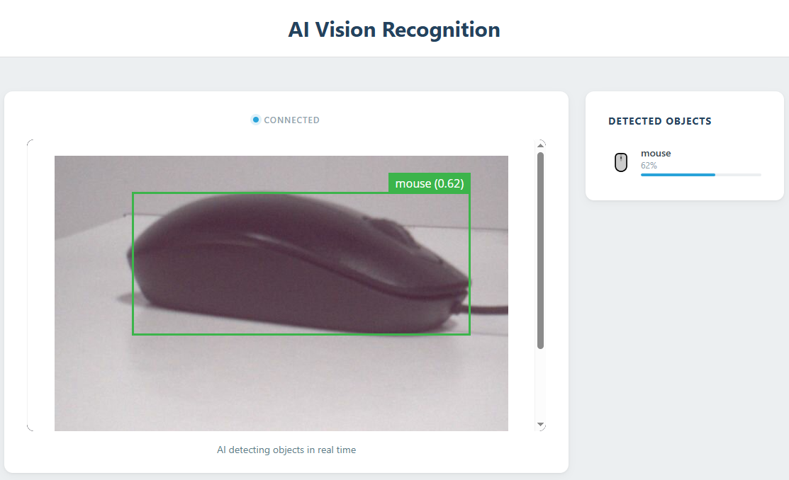

# 01 AI Vision Recognition

Point the camera at everyday objects — the AI detects and labels supported objects in real time using the general `VideoObjectDetection` model, entirely on the board.

## Software

### Bricks Used

This example uses the following Bricks:

- `video_object_detection` — Runs the general object-detection model on every camera frame and reports what it found, from about 80 everyday categories
- `web_ui` — Creates the web interface and provides real-time communication between the browser and the Python backend

## Hardware

- Pan Tilt Kit ×1
- USB-C cable ×1

## Wiring

The CSI camera is built into the Multimedia Carrier, so no breadboard wiring is needed — just attach the carrier to the UNO Q.

## How to Use the Example

1. Download [`01 AI Vision Recognition.zip`](https://github.com/sunfounder/unoq-ai-kit/releases/latest/download/01.AI.Vision.Recognition.zip).
2. In App Lab, go to **Apps** → **Create New App** → **Import App** → **Import from Computer** and open the package you downloaded.
3. Click **Run**.
4. Open the Web UI and show an everyday object such as a cup to the camera — its name and confidence appear next to the live video.

## How it Works

**Flow**

- Camera (`Camera` peripheral) — keeps producing frames in the background; each one is flipped vertically because the CSI camera is mounted upside down
- Brick (`video_object_detection`) — runs the general object model on every frame and hands the results to Python
- Python (`main.py`) — converts each confidence into a whole percentage and pushes the list to the browser with `ui.send_message("detections", ...)`
- Browser (`assets/app.js`) — draws one row per detected object next to the live video stream from port 4912

**Detections arrive as plain data**

`on_detect_all()` delivers a dictionary whose keys are class names such as `cup` or `person`, and whose values are lists of every instance of that class in the frame. Python flattens that into a simple list of records, so the browser never has to understand anything about the model — it only renders what it is given.

**Confidence and debounce**

Every detection carries a confidence between 0 and 1. With `confidence=0.4` anything the model is less than 40% sure about is dropped, and `debounce_sec=1.0` limits how often the same object can trigger a callback. Lower the threshold and the panel fills up with uncertain guesses; raise it and only the obvious objects survive.

**Pixels and results travel separately**

The live video and the detection list are two independent channels. The page embeds the camera stream served on port 4912 in an `<iframe>`, while the detections arrive over Socket.IO. That is why the video never stutters when a detection message is sent — and why the panel keeps showing the last result until the next one replaces it.
