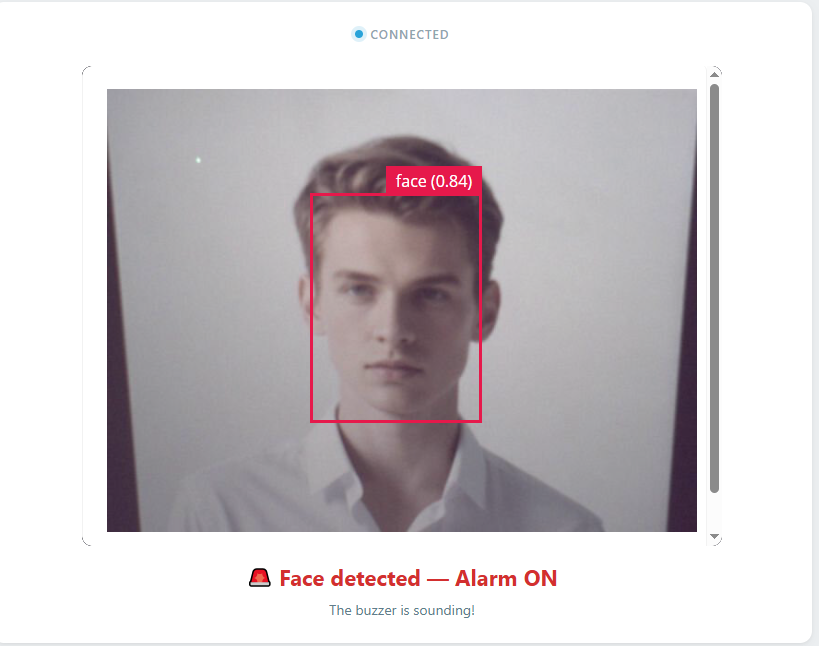
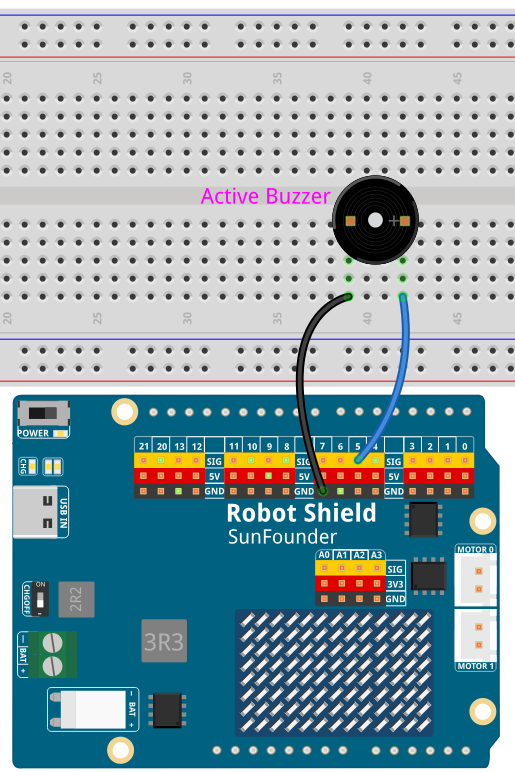

# 02 Face Alarm

When the camera detects a face, a buzzer sounds — the first time AI controls physical hardware. The AI sees, decides, and acts.

## Software

### Bricks Used

This example uses the following Bricks:

- `video_object_detection` — Runs the **face-detection** model (declared as `model: face-detection`) on every camera frame and reports each face it finds
- `web_ui` — Creates the web interface and provides real-time communication between the browser and the Python backend

## Hardware

- Pan Tilt Kit ×1
- Breadboard ×1
- Active buzzer ×1
- Jumper wires
- USB-C cable ×1

## Wiring

Connect the buzzer's positive leg to digital pin **D5** and its negative leg to **GND**.

## How to Use the Example

1. Open **Arduino App Lab**.
2. Select **Apps** → **Create New App** → **Import App** → **Import from Computer**.
3. Import `02 Face Alarm.zip` from `unoq-ai-kit\edge_ai`.
4. Click **Run**.
5. Show your face to the camera — the buzzer beeps rapidly and the Web UI reports the alarm. Step away and it stops after about two seconds.

## Alarm Behavior

| What the camera sees | Buzzer | Web UI |
| --- | --- | --- |
| A face | Rapid beeping (150 ms on / 150 ms off) | Face detected — Alarm ON |
| No face for 2 s | Silent | Waiting for a face |

## How it Works

**Flow**

- Brick (`video_object_detection`, `model: face-detection`) — reports a face whenever one is clearly visible, above 50% confidence
- Python (`main.py`) — `on_detect("face", face_detected)` calls `Bridge.call("alarm_on")` the first time a face appears; a second thread calls `Bridge.call("alarm_off")` after two quiet seconds
- Sketch (`sketch.ino`) — `alarm_on()` and `alarm_off()` start and stop the beep pattern on D5
- Browser — shows the current alarm state next to the live video

**A model that only looks for faces**

This project asks `app.yaml` for `video_object_detection` with `model: face-detection`, so the brick uses a model specialized for faces instead of the general object model. Only detections above 50% confidence are accepted, and `on_detect("face", ...)` means the callback fires for that one class rather than for every object in the frame.

**Python decides, the sketch buzzes**

`face_detected()` raises a flag and calls `Bridge.call("alarm_on")` the first time a face appears. The sketch's `alarm_on()` then toggles the buzzer pin in `loop()` — 150 ms on, 150 ms off — which is why the alarm sounds like a rapid beep rather than a continuous tone.

**Turning the alarm off**

A second Python thread wakes up every 200 ms and watches the clock. As long as new faces keep arriving the timer keeps being refreshed, so the alarm continues; once nothing has been detected for two seconds it calls `Bridge.call("alarm_off")` and the buzzer falls silent.
