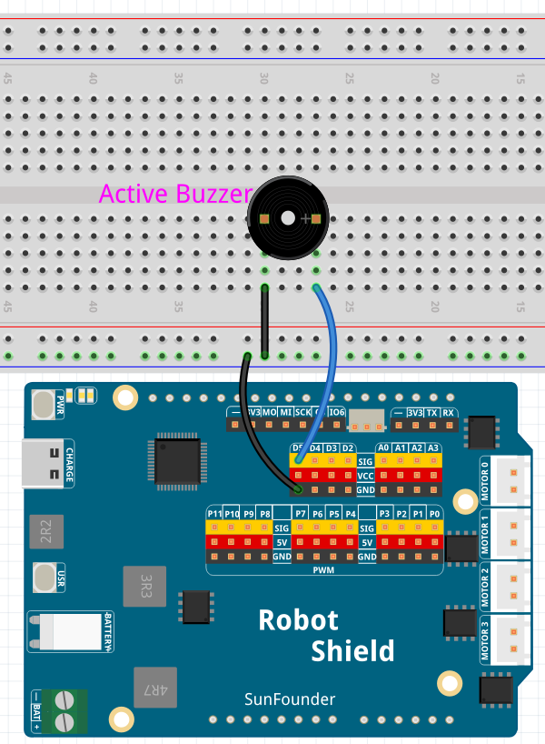

# 02 Face Alarm

When the camera detects a face, a buzzer sounds — the first time AI controls physical hardware. This is the bridge between passive observation (Lesson 01) and active response: the AI sees, decides, and acts.


## Hardware Requirements

### Hardware

- Arduino UNO Q ×1
- Multimedia Carrier with CSI camera
- Breadboard ×1
- Active buzzer ×1
- USB-C cable ×1

### Software

- Arduino App Lab

## Wiring

| Component | Arduino Pin |
|-----------|------------|
| Buzzer (+) | D5 |
| Buzzer (−) | GND |



## Prerequisites

1. App Lab Settings → Carriers → Enable external carriers → Camera → **type1-2lanes** → Reboot.

## How to Use

1. Import `02 Face Alarm.zip` into **Arduino App Lab**.
2. Click **Run**.
3. Show your face to the camera — the buzzer beeps rapidly. Step away — it stops after 2 seconds.

## How it Works

```text
CSI Camera → VideoObjectDetection (face-detection model)
    │
    ├── Video stream → port 4912 → Web UI
    │
    └── on_detect("face") → Bridge.call("alarm_on")
            │
            ▼
        Sketch → digitalWrite(buzzerPin, HIGH/LOW)
            │
            ▼
        Buzzer beeps (150ms on / 150ms off)
```

- **Python** monitors the face detection brick. When ``face_detected()`` fires, it calls ``Bridge.call("alarm_on")``. A background thread checks every 200ms — if the face has been gone for 2 seconds, it calls ``Bridge.call("alarm_off")``.
- **Sketch** runs the buzzer loop — simple on/off toggling via ``digitalWrite``. No RobotShield, no PWM, just an active buzzer.
