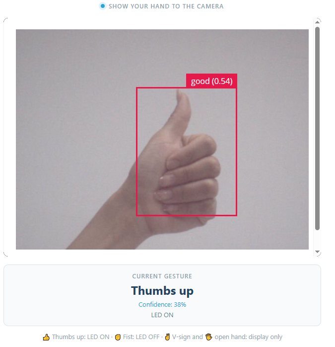
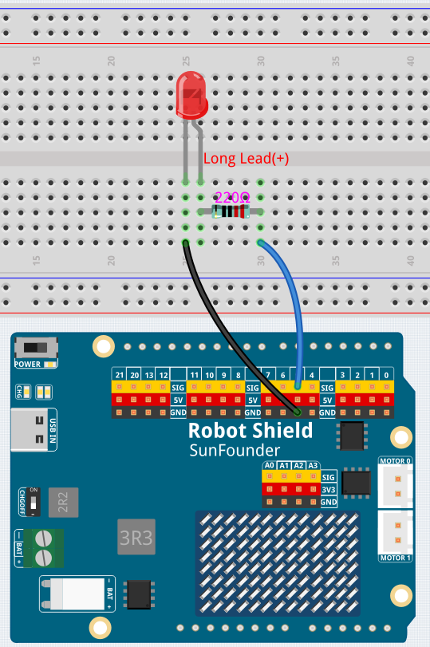

# 04 AI Gesture Light

Use the AI camera to recognize four hand gestures and control one external LED. A thumbs-up turns the LED on, a fist turns it off.

## Software

### Bricks Used

This example uses the following Bricks:

- `video_object_detection` — Runs the **hand-gesture** model (declared as `model: hand-gestures`) on every camera frame and reports which of four hand shapes it sees
- `web_ui` — Creates the web interface and provides real-time communication between the browser and the Python backend

## Hardware

- Pan Tilt Kit ×1
- Breadboard ×1
- Red LED ×1
- 220 Ω resistor ×1
- Jumper wires
- USB-C cable ×1

## Wiring

Connect the LED's anode to digital pin **D5** through a **220 Ω resistor**, and its cathode to **GND**.

## How to Use the Example

1. Download [`04 AI Gesture Light.zip`](https://github.com/sunfounder/unoq-ai-kit/releases/latest/download/04.AI.Gesture.Light.zip).
2. In App Lab, go to **Apps** → **Create New App** → **Import App** → **Import from Computer** and open the package you downloaded.
3. Click **Run** and open the Web UI.
4. Hold a thumbs-up gesture steady for a moment — the LED lights up and the card shows the gesture and its confidence. Make a fist to switch it off. Remove your hand and the card returns to **Show a gesture**.

## Gesture Actions

| Model label | Gesture | Result |
| --- | --- | --- |
| `good` | Thumbs up | LED ON |
| `neut` | Fist | LED OFF |
| `five` | Open hand | Display only |
| `peace` | V-sign | Display only |

## How it Works

**Flow**

- Brick (`video_object_detection`, `model: hand-gestures`) — answers one question per frame: which of the four hand shapes is this?
- Python (`main.py`) — keeps the most confident supported label and compares it with the previous one
- Python → Bridge — a changed label means LED ON, LED OFF, or display only, through `Bridge.call("set_led", ...)`
- Sketch (`sketch.ino`) — `setLed()` writes the LED pin, and nothing else; `loop()` is empty
- Reset thread — clears the stored label after two seconds without a gesture, so the card shows **Show a gesture**

**A classification model, not a detector**

This project asks `app.yaml` for `video_object_detection` with `model: hand-gestures`. Instead of boxes around objects, the model answers one question per frame: which of four hand shapes is this? The four labels are `good` (thumbs up), `neut` (fist), `five` (open hand), and `peace` (V-sign).

**Acting only on a change**

The model reports the same gesture many times per second. If every report switched the LED, nothing would ever change and the Web UI would flicker. `on_detections()` therefore stores the last label and returns early when the new one matches it — only a *change* triggers an action. That edge-triggered style is what makes one held gesture mean exactly one command.

**Tuning and reset**

`CONFIDENCE_THRESHOLD = 0.25` is deliberately low, because hand shapes are easy to confuse and a strict threshold would make the LED feel unresponsive, and `debounce_sec=0.2` stops the brick from flooding Python with callbacks. The reset thread watches the clock: after two seconds without any supported gesture it clears the stored label, ready for the next command.

**Keeping a steady hand**

Hold the gesture roughly 50 cm from the camera against a clean background, keep your whole hand in frame, and hold it still until the card updates. If the preview looks upside down, set `FLIP_IMAGE = False` in `python/main.py`.
