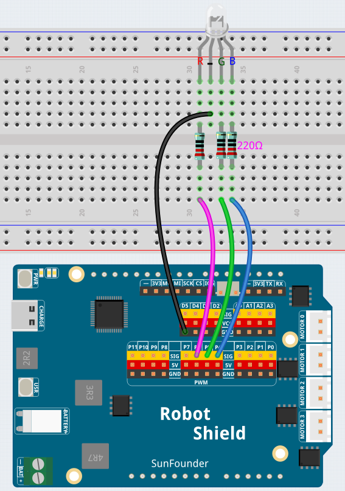

# 04 AI Object Color Light

Show an object to the camera — the AI identifies it and lights up the RGB LED in a matching color. Apple → red, banana → yellow, broccoli → green. Each detected object maps to a color via Bridge.


## Hardware Requirements

### Hardware

- Arduino UNO Q ×1
- Robot Shield (stacked on UNO Q)
- Multimedia Carrier with CSI camera
- RGB LED (common cathode) ×1
- 220 Ω resistors ×3
- USB-C cable ×1

### Software

- Arduino App Lab
- RobotShield library (install via Library Manager)

## Wiring

| RGB LED pin | Robot Shield |
|-------------|-------------|
| Red anode   | P6 (via 220Ω) |
| Green anode | P5 (via 220Ω) |
| Blue anode  | P4 (via 220Ω) |
| Common cathode | GND |



## Object → Color Mapping

| Object | RGB LED Color |
|--------|--------------|
| apple | Red |
| banana | Yellow |
| orange | Orange |
| broccoli | Green |
| bottle | Blue |
| person | White |

## Prerequisites

1. App Lab Settings → Carriers → Enable external carriers → Camera → **type1-2lanes** → Reboot.

## How to Use

1. Import `04 AI Object Color Light.zip` into **Arduino App Lab**.
2. Install **RobotShield** library if prompted.
3. Click **Run**.
4. Show a supported object to the camera — the RGB LED changes to its mapped color. When no object is detected for 2 seconds, the LED turns off.

## How it Works

```text
CSI Camera → VideoObjectDetection brick (general model)
    │
    ├── Video stream → Web UI
    │
    └── Detection → Python maps object → color code
                      │
                      └── Bridge.call("set_color", code)
                            │
                            ▼
                      Sketch → setRgb(r, g, b) → RGB LED
```

The AI model runs locally on the UNO Q. No cloud inference required.
