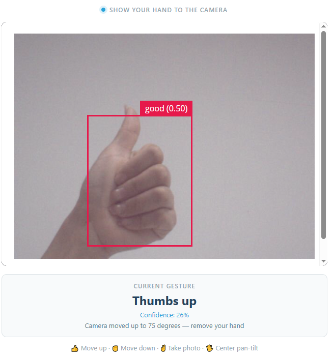
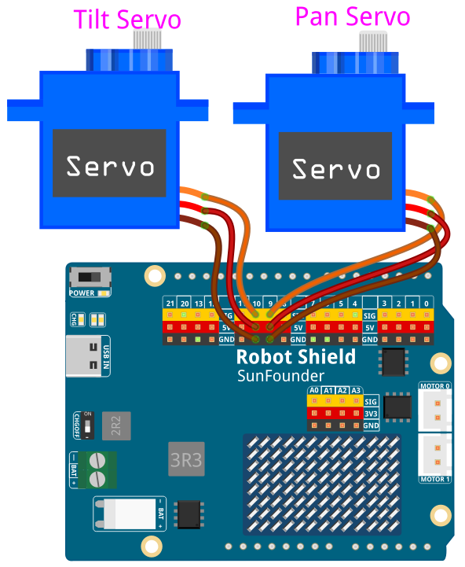

# 06 AI Gesture Camera

Recognize four hand gestures to tilt the camera, take a photo, return the pan-tilt to the center, and speak a short confirmation.

## Software

### Bricks Used

This example uses the following Bricks:

- `video_object_detection` — Runs the **hand-gesture** model (declared as `model: hand-gestures`) on every camera frame and reports which of four hand shapes it sees
- `web_ui` — Creates the web interface with the live camera feed, the current gesture, and the next-gesture prompt
- `sunfounder_tts` — Speaks a short confirmation for every accepted gesture (EdgeTTS needs an Internet connection, but no API key)

### Libraries Used

- **Arduino_HardwareServo** library — drives the pan and tilt servos with hardware PWM

## Hardware

- Pan Tilt Kit ×1
- USB-C cable ×1

## Wiring

Connect the pan servo signal to **D9** and the tilt servo signal to **D10**, with **5V** and **GND** for servo power. No breadboard wiring is needed.

## How to Use the Example

1. Open **Arduino App Lab**.
2. Select **Apps** → **Create New App** → **Import App** → **Import from Computer**.
3. Download [06 AI Gesture Camera.zip](https://github.com/sunfounder/unoq-ai-kit/releases/latest/download/06.AI.Gesture.Camera.zip) and import it in **Arduino App Lab**.
4. Click **Run** and open the Web UI.
5. Hold one gesture steady for about a second — the camera tilts, a photo is taken, or the pan-tilt centers, and the board says what it did. Then take your hand out of the frame and wait for **Ready — show a gesture** before the next one.

> **Note:** The first time you run a TTS example on this UNO Q, App Lab needs to download and prepare the TTS runtime and audio dependencies. This may take half an hour or more, depending on your network connection. Keep the UNO Q connected to the Internet and wait for the setup to complete. This setup only happens once — after it finishes, every TTS example starts much faster.

## Gesture Actions

| Model label | Gesture | Action | Spoken feedback |
| --- | --- | --- | --- |
| `good` | Thumbs up | Tilt up 5° | "Moving up." or "Highest position reached..." |
| `neut` | Fist | Tilt down 5° | "Moving down." or "Lowest position reached..." |
| `peace` | V-sign | Take a photo | "Photo taken." |
| `five` | Open hand | Center the pan-tilt | "Back to the center." |

## Servo Range

| Movement | Angle |
| --- | --- |
| Tilt highest | 60° |
| Tilt center | 85° |
| Tilt lowest | 110° |
| Tilt step per gesture | 5° |
| Pan center | 90° |

## How it Works

**Flow**

- Brick (`video_object_detection`, `model: hand-gestures`) — reports the hand shape it sees on every frame
- Python (`main.py`) — accepts a gesture only after it has been stable for 0.6 s, then puts it into a queue
- Worker thread — takes one gesture at a time and runs the servo move, the photo, and the speech
- Sketch (`sketch.ino`) — owns the angles: `tilt_up`, `tilt_down`, and `center_pan_tilt` move the servos and return the new angle
- Re-arm thread — unlocks the system again after 5 s and 3 s with no gesture, and tells the page **Ready — show a gesture**

**One gesture, one action**

The model reports the same hand shape many times per second, so the project needs a rule for what counts as a deliberate gesture. `on_detections()` tracks a candidate label and only accepts it once it has been stable for `STABLE_SECONDS = 0.6`. That single accepted gesture then locks the whole system: nothing new is accepted until the worker has finished, `MIN_ACTION_INTERVAL = 5.0` seconds have passed, and no gesture has been seen for `REARM_NO_GESTURE_SECONDS = 3.0`. This is why the page says **remove your hand** and later **Ready — show a gesture**.

**A queue keeps detection alive**

Acting on a gesture takes time — a servo move, a JPEG written to disk, and a sentence spoken out loud. The detection callback therefore never does that work itself: it only puts the label into a `queue.Queue(maxsize=1)` and returns immediately. A background worker takes items off the queue one at a time, which also means two gestures can never fight over the servo.

**Servo limits and the two ends**

The sketch moves the tilt servo in steps of 5° and clamps it to 60°–110°, with the center at 85°; the pan servo is kept at its 90° center. When a thumbs-up arrives while the tilt is already at 60°, the sketch returns that angle and Python reports *"Highest position reached. I cannot move up any further."* — the same happens at 110° for a fist. If up and down are reversed on your bracket, swap the addition and subtraction in `tiltUp()` and `tiltDown()`.

**Photos and speech**

A V-sign captures one frame with `camera.capture()` and writes it to `/app/photos/gesture_NNN.jpg`, increasing the number each time. Speech uses EdgeTTS in the same worker, so the camera reacts the instant your gesture lands while the voice arrives a moment later.

**Getting a reliable read**

Hold your hand about 50 cm from the camera against a clean white background, keep the whole hand inside the frame, and hold the gesture still until the card updates. Open-hand and V-sign gestures are the easiest to confuse, so give them a clear silhouette. Open the App only after the pan-tilt can move freely by hand.
