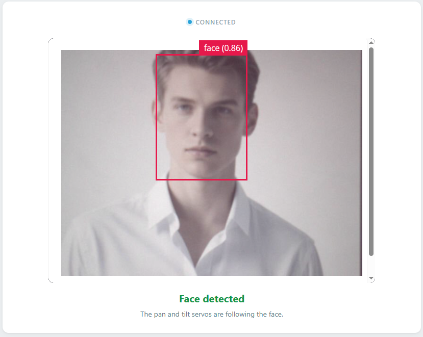

# 07 Face Tracking Camera

When the camera sees a face, the board greets **"Nice to meet you."** and follows it in two directions. The pan servo turns left and right while the tilt servo moves up and down to keep the face centered; when the face disappears for 2.5 seconds, both servos return to the center.

## Software

### Bricks Used

This example uses the following Bricks:

- `video_object_detection` — Runs the **face-detection** model (declared as `model: face-detection`) on every camera frame and reports each face it finds, with its bounding box
- `web_ui` — Creates the web interface with the live camera feed and the face status
- `sunfounder_tts` — Speaks the greeting through the AVIO Carrier's speaker (EdgeTTS needs an Internet connection, but no API key)

### Libraries Used

- **Arduino_HardwareServo** library — drives the pan and tilt servos with hardware PWM

## Hardware

- Pan Tilt Kit ×1
- USB-C cable ×1

## Wiring

Connect the pan servo signal to **D9** and the tilt servo signal to **D10**, with **5V** and **GND** for servo power.

> **Note:** The first time you run a TTS example on this UNO Q, App Lab needs to download and prepare the TTS runtime and audio dependencies. This may take half an hour or more, depending on your network connection. Keep the UNO Q connected to the Internet and wait for the setup to complete. This setup only happens once — after it finishes, every TTS example starts much faster.

## How to Use the Example

1. Download [`07 Face Tracking Camera.zip`](https://github.com/sunfounder/unoq-ai-kit/releases/latest/download/07.Face.Tracking.Camera.zip).
2. In App Lab, go to **Apps** → **Create New App** → **Import App** → **Import from Computer** and open the package you downloaded.
3. Click **Run**.
4. Stand in front of the camera — the board says *"Nice to meet you."* Move left, right, up, and down slowly and the camera follows you. Step away and after 2.5 seconds both servos return to their center positions.

## Behavior

1. The pan-tilt starts at the 90° center.
2. A first face appears → the greeting **"Nice to meet you."** plays once.
3. The pan servo follows horizontal movement and the tilt servo follows vertical movement, one degree per step.
4. Offsets inside the middle 10% of the frame are ignored, so small movements do not make the servos twitch.
5. No face for 2.5 seconds → both servos return to 90° and the next face triggers a new greeting.

## Servo Range

| Movement | Angle |
| --- | --- |
| Pan left / right | 45°–135° |
| Tilt up / down | 45°–115° |
| Center | 90° |
| Step per tracking update | 1° |

## How it Works

**Flow**

- Brick (`video_object_detection`, `model: face-detection`) — reports a detection box for every face it finds
- Python (`main.py`) — computes the center of the box and compares it with the middle of the 640 × 480 frame
- Python → Bridge — outside the dead zone it calls `Bridge.call("pan_step", direction)` or `Bridge.call("tilt_step", direction)`, sending only a direction
- Sketch (`sketch.ino`) — moves the requested servo by one degree, clamps it, and returns the new angle
- Monitor thread — calls `center_pan_tilt` after 2.5 seconds without a face

**Greeting once per visit**

Saying hello on every frame would be unbearable, so a flag named `face_visible` remembers whether a face is already being followed. Only the moment the flag flips from *lost* to *found* queues the greeting through `sunfounder_tts`. Speech runs in its own worker thread with a queue, so a sentence that takes a second to synthesize never stalls face detection.

**From a box to a direction**

Each detection reports a bounding box, and Python uses its top-left and bottom-right corners to compute the face's center. That center is compared with the middle of the frame. If the face sits inside the middle 10% in either direction nothing happens — that dead zone is what stops the servos from twitching at every tiny movement. Outside it, Python sends the direction only: `+1` or `-1`, never an angle.

**One degree at a time**

The sketch owns the angles. Each call moves the requested servo by a single degree and clamps the result, then returns the new angle. Small incremental steps are what make the motion look continuous instead of snappy, and the clamping means a badly framed face can never drive the mechanism past its safe range.

**Returning to center**

The monitor thread checks the clock every 200 ms. Every detection refreshes the timestamp, so as long as a face is visible the pan-tilt keeps following; once 2.5 seconds have passed with nothing detected, Python calls `center_pan_tilt` and both servos go back to 90°, ready to greet the next face.
