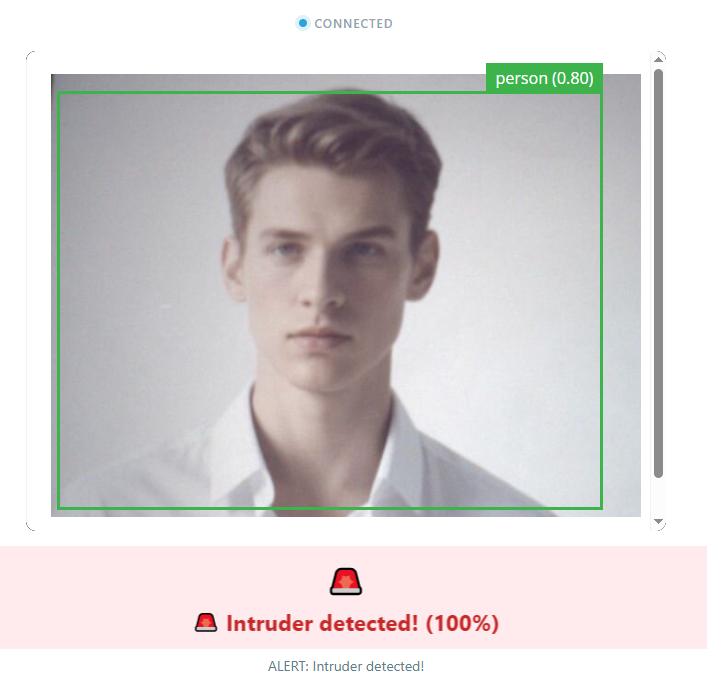
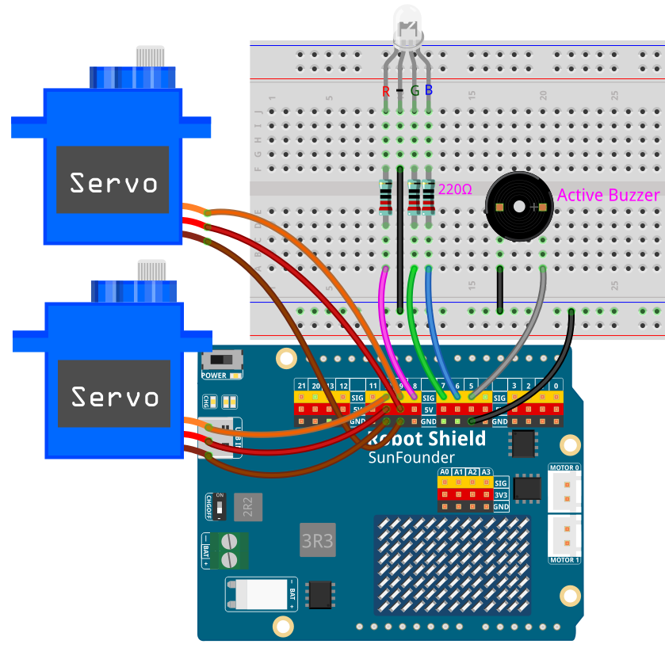

# 08 AI Smart Guard

A complete security system. The camera sweeps the room for intruders — when a **person** (a full body, not just a face) is detected, the RGB LED turns red, the buzzer sounds, the scanning stops, and a voice alert plays. After 3 seconds of quiet it returns to green "all clear" patrol.

## Software

### Bricks Used

This example uses the following Bricks:

- `video_object_detection` — Runs the general object-detection model on every camera frame; Python subscribes only to the **person** class
- `web_ui` — Creates the web interface with the live camera feed and the guard status panel
- `sunfounder_tts` — Speaks the intruder alert and the all-clear message through the AVIO Carrier's speaker (EdgeTTS needs an Internet connection, but no API key)

### Libraries Used

- **Arduino_HardwareServo** library — drives the scanning pan servo with hardware PWM

## Hardware

- Pan Tilt Kit ×1
- Breadboard ×1
- RGB LED (common cathode) ×1
- 220Ω resistor ×3
- Active buzzer ×1
- Jumper wires
- USB-C cable ×1

## Wiring

Connect the RGB LED's red, green, and blue anodes to **D8**, **D7**, and **D6** — each through a 220Ω resistor — and its common cathode to **GND**; connect the buzzer's positive leg to **D5** and its negative leg to **GND**; connect the pan servo signal to **D9** and the tilt servo signal to **D10**, with **5V** and **GND** for servo power.

> **Note:** The first time you run a TTS example on this UNO Q, App Lab needs to download and prepare the TTS runtime and audio dependencies. This may take half an hour or more, depending on your network connection. Keep the UNO Q connected to the Internet and wait for the setup to complete. This setup only happens once — after it finishes, every TTS example starts much faster.

## How to Use the Example

1. Download [`08 AI Smart Guard.zip`](https://github.com/sunfounder/unoq-ai-kit/releases/latest/download/08.AI.Smart.Guard.zip).
2. In App Lab, go to **Apps** → **Create New App** → **Import App** → **Import from Computer** and open the package you downloaded.
3. Click **Run**.
4. The servo scans left and right while the RGB LED glows green. Walk in front of the camera — the light turns red, the buzzer beeps, and the board announces the intruder. Step away and after 3 seconds it settles back into silent green patrol.

## Person Detection vs Face Detection

The **face-detection** model used by the earlier face projects only fires on a clear view of a face — eyes, nose, and mouth. This project instead uses the **general object model**, which reports a `person` class for a whole body, so it still works when someone faces away, wears a mask or sunglasses, or is partly hidden. A greeter wants faces; a guard wants intruders.

| | Face detection | Person detection |
| --- | --- | --- |
| Model | `model: face-detection` | General model |
| Back to the camera | Not detected | Detected |
| Mask / sunglasses | May be missed | Unaffected |
| Typical use | Greeting, face tracking | Security, people counting |

## Guard Behavior

| State | Servo | RGB LED | Buzzer | Voice |
| --- | --- | --- | --- | --- |
| All clear | Scanning left and right | Green | Silent | — |
| Person detected | Stops scanning | Red | Beeping alarm | "Intruder detected" |
| Person lost for 3 s | Resumes scanning | Green | Silent | "All clear" |

## Servo Range

| Movement | Angle |
| --- | --- |
| Scan left / right | 45°–135° |
| Scan step | 1° every 40 ms |
| Center | 90° |

## How it Works

**Flow**

- Brick (`video_object_detection`) — runs the general model on every frame; `on_detect_all()` looks for a `person` in the results
- Python (`main.py`) — the first sighting calls `Bridge.call("alarm_on")` and queues the spoken alert; a throttle limits how often it speaks
- Sketch (`sketch.ino`) — `alarm_on()` switches to red, starts the buzzer, and stops the scan; `alarm_off()` does the reverse
- Monitor thread — calls `Bridge.call("alarm_off")` after 3 seconds without a person
- Browser — shows the live camera feed and the alert panel

**Two states, two processors**

The whole guard is a two-state machine — patrolling and alarming — and both halves of the app agree on it. Python watches the model and decides which state the system should be in; the sketch owns the hardware and switches all three outputs at once, because scanning, lighting, and beeping have to change together. Two Bridge commands, `alarm_on()` and `alarm_off()`, are the entire interface between them.

**A guard that warns without nagging**

Speech is slow and the intruder stays in view, so announcing every detection would make the speaker scream continuously. A timestamp throttles the alert: *"Intruder detected. Intruder detected."* is spoken at most once every 8 seconds, however many detections arrive. The sentence is deliberately repeated so it stays intelligible over the buzzer. EdgeTTS runs in a background thread, so the alert never blocks detection.

**Going quiet again**

The monitor thread checks the clock every 200 ms and compares it with the last time a person was seen. After 3 seconds of nothing, the state flips back to patrolling: green light, silent buzzer, resumed scan, and the spoken *"All clear."* Raising `confidence` in `python/main.py` makes the guard stricter, which is the usual fix if moving shadows start triggering it.
