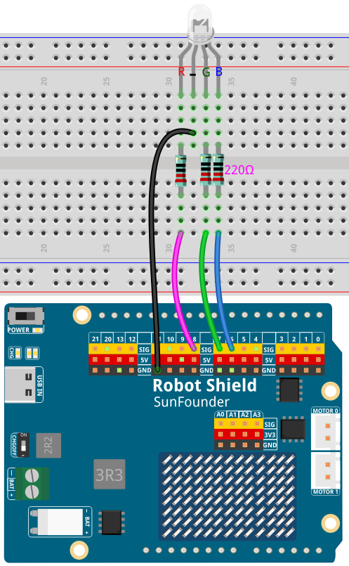

# 09 AI Voice Light

A hands-free lamp: the wake-word model listens to the microphone continuously and, when it hears **"Hey Arduino"**, the assistant answers *"I'm here."*, records one spoken command, and switches the RGB LED on **D8**, **D7**, and **D6** through the Bridge. There is no Web UI and no button — the console is the interface.

## Software

### Bricks Used

This example uses the following Bricks:

- `keyword_spotting` — Runs the `keyword-spotting-hey-arduino` Edge Impulse model on the live microphone stream and calls back when the wake word clears the confidence threshold; it must be the **first** brick in `app.yaml`, or it takes over the port the other audio bricks use
- `sunfounder_stt` — Whisper speech recognition, started only after the wake word so room audio is never transcribed continuously
- `sunfounder_tts` — Answers *"I'm here."* through the Multimedia Carrier's speaker (EdgeTTS needs an Internet connection, but no API key)

## Hardware

- Breadboard ×1
- RGB LED (common cathode) ×1
- 220 Ω resistor ×3
- Jumper wires
- USB-C cable ×1

## Wiring

Connect the RGB LED's red, green, and blue anodes to **D8**, **D7**, and **D6** — each through a 220 Ω resistor — and its common cathode to **GND**.

## How to Use the Example

1. Open **Arduino App Lab**.
2. Select **Apps** → **Create New App** → **Import App** → **Import from Computer**.
3. Download [09 AI Voice Light.zip](https://github.com/sunfounder/unoq-ai-kit/releases/latest/download/09.AI.Voice.Light.zip) and import it in **Arduino App Lab**.
4. Click **Run**.
5. Wait for `[READY] Waiting for "Hey Arduino"...` in the console, then say **"Hey Arduino"**.
6. When the assistant answers *"I'm here."*, say one light command within four seconds — for example *"Turn the light blue."*
7. The LED keeps that colour and the console returns to `[READY]`, listening for the next wake word.

> **Note:** The first time you run a TTS example on this UNO Q, App Lab needs to download and prepare the TTS runtime and audio dependencies. This may take half an hour or more, depending on your network connection. Keep the UNO Q connected to the Internet and wait for the setup to complete. This setup only happens once — after it finishes, every TTS example starts much faster.

## Spoken Commands

| Command | Result |
| --- | --- |
| "Turn the light red / green / blue / yellow / purple / white" | The LED shows that colour |
| "Turn the light off" | The LED goes dark |
| "Turn the light on" | Back to the last colour that was asked for — white straight after startup |

Anything else is recognised but ignored: the console prints `[ACTION] No supported light command in that sentence.` and the LED stays the colour it was already showing.

## Console Output

Every step is printed with a prefix, so the interaction can be followed without a Web UI:

- `[MIC] Capture route and gain applied (9/9 settings).` — every mixer setting the capture path needs was accepted by the audio codec
- `[MIC] Platform microphone 0 resolves to ... , volume 100%.` — which device the model will listen to, and the level measured on it
- `[MIC] Captured 22528 samples in 1.5s: peak 32768, average 11614, pinned at full scale 0.9%.` — real audio, counted before the model is blamed for hearing nothing
- `[READY] Waiting for "Hey Arduino"...` — the models are loaded and the microphone is live
- `[WAKE] "Hey Arduino" recognised - waking up.` — the wake word cleared the threshold
- `[HEARD] Turn the light blue.` — what speech recognition returned
- `[ACTION] Light is now blue.` — the colour sent to the sketch
- `[HEARD] background 11x (best 100%), other 3x (best 88%)` — every 15 seconds, a summary of what the model made of the audio: `background` is silence, `other` is speech that was not the wake word, `hey_arduino` is the wake word
- `[LISTENING] Microphone active. wakes=2, last wake 34s ago.` — the heartbeat that proves detection is still running

## How it Works

**Flow**

- Brick (`keyword_spotting`) — classifies one second of audio at a time into `background`, `other` or `hey_arduino`, and fires the wake callback when the score clears `CONFIDENCE`
- Python (`main.py`) — answers, lights the LED dim green as an "awake" cue, records four seconds, asks the speech recogniser what was said, and maps the sentence to a colour
- Brick (`sunfounder_stt`) — transcribes the recorded command locally with Whisper
- Sketch (`sketch.ino`) — `setRgb()` writes the three values with `analogWrite()` on D8, D7, and D6
- Heartbeat thread — prints the window summary every 15 seconds, so a quiet console is never mistaken for a dead app

**The brick has to exist before App.run()**

The keyword spotting brick registers its microphone reader and its inference loop as app loops, and `App.run()` collects those loops when it starts. Creating the brick afterwards, from the initialisation thread, leaves both of them unregistered — and the failure is silent: the console still reports that keyword spotting is running, the model still answers over HTTP, the microphone device still resolves correctly, and not a single sample is ever read. Arduino's own examples create the brick at module level, before `App.run()`, and this app does the same.

**One and a half seconds of proof**

Before the model is opened, the app captures a short burst from the same device the brick is about to use and prints the device name, the peak, the average level and how much of it sits pinned at full scale. A microphone that never delivers a sample, one that delivers near-silence, and one whose gain is so high that words arrive clipped are three different problems, and they are indistinguishable from "the model does not know my voice" unless the level is measured first.

**Two stages of listening**

Keyword spotting runs all the time and costs almost nothing: it is a small model that answers one question — is this the wake word? Full speech recognition is expensive, so it starts only after the wake word and stops four seconds later. That is also why a command has to be spoken promptly: the recording window is fixed, and the spoken *"I'm here."* is the cue that it has opened.

**The light is state, not a flash**

A command sets the LED and leaves it set, so the lamp keeps the colour you asked for until you ask for another one. The dim green glow during recording is only a cue: once the command has been applied the LED returns to the commanded colour, and a sentence it cannot use restores that colour instead of switching the lamp off.

**Where the wake word comes from**

`keyword-spotting-hey-arduino` ships with App Lab and was trained on a single speaker, so it matches some voices much better than others. The summary line is how the two failure modes are told apart: `background` alone means the microphone is hearing nothing worth classifying, while `other` means speech arrived but never matched the wake word — the model heard you and disagreed. `CONFIDENCE` in `python/main.py` is set to 0.45 to be more forgiving than the brick's default of 0.8, and training a model on your own recordings in Edge Impulse is the real fix for a voice the shipped model does not know.

**Testing without the wake word**

Because the wake word depends on the model matching your voice, the light, speech and recognition halves of the app can be exercised on their own. Setting `BENCH_WAKE_AFTER_SECONDS` in `python/main.py` to a positive number runs one wake cycle that many seconds after startup, without the wake word; adding a sentence to `BENCH_COMMAND` applies that sentence instead of recording one. Both ship as `0.0` and `""`.
