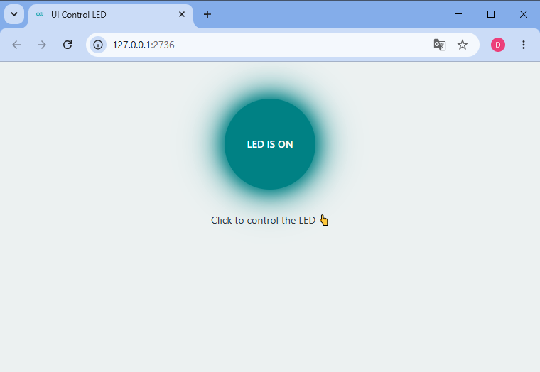
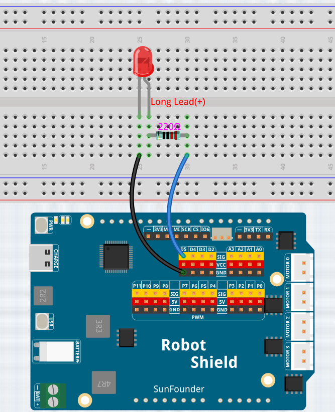

# 01 UI Control LED

The **UI Control LED** example demonstrates how to control an external LED from a web page using Arduino App Lab. The browser sends commands to the Python backend through Socket.IO, and Python communicates with the sketch through the Bridge to control the LED connected to digital pin **D5**.




## Bricks Used

This example uses the following Brick:

- `web_ui` – Creates the web interface and provides real-time communication between the browser and the Python backend.

## Hardware Requirements

### Hardware

- Arduino UNO Q ×1
- Breadboard ×1
- Red LED ×1
- 220 Ω resistor ×1
- Jumper wires
- USB-C cable ×1

### Software

- Arduino App Lab

## Wiring

Connect the LED through a **220 Ω resistor** between **digital pin D5** and **GND**.




## How to Use the Example

1. Open **Arduino App Lab**.
2. Select **My Apps** → **Create New App** → **Import App** → **Import from Computer**.
3. Import `01 UI Control LED.zip` from `unoq-ai-kit\iot`.
4. Click **Run**.
5. When the Web UI opens, click the **LED IS OFF** button to toggle the LED.

## How it Works

The application consists of three parts that work together:

```text
Browser
      │
      │ Socket.IO
      ▼
Python Backend
      │
      │ Bridge
      ▼
Sketch
      │
      ▼
LED
```

When the button is clicked, the browser sends a Socket.IO message to the Python backend. Python processes the request and uses the Bridge to call a function in the sketch. The sketch updates the GPIO output to switch the LED on or off, and Python then sends the latest LED state back to the browser.

## Code Overview

### Browser

The frontend provides the user interface and handles user interaction.

- `index.html` builds the page layout.
- `style.css` styles the LED button.
- `app.js` sends button events to the backend and updates the button state.

### Python Backend

`main.py` manages the application logic.

It is responsible for:

- Starting the Web UI server.
- Receiving browser events.
- Calling sketch functions through the Bridge.
- Broadcasting LED status updates to connected browsers.

Example:

```python
Bridge.call("set_led_state", led_is_on)
```

### Sketch

`sketch.ino` controls the hardware running on the microcontroller.

It:

- Configures pin **D5** as an output.
- Initializes the Bridge.
- Exposes `set_led_state()` for Python to call.
- Controls the LED using `digitalWrite()`.

Example:

```cpp
Bridge.provide("set_led_state", set_led_state);

void set_led_state(bool state) {
    digitalWrite(5, state ? HIGH : LOW);
}
```
