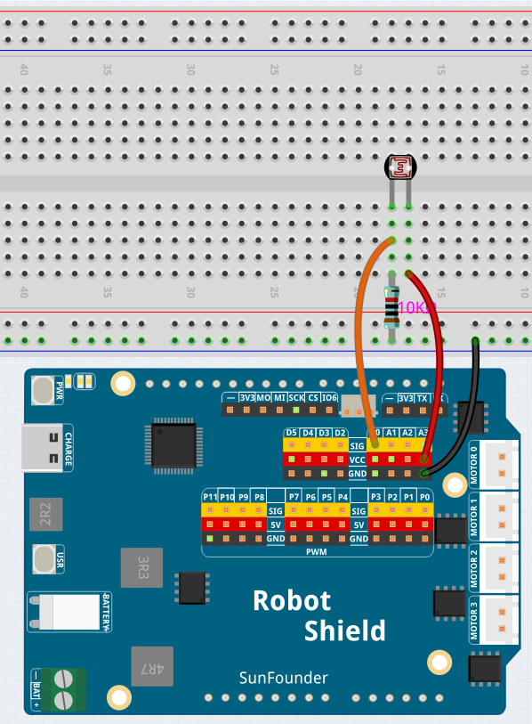

# 03 Sensor Data Dashboard

Build a real-time sensor dashboard that displays light levels and visualizes changes over time. A photoresistor connected to A0 measures the surrounding light — the sketch sends the reading to Python through Bridge, and Python forwards it to the Web UI's current-value display and trend chart.

## Software

### Bricks Used

- `web_ui` — Creates the web interface and provides real-time communication between the browser and the Python backend

## Hardware

- Arduino UNO Q ×1
- Photoresistor ×1
- 10 kΩ resistor ×1
- Jumper wires
- USB-C cable ×1

## Wiring

Connect the photoresistor between 3.3V and A0, and the 10 kΩ resistor between A0 and GND — the two resistors form a voltage divider, and the UNO Q reads the divided voltage on A0.

## How to Use the Example

1. Open **Arduino App Lab**.
2. Select **Apps** → **Create New App** → **Import App** → **Import from Computer**.
3. Download [03 Sensor Data Dashboard.zip](https://github.com/sunfounder/unoq-ai-kit/releases/latest/download/03.Sensor.Data.Dashboard.zip) and import it in **Arduino App Lab**.
4. Click **Run**.
5. Open the Web UI and watch the current light level and trend chart. Cover the photoresistor with your hand, then uncover it — the percentage and chart change in real time. The chart displays approximately the last 30 seconds of readings.

## How it Works

**Flow**

- Sketch (`sketch.ino`) — reads A0 every 200 ms with `analogRead()`, maps the raw 0–1023 value to a 0–100% light level, and calls `Bridge.notify("update_light_level", lightLevel)`
- Python (`main.py`) — receives the value through `Bridge.provide()` and forwards it to the browser with `ui.send_message("light_level", {"value": light_level})`
- Browser — JavaScript updates the current value, level bar, and trend chart

**The non-blocking timer**

The sketch uses `millis()` instead of `delay()` to keep a steady 200 ms sample interval — the board can still respond to Bridge events between readings.

**Direction depends on the sensor**

Depending on your photoresistor circuit, brighter light may produce either a higher or lower ADC reading. If the displayed percentage changes in the opposite direction from what you expect, change the mapping to `map(rawValue, 0, 1023, 100, 0)`.
