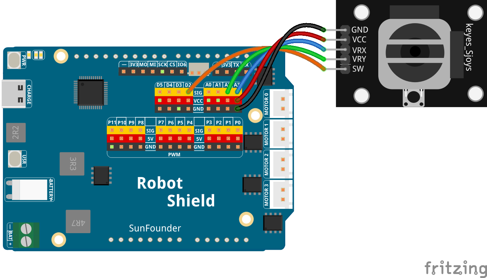

# 04 UI Joystick Maze

Use a physical joystick to guide an explorer through a maze in your browser. Push up/down/left/right to move one cell at a time, reach the yellow goal to finish, and press the joystick button to restart. The page tracks your move count and completion time.

## Software

### Bricks Used

- `web_ui` — Creates the web interface and provides real-time communication between the browser and the Python backend

## Hardware

- Arduino UNO Q ×1
- Joystick module ×1
- Jumper wires
- USB-C cable ×1

## Wiring

Connect the joystick's VRX to A3, VRY to A2, SW to D4, VCC to 3.3V (the UNO Q's analog inputs measure 0–3.3V), and GND to GND.

## How to Use the Example

1. Open **Arduino App Lab**.
2. Select **Apps** → **Create New App** → **Import App** → **Import from Computer**.
3. Import `04 UI Joystick Maze.zip` from `unoq-ai-kit\iot`.
4. Click **Run**.
5. Open the Web UI and move the joystick to guide the blue explorer through the maze. Reach the yellow goal to see your moves and completion time. Press the joystick button or click **Play Again** to restart.

## How it Works

**Flow**

- Sketch (`sketch.ino`) — calibrates the joystick center at startup (averages 20 readings per axis), then checks the analog X/Y values each loop. When the joystick moves past the dead zone (±150), it sends one direction via `Bridge.notify("joystick_move", "left")` and waits for the stick to return to center before sending the next move. The button sends `Bridge.notify("reset_game")`.
- Python (`main.py`) — validates the direction and forwards it to the browser with `ui.send_message("joystick_move", {"direction": direction})`
- Browser — JavaScript tries to move the player one maze cell; walls block movement, the goal ends the game

**Auto-calibration**

Every joystick rests at a slightly different voltage, so `setup()` averages 20 X/Y readings and uses that as "center". No manual tuning needed.

**One move per push**

After sending a direction, `joystickReady` turns false until the stick returns to the center zone. Without this, a single push would fire dozens of moves — one cell per push keeps the game fair.

**The dead zone**

Small voltage wobbles around center are ignored (the ±150 band). For diagonal pushes, the stronger axis wins.
