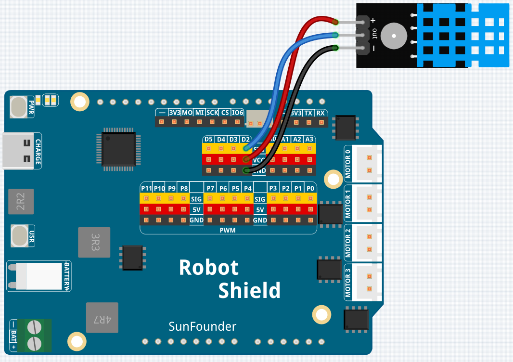

# 04 Arduino Cloud Environment Monitor

Build an IoT environment monitoring system using Arduino Cloud.

This project uploads temperature and humidity readings from a DHT11 sensor to Arduino Cloud, while a switch on the Cloud Dashboard remotely controls an external LED connected to D5.

```text
DHT11
  ↓
UNO Q Sketch
  ↓
Bridge
  ↓
Python App
  ↓
Arduino Cloud Dashboard
```

The control path works in the opposite direction:

```text
Cloud Switch
  ↓
Python Callback
  ↓
Bridge RPC
  ↓
Built-in LED
```

## What You'll Learn

- Read temperature and humidity from a DHT11 sensor
- Send sensor readings from the sketch to Python through Bridge
- Upload sensor data to Arduino Cloud
- Display live measurements on a Cloud Dashboard
- Control an LED remotely with a Cloud switch
- Combine Cloud monitoring and Cloud control in one project

## Components Needed

- Arduino UNO Q ×1
- Breadboard ×1
- DHT11 temperature and humidity sensor module ×1
- LED ×1
- 220 Ω resistor ×1
- Jumper wires
- USB-C cable ×1

## Wiring

Connect the DHT11 module as follows:

- DHT11 **VCC** → **5V**
- DHT11 **DATA** → **D2**
- DHT11 **GND** → **GND**

Connect the external LED as follows:

- LED anode (long leg) → **D5**
- LED cathode (short leg) → **220 Ω resistor**
- Other end of the resistor → **GND**



> Update the wiring diagram before publishing so it also shows the external LED connected to D5.

## Arduino Cloud Resources

Use the following names throughout the lesson:

```text
Device:     UNO Q AI Kit
Thing:      Environment Monitor
Dashboard:  Environment Dashboard
```

Create three Cloud variables:

| Variable | Type | Permission | Update Policy |
|---|---|---|---|
| `temperature` | Floating Point Number | Read Only | On change |
| `humidity` | Floating Point Number | Read Only | On change |
| `led` | Boolean | Read & Write | On change |

The variable names must match the names used in `python/main.py`.

## How to Use the Example

This example requires an Arduino Cloud account with a Device, Thing, variables, and Dashboard.

### Create or Reuse the Device

If you completed the previous Arduino Cloud lesson, reuse the existing Device:

```text
UNO Q AI Kit
```

Otherwise:

1. Sign in to [Arduino Cloud](https://app.arduino.cc/).
2. Open **Devices** and click **Add Device**.
3. Select **Manual Device**, then select **Arduino UNO Q**.
4. Name it `UNO Q AI Kit`.
5. Save the **Device ID** and **Secret Key**.

### Create the Thing

1. Open **Things** and click **Create Thing**.
2. Name the Thing:

   ```text
   Environment Monitor
   ```

3. Associate it with the `UNO Q AI Kit` Device.

### Create the Variables

Inside the Thing, create the following variables.

#### Temperature

```text
Name: temperature
Type: Floating Point Number
Permission: Read Only
Update Policy: On change
```

#### Humidity

```text
Name: humidity
Type: Floating Point Number
Permission: Read Only
Update Policy: On change
```

#### LED

```text
Name: led
Type: Boolean
Permission: Read & Write
Update Policy: On change
```

Use the exact lowercase names shown above.

### Create the Dashboard

1. Open **Dashboards** and click **Build Dashboard**.
2. Name it:

   ```text
   Environment Dashboard
   ```

3. Open it in **Edit** mode.
4. Add widgets linked to the three variables:

| Variable | Suggested Widget | Widget Name |
|---|---|---|
| `temperature` | Value or Gauge | Temperature |
| `humidity` | Value or Gauge | Humidity |
| `led` | Switch | LED |

Suggested units:

```text
Temperature: °C
Humidity: %
```

### Configure the Arduino Cloud Brick

1. Import this ZIP file into **Arduino App Lab**.
2. Open the **Arduino Cloud** Brick.
3. Click **Brick Configuration**.
4. Enter the credentials saved when creating the Device:

   ```text
   ARDUINO_DEVICE_ID: your Device ID
   ARDUINO_SECRET: your Secret Key
   ```

5. Save the configuration.

### Launch the App

1. Click **Run** (▶).
2. Wait for the Arduino Cloud connection to start.
3. Open the Python Console and Serial Monitor.
4. Open the `Environment Dashboard`.

The temperature and humidity widgets update as new DHT11 readings arrive.

Use the **LED** switch to turn the external LED connected to D5 on or off.

## How It Works

### Reading the DHT11

The sketch reads the DHT11 every five seconds:

```cpp
float humidity = dht.readHumidity();
float temperature = dht.readTemperature();
```

A five-second interval avoids sending unnecessary Cloud updates and respects the relatively slow DHT11 sensor.

### Sending Sensor Data to Python

The sketch sends both readings through Bridge:

```cpp
Bridge.notify(
    "update_environment_cloud",
    temperature,
    humidity
);
```

Python exposes a matching function:

```python
Bridge.provide(
    "update_environment_cloud",
    update_environment_cloud,
)
```

### Uploading Values to Arduino Cloud

The Python function updates the registered Cloud variables:

```python
iot_cloud.temperature = temperature
iot_cloud.humidity = humidity
```

The Dashboard widgets then show the latest values.

### Controlling the LED

When the Cloud switch changes, Arduino Cloud calls:

```python
def led_callback(client, value):
    Bridge.call("set_led_state", bool(value))
```

The sketch receives the Boolean value and controls the external LED on D5:

```cpp
digitalWrite(
    LED_PIN,
    state ? HIGH : LOW
);
```

## Expected Output

Python Console:

```text
Cloud update -> Temperature: 24.8 °C, Humidity: 52.0 %
LED updated from cloud: ON
Cloud update -> Temperature: 24.9 °C, Humidity: 51.0 %
LED updated from cloud: OFF
```

Serial Monitor:

```text
=== Arduino Cloud Environment Monitor ===
Waiting for DHT11 readings...
Temperature: 24.8 °C    Humidity: 52.0 %
LED: ON
Temperature: 24.9 °C    Humidity: 51.0 %
LED: OFF
```

## Troubleshooting

### The Dashboard does not show temperature or humidity

Check that:

- The variable names are exactly `temperature` and `humidity`.
- Both variables use the Floating Point Number type.
- The Thing is associated with the correct Device.
- The Device ID and Secret Key are correct.
- The DHT11 is connected to D2.
- The external LED is connected to D5 through a 220 Ω resistor.
- The Python Console shows `Cloud update` messages.

### The LED switch does not work

Check that:

- The Boolean variable is named exactly `led`.
- Its permission is **Read & Write**.
- The Dashboard switch is linked to the correct variable.
- The Python Console prints `LED updated from cloud`.
- The sketch is running.

### DHT11 readings fail

Check the VCC, DATA, and GND connections. The sensor may also need a few seconds to stabilize after power-up.
