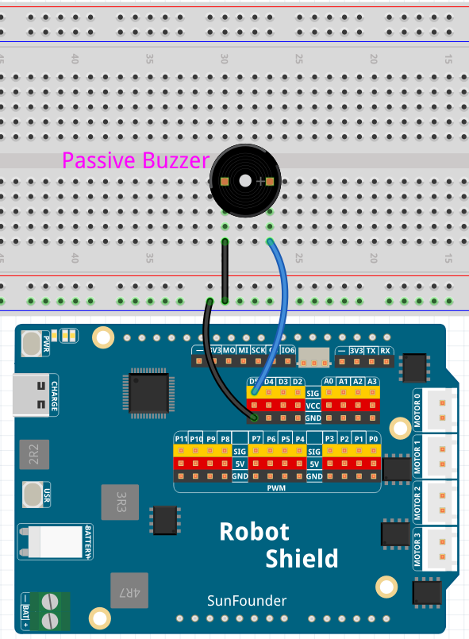

# 06 Arduino Cloud Melody Pitch

Use a slider on an Arduino Cloud Dashboard to raise or lower the pitch of a repeating melody played by a passive buzzer. The Cloud slider sends a pitch level from 0 to 50; the sketch maps it to 50%–200% of the melody's base pitch — 0 plays an octave lower, 50 plays an octave higher.

## Software

### Bricks Used

- `arduino_cloud` — Connects the App to Arduino Cloud; the `pitch` variable receives slider updates from the Dashboard

## Hardware

- Arduino UNO Q ×1
- Passive buzzer ×1
- Jumper wires
- USB-C cable ×1

## Wiring

Connect the passive buzzer between D5 and GND (the sketch drives it with `tone()`).

## How to Use the Example

1. Open **Arduino App Lab**.
2. Select **Apps** → **Create New App** → **Import App** → **Import from Computer**.
3. Download [06 Arduino Cloud Melody Pitch.zip](https://github.com/sunfounder/unoq-ai-kit/releases/latest/download/06.Arduino.Cloud.Melody.Pitch.zip) and import it in **Arduino App Lab**.
4. Open the **Arduino Cloud** Brick, click **Brick Configuration**, and enter your `ARDUINO_DEVICE_ID` and `ARDUINO_SECRET`.
5. In Arduino Cloud, create a Device, a Thing with an Integer `pitch` variable (Read & Write, On change), and a Dashboard with a 0–50 slider linked to `pitch`.
6. Click **Run**.
7. Move the Dashboard slider — the melody's pitch shifts lower or higher while staying recognizable.

## How it Works

**Flow**

- Arduino Cloud Dashboard — the slider writes a 0–50 value to the `pitch` variable
- Python (`main.py`) — `iot_cloud.register("pitch", value=25, on_write=pitch_callback)` fires `pitch_callback()` on every change; it clamps the value and calls `Bridge.call("set_pitch_level", pitch_level)`
- Sketch (`sketch.ino`) — `setPitchLevel()` stores the value; the non-blocking `loop()` maps 0–50 to 50–200% and plays the current note with `tone(BUZZER_PIN, frequency)`, advancing to the next note every 250 ms

**The melody**

Four base notes are stored in an array — C4 (262 Hz), E4 (330 Hz), G4 (392 Hz), C5 (523 Hz). Each note is multiplied by the pitch percentage, so the relative spacing between notes stays the same and the melody remains recognizable at any pitch.

**Non-blocking note timing**

The sketch uses `millis()` instead of `delay()` to track each note's duration — when the Cloud slider changes, the new pitch applies on the very next note without waiting for a blocked delay to finish.
