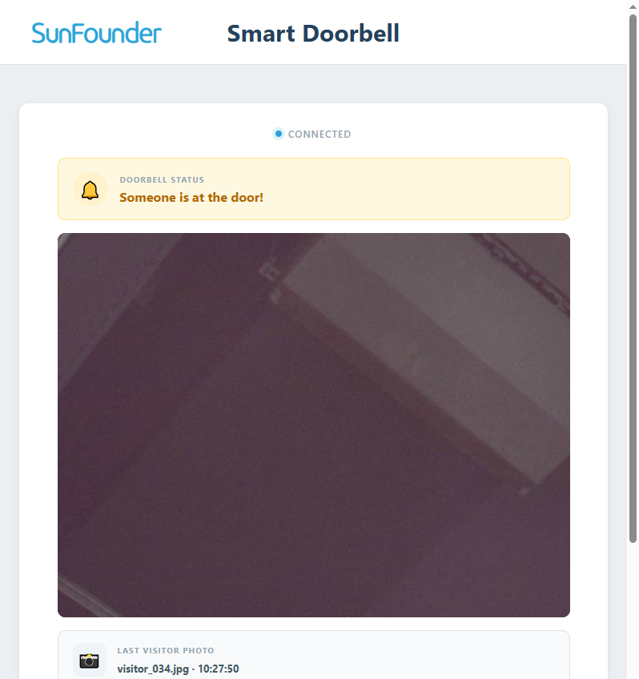
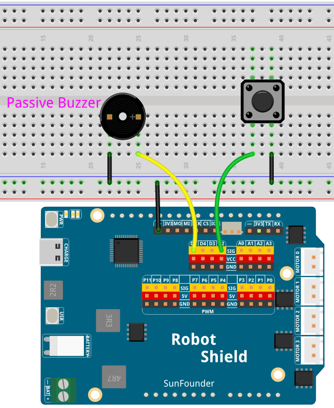

# 08 Smart Doorbell

Build a smart doorbell with a push button, passive buzzer, live camera preview, automatic visitor photo, browser notification, and spoken visitor alert. Press the button — the buzzer plays a "ding-dong" chime, the Web UI shows "Someone is at the door!", a visitor photo is saved, and the UNO Q speaker says "Someone is at the door."

## Software

### Bricks Used

- `web_ui` — Creates the web interface and provides real-time communication between the browser and the Python backend
- `sunfounder_tts` — Plays the spoken visitor alert through the UNO Q speaker

## Hardware

- Pan Tilt Kit ×1
- Push button ×1
- Passive buzzer ×1
- Jumper wires
- USB-C cable ×1

## Wiring

Connect the push button between D4 and GND (uses `INPUT_PULLUP`), and the passive buzzer between D5 and GND.

## How to Use the Example

1. Download [`08 Smart Doorbell.zip`](https://github.com/sunfounder/unoq-ai-kit/releases/latest/download/08.Smart.Doorbell.zip).
2. In App Lab, go to **Apps** → **Create New App** → **Import App** → **Import from Computer** and open the package you downloaded.
3. Click **Run**.
4. Open the Web UI and press the doorbell button. The buzzer plays the chime, the page shows **Someone is at the door!**, a visitor photo is saved, and the speaker says **"Someone is at the door."**

## How it Works

**Flow**

- Sketch (`sketch.ino`) — waits for a HIGH→LOW transition on the button (debounced by edge detection), plays the chime with `tone()`, and calls `Bridge.notify("doorbell_pressed")`
- Python (`main.py`) — receives the event, updates the Web UI, requests a snapshot of the current camera frame, and uses TTS to announce the visitor
- The App loop streams the camera preview at about 5 FPS and saves visitor photos as `photos/visitor_001.jpg`, `visitor_002.jpg`, and so on

**The ding-dong chime**

`tone(BUZZER_PIN, 1047)` plays the high "ding" for 300 ms, a 150 ms silence separates the two notes, and `tone(BUZZER_PIN, 784)` plays the lower "dong" for 500 ms. `noTone(BUZZER_PIN)` silences the buzzer between notes.

**The button edge detection**

The sketch remembers the previous button state and reacts only on the HIGH→LOW transition — holding the button down does not fire repeated doorbell events.

**Camera and photos**

This project uses a normal camera stream, not Edge AI. Python captures frames, compresses them to JPEG, sends them to the Web UI, and saves a snapshot for each button press. The latest 10 doorbell events are kept per browser session.
