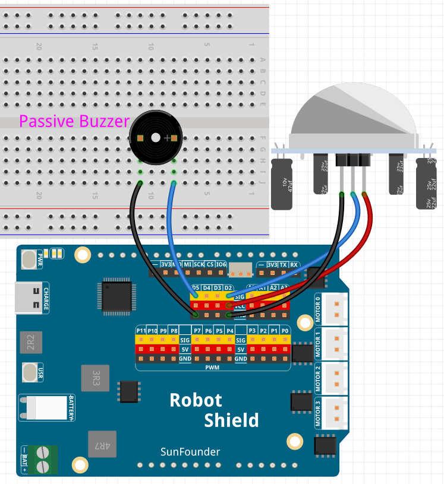

# 09 IoT Security Monitor

Build an IoT security monitor with a live camera stream, PIR motion detection, a two-tone buzzer alarm, automatic snapshots, and a browser event log. This project does **not** use Edge AI or the Video Object Detection Brick — the CSI camera is used as a normal camera.

## Software

### Bricks Used

- `web_ui` — Creates the web interface and provides real-time communication between the browser and the Python backend

## Hardware

- Arduino UNO Q ×1
- Multimedia Carrier with CSI camera ×1
- PIR motion sensor ×1
- Passive buzzer ×1
- Jumper wires
- USB-C cable ×1

## Wiring

Connect the PIR sensor's VCC to 3.3V, GND to GND, and OUT to D2; connect the passive buzzer between D5 and GND.

## How to Use the Example

1. Open **Arduino App Lab**.
2. Select **Apps** → **Create New App** → **Import App** → **Import from Computer**.
3. Import `09 IoT Security Monitor.zip` from `unoq-ai-kit\iot`.
4. Click **Run**.
5. Open the Web UI — you'll see the live camera preview, motion status, and event log. Walk in front of the PIR sensor: the status changes to **MOTION DETECTED**, the buzzer sounds a two-tone siren, and a snapshot is saved. Stand still for 10 seconds and the status returns to **AREA CLEAR**.

## How it Works

**Flow**

- Sketch (`sketch.ino`) — polls the PIR sensor on D2. On motion, it latches **MOTION DETECTED** and alternates `tone()` between 800 Hz and 1200 Hz every 300 ms using `millis()` (no blocking delays). It only returns to **AREA CLEAR** after 10 continuous seconds without motion, then calls `Bridge.notify("motion_state", ...)`
- Python (`main.py`) — streams the camera preview at about 5 FPS (JPEG quality 70), saves a snapshot on the first motion event, and keeps saving one every 2 minutes while motion continues
- Browser — shows the live preview, motion/alarm status, latest snapshot, and an event log

**The motion hold time**

Brief PIR dropouts do not immediately clear the security state — the sketch requires 10 continuous seconds without motion (`MOTION_HOLD_TIME = 10000`) before returning to **AREA CLEAR**. This keeps the alarm from flickering on and off.

**The two-tone siren**

The alarm alternates between 800 Hz and 1200 Hz every 300 ms via `tone()`, creating a siren-like warning sound. The timing uses `millis()` rather than long `delay()` calls, so PIR detection and Bridge communication continue normally while the alarm sounds.

**Automatic snapshots**

Photos are saved as `photos/security_001.jpg`, `security_002.jpg`, and so on. The first motion event triggers an immediate snapshot; if motion stays active, another photo is saved every 2 minutes (`REPEAT_PHOTO_SECONDS = 120.0`).

**Camera preview settings**

The live preview runs at about 5 FPS (`STREAM_INTERVAL = 0.20`) with JPEG quality 70 (`JPEG_QUALITY = 70`) — a balance between image quality and network traffic.
