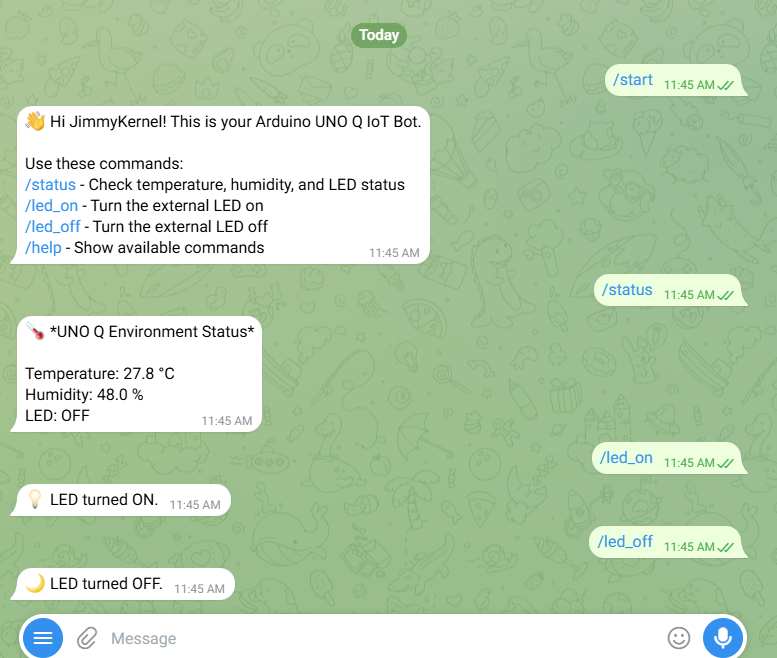
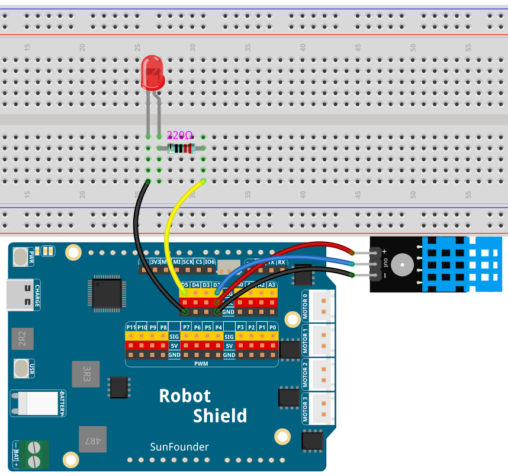

# 11 Telegram IoT Bot

Turn your Arduino UNO Q into an Internet-connected Telegram bot. Send `/status` to read temperature and humidity from a DHT11 and check the LED state; send `/led_on` and `/led_off` to control an external LED on D5 from anywhere in the world.

## Software

### Bricks Used

- `telegram_bot` — Handles communication with the Telegram Bot API; the bot token is configured in the Brick, not in the code

## Hardware

- Pan Tilt Kit ×1
- Breadboard ×1
- DHT11 temperature and humidity sensor ×1
- LED ×1
- 220Ω resistor ×1
- Jumper wires
- USB-C cable ×1

## Wiring

Connect the DHT11's VCC to 3.3V, DATA to D4, and GND to GND; connect the external LED's anode through a 220Ω resistor to D5 and its cathode to GND.

## How to Use the Example

1. Download [`11 Telegram IoT Bot.zip`](https://github.com/sunfounder/unoq-ai-kit/releases/latest/download/11.Telegram.IoT.Bot.zip).
2. In App Lab, go to **Apps** → **Create New App** → **Import App** → **Import from Computer** and open the package you downloaded.
3. In Telegram, open **@BotFather** and create a new bot with `/newbot` — save the API token it gives you (treat it like a password).
4. Click **Run**.
5. Open Telegram, find your bot, and send `/start` — it replies with the available commands. Then try `/status`, `/led_on`, and `/led_off`.

## How it Works

**Flow**

- Telegram — a user sends a command (e.g., `/status`) to the bot
- Telegram Bot Brick — routes the message to the matching Python command handler registered with `bot.add_command("status", status_cmd, ...)`
- Python (`main.py`) — `status_cmd` calls `Bridge.call("get_temperature")` and `Bridge.call("get_humidity")` to read the DHT11, and `Bridge.call("get_led_state")` for the LED; then `sender.reply(...)` sends the formatted answer back to Telegram
- Sketch (`sketch.ino`) — provides `get_temperature()`, `get_humidity()`, `set_led()`, and `get_led_state()` through `Bridge.provide()`; the DHT11 is on D4 and the LED on D5

**Commands**

`/start` introduces the bot, `/help` lists the commands, `/status` reports temperature, humidity, and LED state, `/led_on` and `/led_off` control the LED. Each handler catches failures and replies with a friendly error message instead of crashing.

**The token stays in the Brick**

The Telegram bot token is configured in the Brick configuration, not written into `main.py` — so the code can be shared safely without exposing credentials. Never include a real token in screenshots, documentation, or shared ZIP files; if a token leaks, regenerate it with BotFather.
